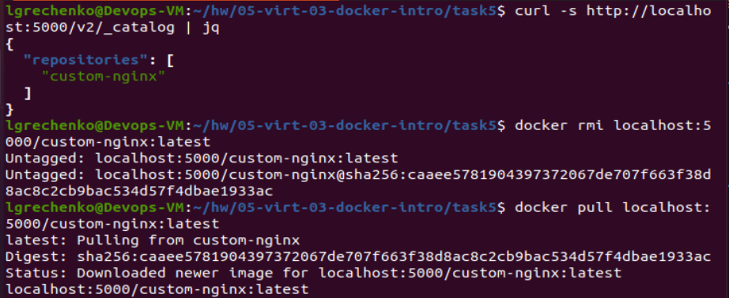
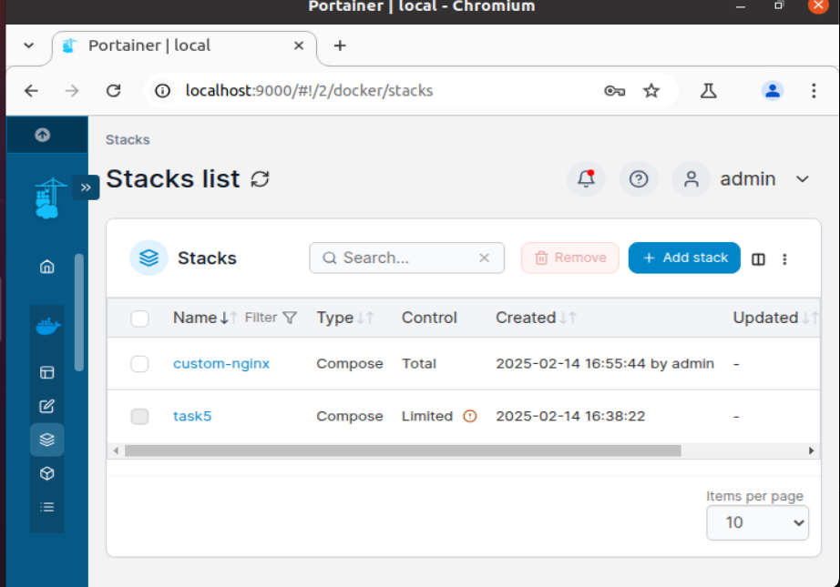

## Задача 1

[Ссылка на репозиторий Docker Hub](https://hub.docker.com/repository/docker/lauragrechenko/custom-nginx/general)

---

## Задача 2
#### 1-2. Запустили образ custom-nginx:1.0.0 согласно требованиям и переименовали


#### 3. Выполнили команды 


#### 4. Проверили доступ к индекс-странице


---

## Задача 3
#### 1-3. Подключились (attach) к контейнеру и нажали Ctrl-C

Когда мы подключаемся к контейнеру с помощью attach - мы напрямую подключаемся к главному процессу контейнера. При нажатие Ctrl-C процессу отправляется прерывающий сигнал (SIGINT) в результате чего главный процесс завершается и контейнер останавливается (т.к Docker контейнер работает только пока жив их основной процесс).

#### 4-6. Перезапустили контейнер и подключились к интерактивному терминалу (bin/bash)


#### 7-8. Изменили порт nginx с 80 на 81 и перезапустили nginx с новым конфигом

```
curl http://127.0.0.1:80
```
Ошибка Connection refused (Nginx больше не слушает порт 80).
```
curl http://127.0.0.1:81
```
Получили HTML-ответ от Nginx (он теперь работает на порту 81).

#### 9-10. Выполнили команды с хоста

Контейнер был запущен с `-p 8080:80`, Docker перенаправляет трафик с хоста (8080) на порт 80 внутри контейнера.
Но мы поменяли порт на 81 внутри контейнера, теперь 8080 на хосте ссылается на несуществующий порт.

#### 11. Исправили конфигурацию контейнера согласно инструкции


#### 12.  Удалили контейнер без остановки


---

## Задача 4
#### 1. Запустилм первый контейнер из образа centos и замонтировали каталог ($(pwd) в /data)


#### 2. Запустилм второй контейнер из образа debian и замонтировали каталог ($(pwd) в /data)
```
lgrechenko@Devops-VM:~/hw/05-virt-03-docker-intro$ docker run -d --name debian-container -v $(pwd):/data debian:latest sleep infinity
```

#### 3-5. Создали файлы на centos и хостовой машине. Проверили /data на debian


---

## Задача 5
#### 1. Создали 2 файла `compose.yaml` и `docker-compose.yaml`. Выполнили команду `docker compose up -d`

Compose поддерживает оба варианта имени файла: `compose.yaml` и `docker-compose.yaml`, но если оба файла присутствуют, приоритет отдается `compose.yaml`.

#### 2. Изменили файл compose.yaml так, чтобы были запущенны оба файла

Запустили оба контейнера


#### 3. Залили образ custom-nginx:latest в локальное registry

Проверили


#### 4-5. Настроили portainer и выбрав локальное окружение задеплоили компоуз с custom-nginx


Запущенный custom-nginx контейнер


#### 6. Часть конфигурации контейнера custom-nginx


#### 7. Удалили compose.yaml, исправили warning (Found orphan containers) и погасили compose-проект

`Found orphan containers` означает, что существуют контейнеры-сироты, которые до этого были частью compose-проекта, но теперь отсутствуют в compose.yaml (docker-compose.yaml).
С помощью флага мы удалили такие контейнеры автоматически `--remove-orphans`