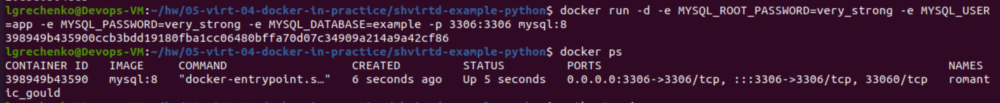
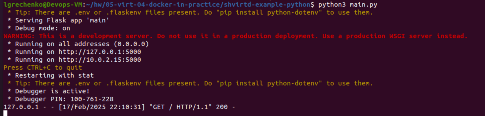
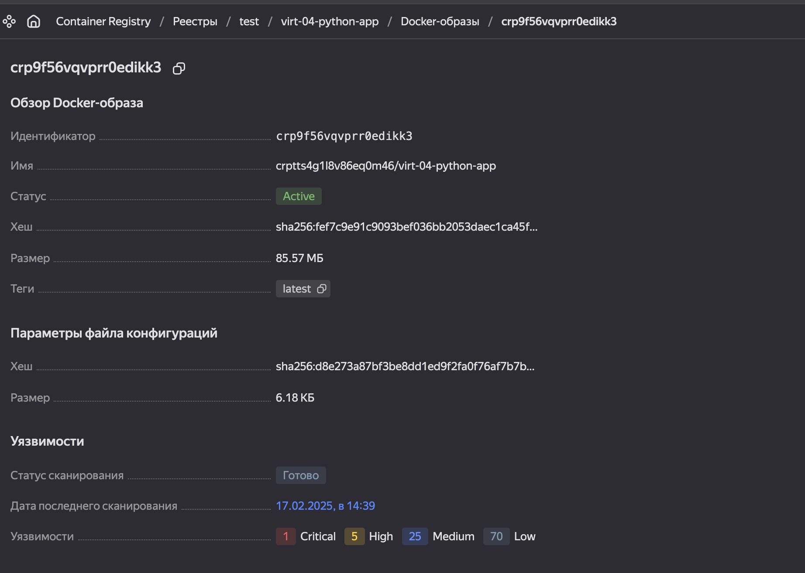
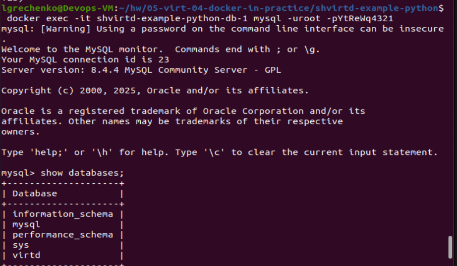
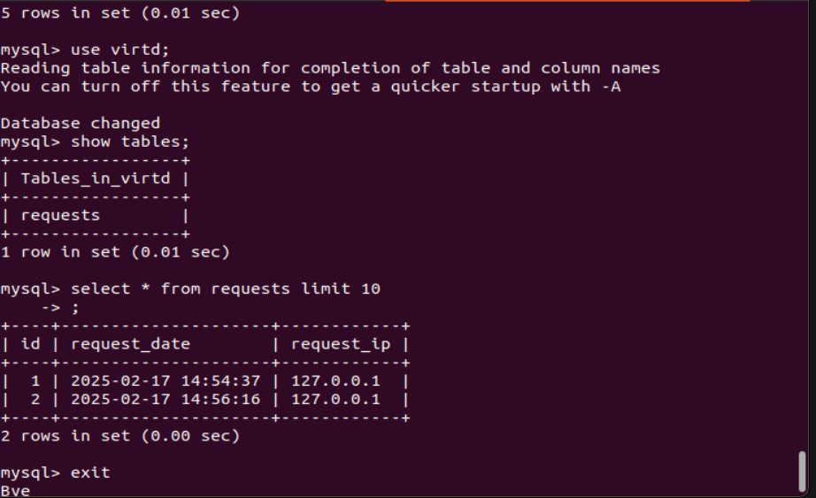
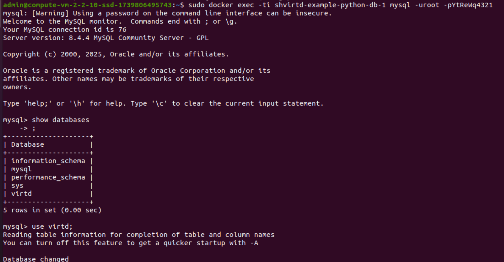
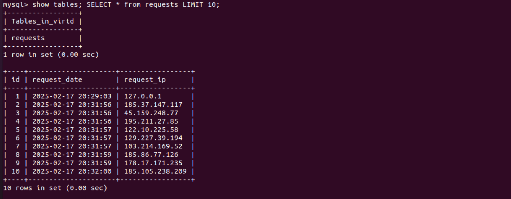

# Задача 1
### 1-2. Создали fork репозиторий и `Dockerfile.python`.
[Ссылка на fork репозиторий](https://github.com/lauragrechenko/shvirtd-example-python)
[Ссылка на Dockerfile.python](https://github.com/lauragrechenko/shvirtd-example-python/blob/1f5db713c54f50c6e8b075e47cdc9b854d29d37c/Dockerfile.python)

-------------------

### 3. Запустили web-приложение без использования docker



### 4. Задали имя используемой таблицы через ENV переменную `DB_TABLE`
[Ссылка на main.py](https://github.com/lauragrechenko/shvirtd-example-python/blob/main/main.py#L12)

-------------------

# Задача 2
### Загрузили образ в yandex cloud и просканировали на уязвимости


-------------------

# Задача 3
### Создали compose-проект согласно описанной схеме. Результат работы SQL:



-------------------

# Задача 4
### Запустили в YC ВМ, прогнали трафик. Результат работы SQL:



[Ссылка на fork репозиторий](https://github.com/lauragrechenko/shvirtd-example-python)

[Ссылка на bash скрипт](https://github.com/lauragrechenko/shvirtd-example-python/blob/main/setup.sh)

[Ссылка на compose.yaml](https://github.com/lauragrechenko/shvirtd-example-python/blob/1f5db713c54f50c6e8b075e47cdc9b854d29d37c/compose.yaml)

-------------------

# Задача 5
## Создание бэкапа в ручную (script)
### При попытке запуска образа schnitzler/mysqldump согласно инструкции получили ошибку:
```
mysqldump: Got error: 1045: "Plugin caching_sha2_password could not be loaded: Error loading shared library /usr/lib/mariadb/plugin/caching_sha2_password.so: No such file or directory"
```


### Чтобы ее исправить, создали новый образ lauragrechenko/mysqldump-fixed на базе schnitzler/mysqldump, в котором установили необходимые зависимости:


### Залили образ на docker-hub:


### Используя образ, запустили создание бэкапов и проверили, что файл был создан:


### Backup script
```
#!/bin/sh

docker run --rm --entrypoint "" \
    -v /opt/backup:/opt/backup \
    --network shvirtd-example-python_backend \
    lauragrechenko/mysqldump-fixed \
    mysqldump --opt -h shvirtd-example-python-db-1 -u root -p"YtReWq4321" --result-file=/opt/backup/dumps.sql virtd

```
-------------------
## Создание бэкапа используя Cron
### По примеру в инструкции для образа schnitzler/mysqldump создали docker-compose.yaml, но использовали lauragrechenko/mysqldump-fixed
### Использоаали .env для хранения все переменных. Добавили .env в .dockerignore.
```
services:
  cron:
    image: lauragrechenko/mysqldump-fixed
    restart: always
    volumes:
      - ./bin/crontab:/var/spool/cron/crontabs/root  # Load cron jobs
      - ./bin/backup:/usr/local/bin/backup  # Backup script
      - /opt/backup:/backup  # Store backups
      - .env:/env/.env # Mount .env file

    env_file: .env
    networks:
      - shvirtd-example-python_backend
networks:
  shvirtd-example-python_backend:
    external: true
```
### Скрипт, cron-task и скриншот с несколькими резервными копиями в "/opt/backup"


# Задача 6 
### Используя `Dive` нашли слой, в котором добавляется `Terraform`, запомнили `digest = da25c3c268493bc8d...`
 
### Используя `Docker save`, сохранили образ `Terraform` в архив tar:

### Нашли нужный слой `da25c3c268493bc8d...`

### Нашли и запустили `bin\terraform'


# Задача 6.1
### Скопировали используя 'docker cp' и запустили `bin\terraform'


# Задача 6.2
### Извлекли файл из контейнера, используя только команду docker build и Dockerfile. 

### Запустили `bin\terraform'

