# Домашнее задание к занятию 11 «Teamcity»

## Подготовка к выполнению

1. В Yandex Cloud создали новый инстанс (4CPU4RAM) на основе образа `jetbrains/teamcity-server`.
2. Дождались запуска teamcity, выполнили первоначальную настройку.
3. Создали ещё один инстанс (2CPU4RAM) на основе образа `jetbrains/teamcity-agent`. Прописали к нему переменную окружения `SERVER_URL: "http://<teamcity_url>:8111"`.
4. Авторизовали агент.
5. Сделали fork [репозитория](https://github.com/aragastmatb/example-teamcity).
6. Создали VM (2CPU4RAM) и запустили [playbook](./infrastructure).

### Результаты выполнения
Создали 3 ВМ согласно заданию
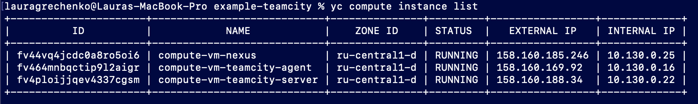

Авторизовали агент
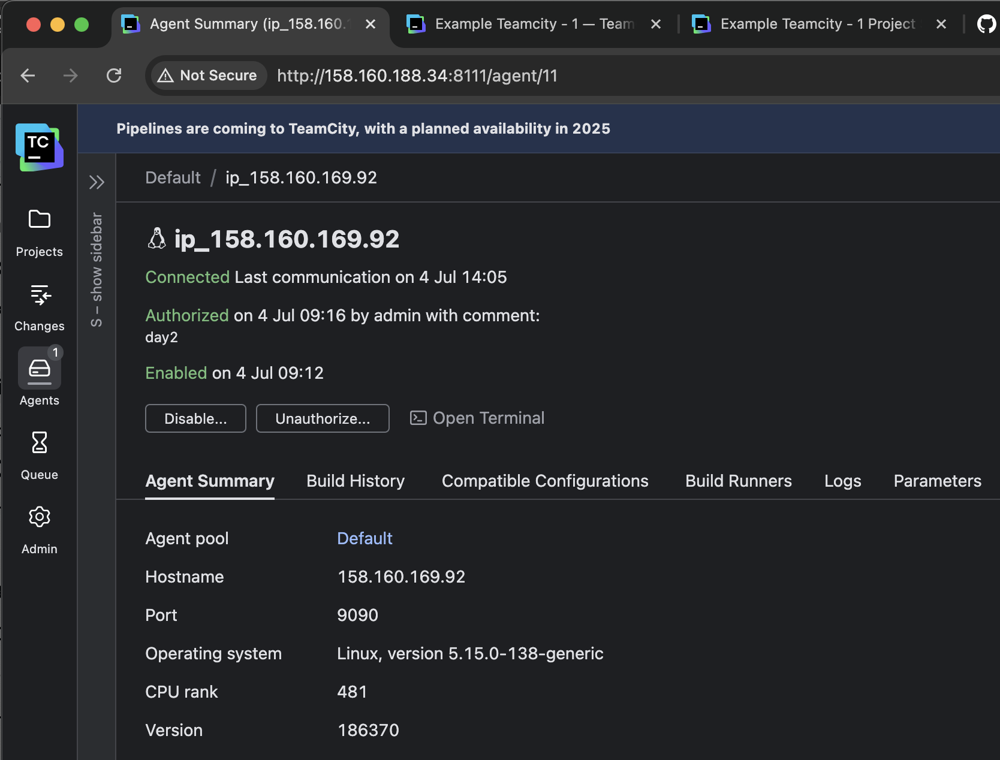

Настроили nexus
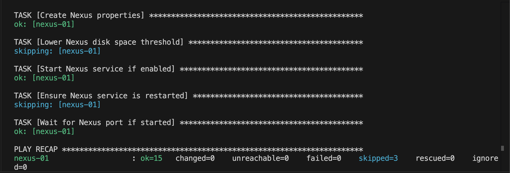

[Ссылка на fork проект с изменениями](https://github.com/lauragrechenko/example-teamcity)

## Основная часть

1. Создали новый проект в teamcity на основе fork.
2. Сделали autodetect конфигурации.
3. Сохранили необходимые шаги, запустили первую сборку master.
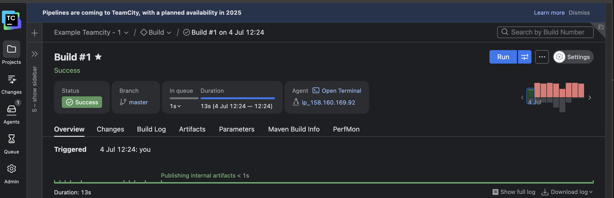

4. Поменяли условия сборки: если сборка по ветке `master`, то должен происходить `mvn clean deploy`, иначе `mvn clean test`.
5. Для deploy загрузили [settings.xml](./teamcity/settings.xml) в набор конфигураций maven у teamcity, предварительно записав туда креды для подключения к nexus.
6. В pom.xml поменяли ссылки на репозиторий и nexus.
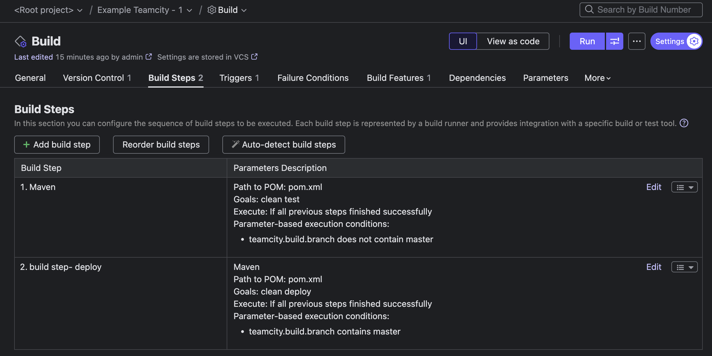

7. Запустили сборку по master, убедились, что всё прошло успешно и артефакт появился в nexus.
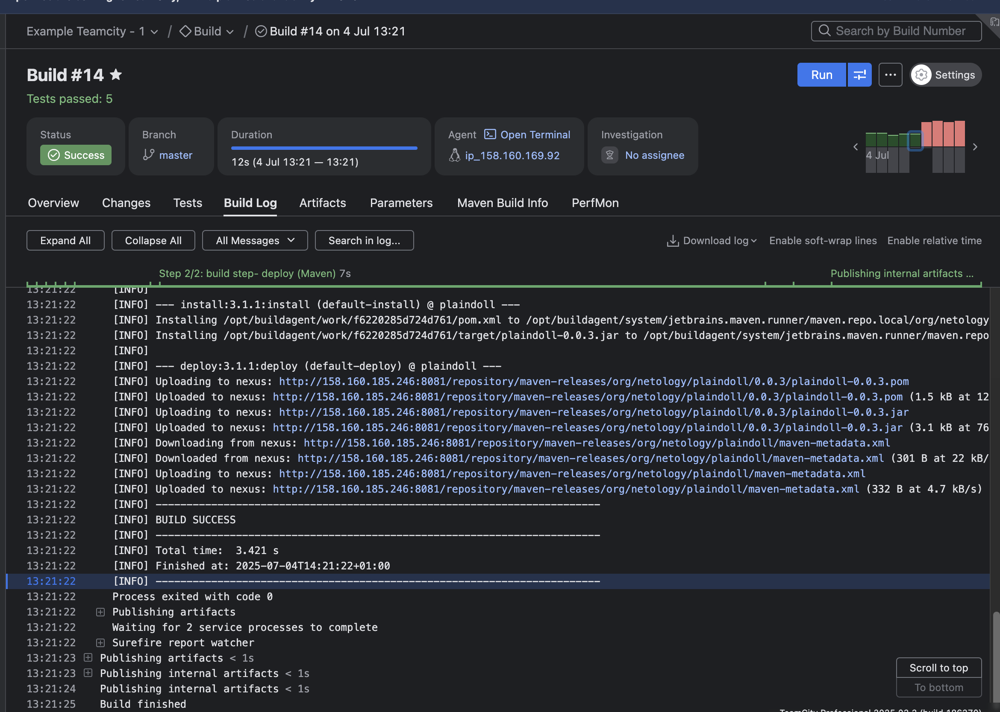
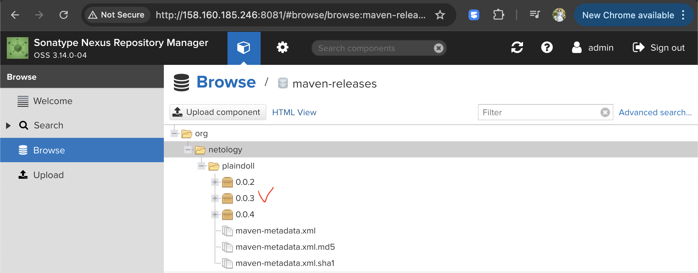

8. Мигрировали `build configuration` в репозиторий.
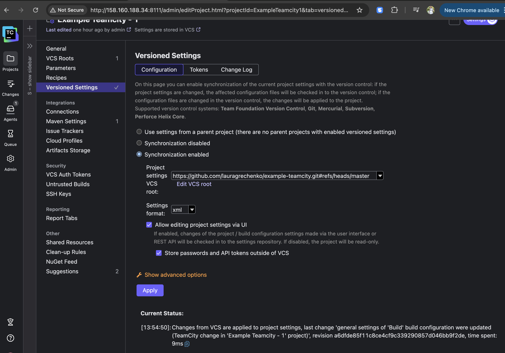

9. Создали отдельную ветку `feature/add_reply` в репозитории.
10. Написали новый метод для класса Welcomer: метод должен возвращать произвольную реплику, содержащую слово `hunter`.
11. Дополнили тест для нового метода на поиск слова `hunter` в новой реплике.
12. Сделали push всех изменений в новую ветку репозитория.
13. Убедились, что сборка самостоятельно запустилась, тесты прошли успешно.
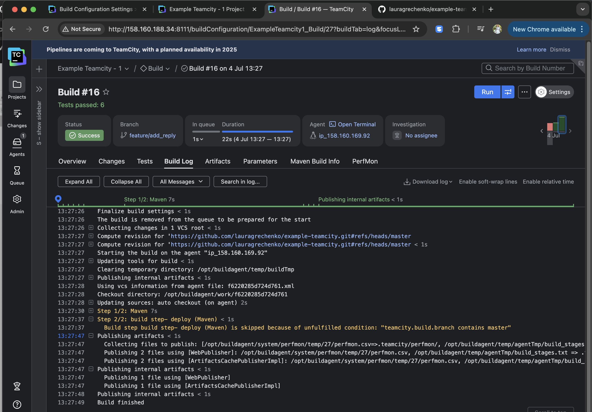

14. Внесли изменения из ветки `feature/add_reply` в `master` через `Merge`.
15. Убедились, что нет собранного артефакта в сборке по ветке `master`.
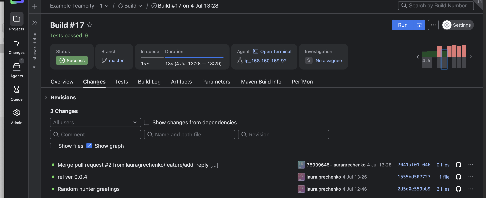
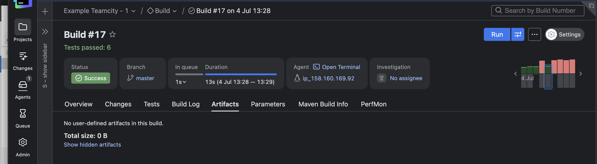

16. Настроили конфигурацию так, чтобы она собирала `.jar` в артефакты сборки.
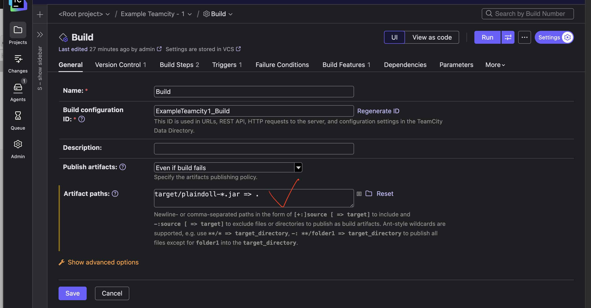

17. Провели повторную сборку мастера, убедились, что сборка прошла успешно и артефакты собраны.
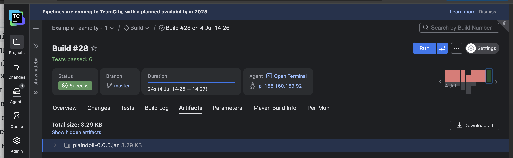

18. Проверили, что конфигурация в репозитории содержит все настройки конфигурации из teamcity.
