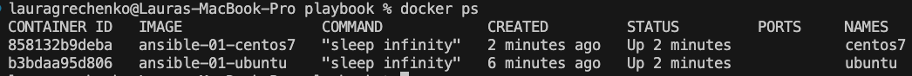
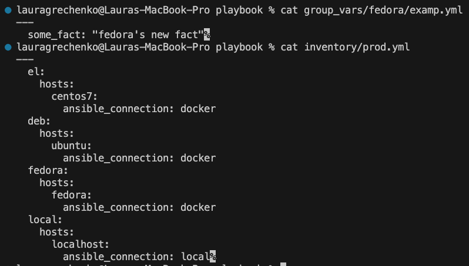

### 1. Запустили playbook на окружении из test.yml, зафиксировали значение, которое имеет факт some_fact для указанного хоста при выполнении playbook.
### `some_fact` имеет значение 12.


### 2. Нашли файл с переменными (group_vars), в котором задаётся найденное в первом пункте значение, и поменяли его на `all default fact`.


### 3. Запустили 2 Docker контейнера `ubuntu` & `centos7` для проведения дальнейших испытаний.


### 4. Запустили playbook на окружении из prod.yml. Зафиксировали полученные значения some_fact для каждого из managed host.
### для `deb(ubuntu)` — `deb`, для `el(centos7)` — `el`


### 5. Добавили факты в group_vars каждой из групп хостов так, чтобы для some_fact получились значения: для `deb` — `deb default fact`, для `el` — `el default fact`.

### 6. Повторили запуск playbook на окружении prod.yml. Убедились, что выдаются корректные значения для всех хостов.


### 7. При помощи ansible-vault зашифровали факты в group_vars/deb и group_vars/el с паролем `netology`.


### 8. Запустили playbook на окружении prod.yml. При запуске ansible запросил пароль. Убедились в работоспособности.


### 9. Посмотрели при помощи ansible-doc список плагинов для подключения. Выбрали `ansible.builtin.local` подходящий для работы на control node.


### 10. В prod.yml добавили новую группу хостов с именем local, в ней разместили localhost с типом подключения `local`.
```
  local:
    hosts:
      localhost:
        ansible_connection: local
```

### 11. Запустили playbook на окружении prod.yml. При запуске ansible запросил пароль. Убедились, что факты some_fact для каждого из хостов определены из верных group_vars.


------------------


### 1. При помощи ansible-vault расшифровали все зашифрованные файлы с переменными.


### 2. Зашифровали отдельное значение PaSSw0rd для переменной some_fact паролем netology. 


### Добавили полученное значение в group_vars/all/examp.yml.


### 3. Запустили playbook, убедились, что для нужных хостов применился новый fact.


### 4. Добавили новую группу хостов fedora, добавили для неё переменную. 


### 5. Написали скрипт на bash: автоматизировав поднятие контейнеров, запуск ansible-playbook и остановку контейнеров.
```
#!/bin/bash
set -e

docker compose up -d

ansible-playbook -i playbook/inventory/prod.yml playbook/site.yml --vault-password-file <(echo netology)

docker compose down
```
### Результат выполнения скрипта.


