### Факультивный вопрос: каким образом можно интерактивно выполнять debug Ansible task?
### Можно используя `--step`.
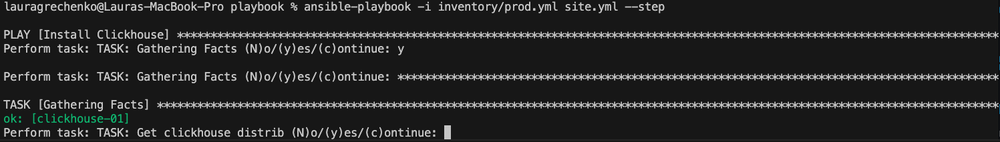
### Можно в ansible-console вызывать модули
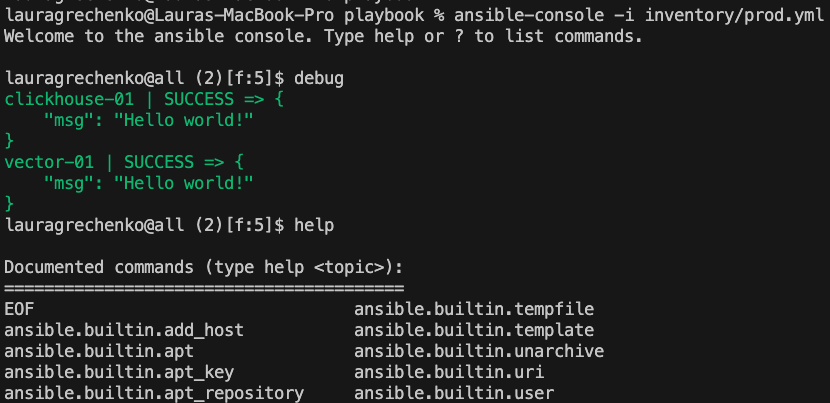

--------

### 0. Создали ВМ в YC, с Centos Stream 9.
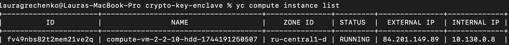

### 1. Подготовили inventory-файл prod.yml.
```
---
clickhouse:
  hosts:
    clickhouse-01:
      ansible_host: 84.201.149.89
      ansible_user: admin
      ansible_ssh_private_key_file: ~/.ssh/id_rsa
      ansible_python_interpreter: /usr/libexec/platform-python

vector:
  hosts:
    vector-01:
      ansible_host: 84.201.149.89
      ansible_user: admin
      ansible_ssh_private_key_file: ~/.ssh/id_rsa
```

### 2. Дописали playbook: добавили play, который устанавливает и настраивает vector. Добавили handler на перезапуск vector в случае изменения конфигурации.
### 3. При создании tasks использовали модули: get_url, template, unarchive, file.
### 4. Tasks скачивают дистрибутив нужной версии, выполняет распаковку в выбранную директорию, устанавливает vector.
[Ссылка на изменения](https://github.com/lauragrechenko/devops-net-homework/blob/master/ansible-02/playbook/site.yml#L42)

### Конфигурация vector деплоиться через template файл jinja2.
[Ссылка на template файл jinja2](https://github.com/lauragrechenko/devops-net-homework/blob/master/ansible-02/playbook/templates/vector.toml.j2)

### 5. Запустили ansible-lint site.yml.
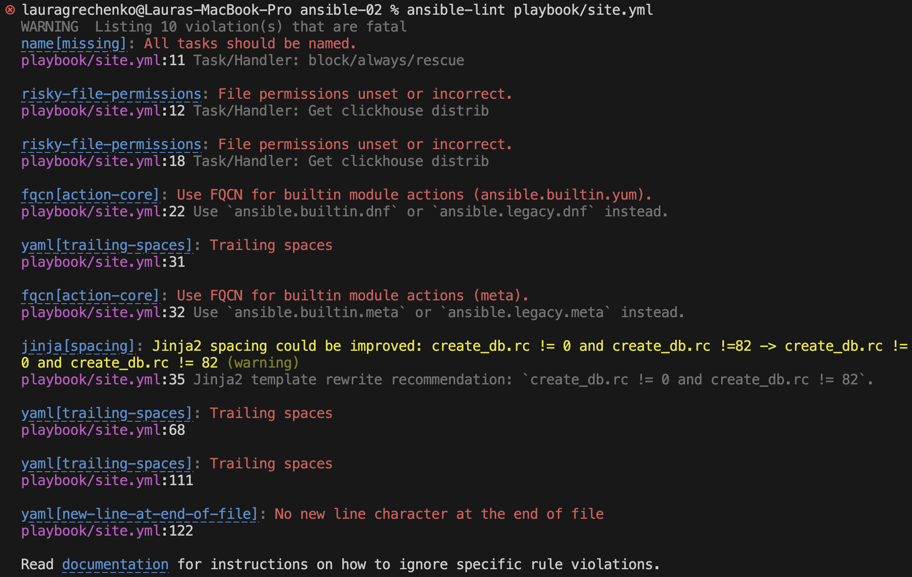
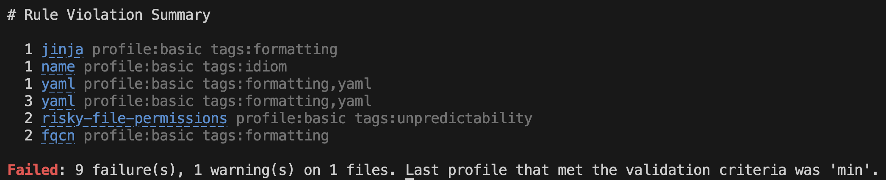
### Исправили ошибки.
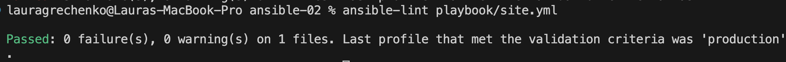

### 6. Запустили playbook с флагом --check.
Выполнение прервалось на шаге установки clickhouse пакетов.

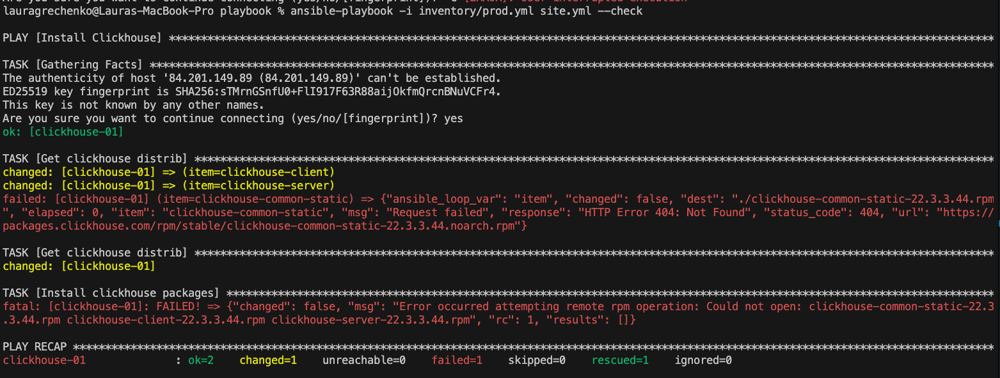

### 7. Запустили playbook с флагом --diff.
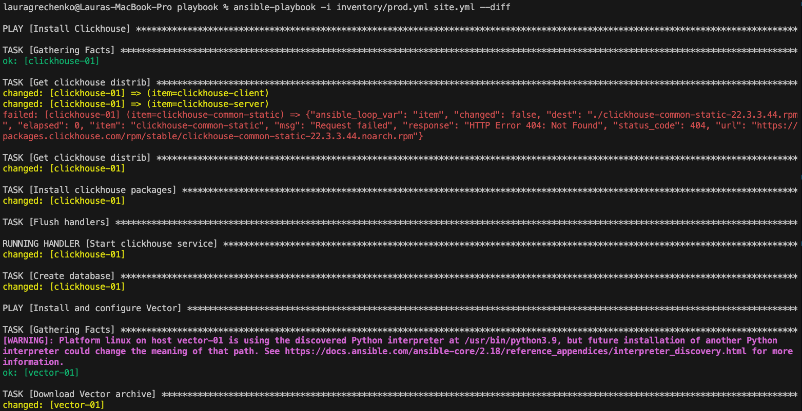
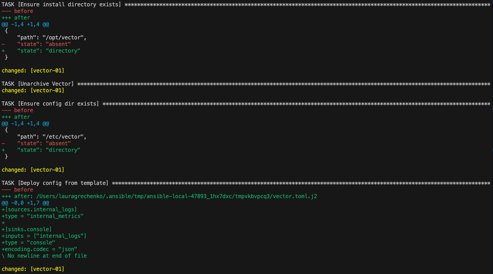
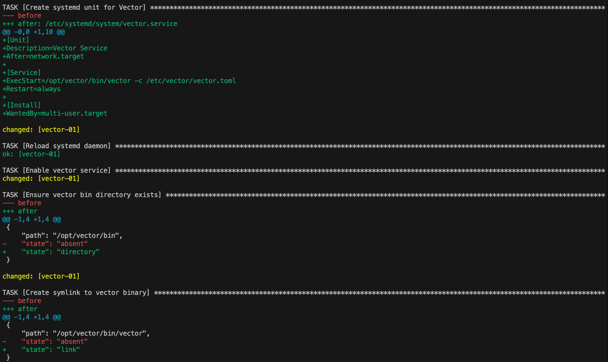
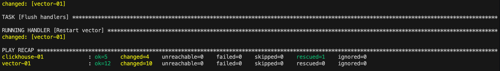

### Убедились, что изменения на системе произведены.
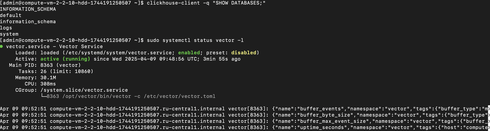

### 8. Повторно запустили playbook с флагом --diff и убедились, что playbook идемпотентен.
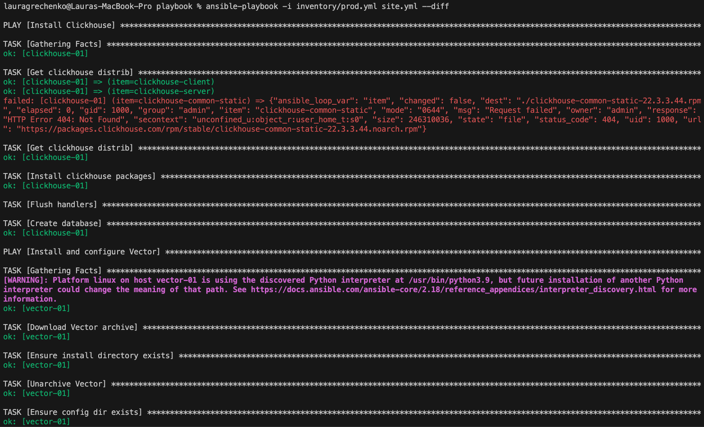
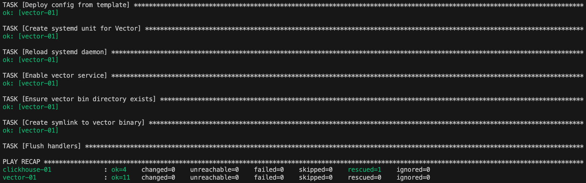

### 9. Что делает playbook, какие у него есть параметры и теги. 
### Данный playbook автоматизирует процесс установки и настройки двух сервисов:
- **Clickhouse:** установка пакетов, запуск и управление сервисом, создание БД.
- **Vector:** загрузка и установка Vector, развёртывание конфиг файла и создание systemd-сервиса.

### Параметры (Переменные)
### Для Clickhouse (./playbook/group_vars/clickhouse/vars.yml):
- **clickhouse_version:**  
  Версия Clickhouse для установки.  
  _Пример:_ `"21.3.15.1"`
- **clickhouse_packages:**  
  Список пакетов, необходимых для установки Clickhouse.  
  _Пример:_ `['clickhouse-common-static', 'clickhouse-client', 'clickhouse-server']`

### Для Vector (./playbook/group_vars/vector/vars.yml):
- **vector_url:**  
  URL-шаблон для скачивания архива Vector.  
  _Пример:_ `"https://packages.timber.io/vector/{{ vector_version }}/vector-{{ vector_version }}-x86_64-unknown-linux-gnu.tar.gz"`
- **vector_archive_path:**  
  Путь, куда будет сохранён архив Vector.  
  _Пример:_ `"/tmp/vector.tar.gz"`
- **vector_install_dir:**  
  Каталог установки Vector.  
  _Пример:_ `"/opt/vector"`
- **vector_config_dir:**  
  Каталог для хранения конфиг файла Vector.  
  _Пример:_ `"/etc/vector"`
- **vector_template_local_path:**  
  Локальный путь к шаблону конфиг файла (Jinja2).  
  _Пример:_ `"templates/vector.toml.j2"`
- **vector_version:**  
  Версия Vector (используется для формирования URL).  
  _Пример:_ `"0.36.0"`

### Теги
На данный момент playbook не содержит явных тегов для отдельных задач.

### Установка и настройка Vector
### Загружается архив Vector по указанному URL.
```
- name: Download Vector archive
  ansible.builtin.get_url:
    url: "{{ vector_url }}"
    dest: "{{ vector_archive_path }}"
    mode: "0644"
```

### Убедились, что каталоги для установки и конфигурации существуют
```
- name: Ensure install directory exists
  ansible.builtin.file:
    path: "{{ vector_install_dir }}"
    state: directory
    mode: "0755"
```

### Распаковка загруженного архива в каталог установки.
```
- name: Unarchive Vector
  ansible.builtin.unarchive:
    src: "{{ vector_archive_path }}"
    dest: "{{ vector_install_dir }}"
    remote_src: true
```

### Убедились, что каталоги для хранения конфигурации существуют
```
- name: Ensure config dir exists
  ansible.builtin.file:
    path: "{{ vector_config_dir }}"
    state: directory
    mode: "0755"
```

### Конфиг файл генерируется из Jinja2-шаблона. При изменении шаблона уведомляется handler для перезапуска Vector.
```
- name: Deploy config from template
  ansible.builtin.template:
    src: "{{ vector_template_local_path }}"
    dest: "{{ vector_config_dir }}/vector.toml"
    mode: "0644"
  notify: Restart vector
```

### Создаётся unit-файл для Vector, который включает определение сервиса, перезапуск сервиса и подключение к загрузке системы (multi-user.target).  

```
- name: Create systemd unit for Vector
  ansible.builtin.copy:
    dest: /etc/systemd/system/vector.service
    content: |
      [Unit]
      Description=Vector Service
      After=network.target

      [Service]
      ExecStart={{ vector_install_dir }}/bin/vector -c {{ vector_config_dir }}/vector.toml
      Restart=always

      [Install]
      WantedBy=multi-user.target
    mode: "0644"
  notify: Restart vector
```

### Дополнительно происходит перезагрузка демона systemd и включение сервиса.
```  
- name: Reload systemd daemon
  ansible.builtin.systemd:
    daemon_reload: yes  

- name: Enable vector service
  ansible.builtin.systemd:
    name: vector
    enabled: true
```

### Убедились, что vector bin каталог существуют
```
- name: Ensure vector bin directory exists
  ansible.builtin.file:
    path: "{{ vector_install_dir }}/bin"
    state: directory
    mode: '0755'
```

### Создается симлинк на бинарный файл Vector.
```    
- name: Create symlink to vector binary
  ansible.builtin.file:
    src: "{{ vector_install_dir }}/vector-x86_64-unknown-linux-gnu/bin/vector"
    dest: "{{ vector_install_dir }}/bin/vector"
    state: link
```

### Применение handler-ов
```    
- name: Flush handlers
  ansible.builtin.meta: flush_handlers
```      