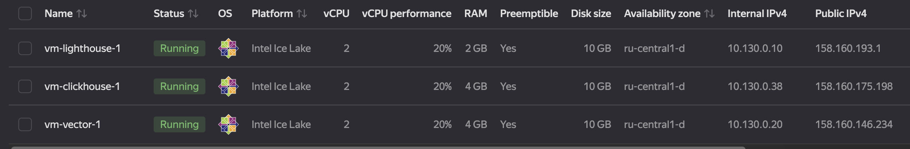
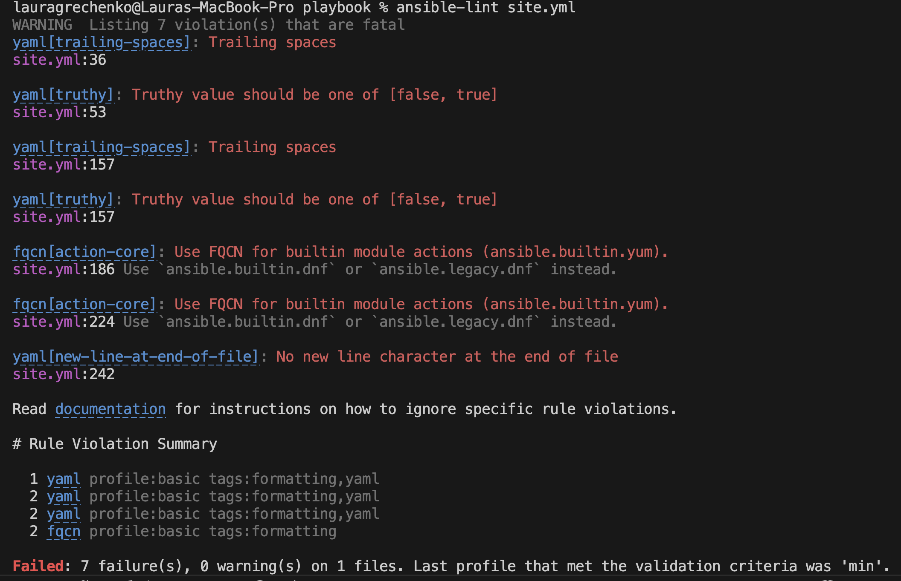
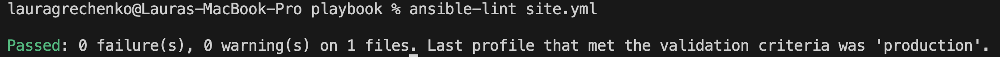
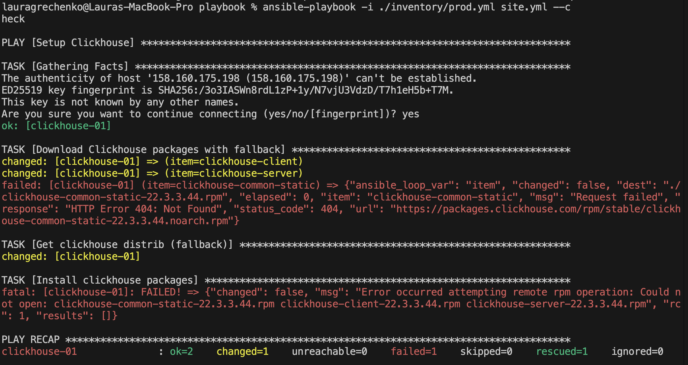
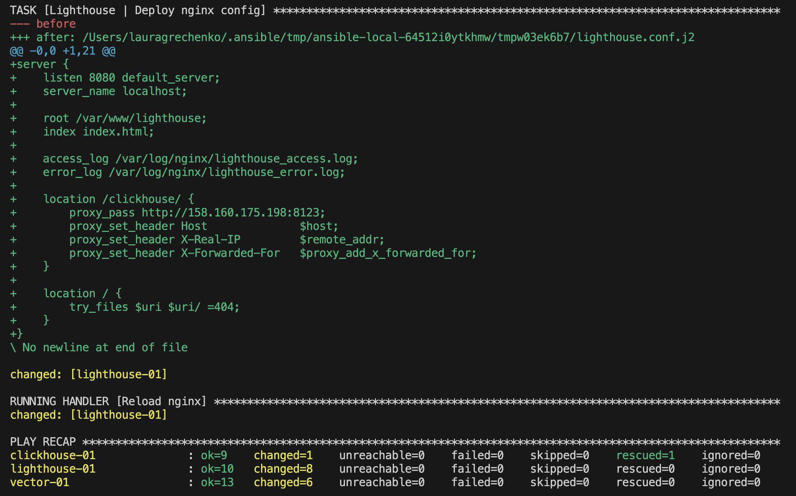
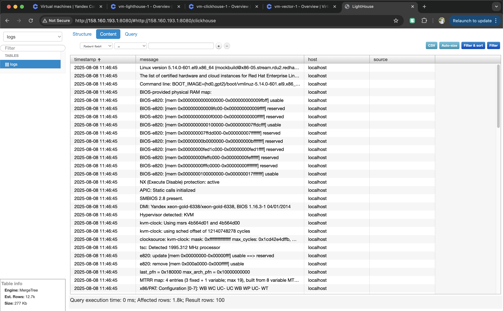
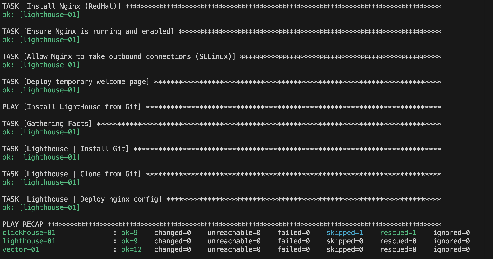

## Подготовка к выполнению

1. Подготовили в Yandex Cloud три хоста: для `clickhouse`, для `vector` и для `lighthouse`.

2. Репозиторий LightHouse находится [по ссылке](https://github.com/VKCOM/lighthouse).

## Основная часть

1. Дописали playbook: дописали ещё два play, которые устанавливают и настраивают LightHouse и Nginx.
2. При создании tasks использовали модули: `get_url`, `template`, `dnf`, и другие.
3. Tasks: скачивают статику LightHouse, устанавливают Nginx, настраивают Nginx конфиг для открытия LightHouse, запускают веб-сервер.

4. Подготовили inventory-файл `prod.yml`.

5. Запустили `ansible-lint site.yml` 

и исправили ошибки.

6. Попробовали запустить playbook на этом окружении с флагом `--check`.

7. Запустили playbook на `prod.yml` окружении с флагом `--diff`. (При первом запуске были ошибки, поэтому для clickhouse так много задач без изменений)

Убедились, что изменения на системе произведены. Открыли lighthouse `http://158.160.193.1:8080/#http://158.160.193.1:8080/clickhouse` и проверили, что в таблице есть данные

8. Повторно запустили playbook с флагом `--diff` и убедились, что playbook идемпотентен.

9. Подготовьте README.md-файл по своему playbook. В нём должно быть описано: что делает playbook, какие у него есть параметры и теги.

- ClickHouse: скачивает и устанавливает RPM-пакеты, включает прослушивание на 0.0.0.0 (вставляет <listen_host> сразу после <http_port>8123</http_port>), запускает сервис, ждёт доступности портов 9000/8123, создаёт БД logs и таблицу logs.logs.

- Vector: скачивает архив, устанавливает в каталог, деплоит конфиг из шаблона и перезапускает.

- Nginx: устанавливает и включает сервис, настраивает SELinux httpd_can_network_connect, кладёт временную стартовую страницу.

- LightHouse: клонирует статику из Git и разворачивает nginx-конфиг из шаблона.

Переменные
- clickhouse_version — версия CH, например 22.3.3.44.

- clickhouse_packages — список пакетов: ['clickhouse-client', 'clickhouse-server', 'clickhouse-common-static'].

- vector_url — URL архива Vector.

- vector_archive_path — путь, куда скачать архив Vector.

- vector_install_dir — каталог установки Vector.

- vector_config_dir — каталог конфигов Vector.

- vector_template_local_path — путь к шаблону vector.toml.j2.

- lighthouse_vcs — Git-URL LightHouse.

- lighthouse_location_dir — куда положить статику LightHouse (например /var/www/lighthouse).

- nginx_conf_path — путь для vhost’а nginx (например /etc/nginx/conf.d/lighthouse.conf).

Теги
- clickhouse — установка и настройка ClickHouse.

- vector — развертывание Vector.

- nginx — установка и базовая настройка Nginx.

- lighthouse — деплой LightHouse и nginx-конфига.

10. Готовый playbook выложите в свой репозиторий, поставьте тег `08-ansible-03-yandex` на фиксирующий коммит, в ответ предоставьте ссылку на него.