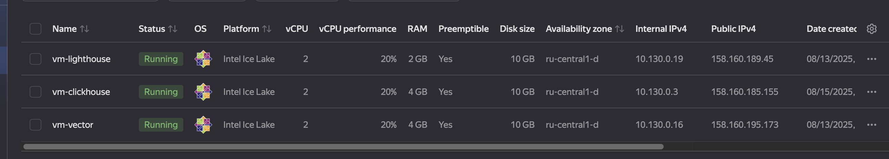

# Домашнее задание к занятию 4 «Работа с roles»

## Подготовка к выполнению

1. Ознакомились с [LightHouse](https://youtu.be/ymlrNlaHzIY?t=929).
2. Создали два пустых публичных репозитория: vector-role и lighthouse-role.
3. Добавили публичную часть своего ключа к своему профилю на GitHub.

## Основная часть

Наша цель — разбить наш playbook на отдельные roles. 

Задача — сделать roles для ClickHouse, Vector и LightHouse и написать playbook для использования этих ролей. 

Ожидаемый результат — существуют три репозитория: два с roles и один с playbook.

**Что нужно сделать**

1. Создали в старой версии playbook файл `requirements.yml` и заполнили его содержимым по примеру:

   ```yaml
   ---
     - src: git@github.com:AlexeySetevoi/ansible-clickhouse.git
       scm: git
       version: "1.13"
       name: clickhouse 
   ```

2. При помощи `ansible-galaxy` скачали себе добавленную роль.

3. Создали новый каталог с ролью при помощи `ansible-galaxy role init vector`.
4. На основе tasks из старого playbook заполнили новую role. Разнесли переменные между `vars` и `default`. 
5. Перенесли нужные шаблоны конфигов в `templates`.
6. Описали в `README.md` обе роли и их параметры. 
7. Повторили шаги 3–6 для LightHouse.
8. Выложили все roles в репозитории. Проставили теги, используя семантическую нумерацию. Добавили roles в `requirements.yml` в playbook.

9. Переработали playbook на использование roles.
10. Выложили playbook в 
[репозиторий](https://github.com/lauragrechenko/devops-net-homework/tree/master/ansible-04).

11. Ссылки на репозитории с roles
[clickhouse](https://github.com/lauragrechenko/ansible-clickhouse)
[lighthouse](https://github.com/lauragrechenko/lighthouse-role)
[vector](https://github.com/lauragrechenko/vector-role)


Результаты запуска playbook с ролями на хостах:



---

### Как оформить решение задания

Выполненное домашнее задание пришлите в виде ссылки на .md-файл в вашем репозитории.

---
