# Домашнее задание к занятию 5 «Тестирование roles»

[Ссылка на репозиторий Vector-role со всеми изменениями и тэгами](https://github.com/lauragrechenko/vector-role).
[Ссылка на изменения clickhouse-role](https://github.com/lauragrechenko/ansible-clickhouse/tree/master/molecule/ubuntu_focal)

## Подготовка к выполнению

1. Установите molecule и его драйвера: `pip3 install "molecule molecule_docker molecule_podman`.
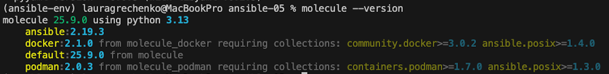
2. Выполните `docker pull aragast/netology:latest` —  это образ с podman, tox и несколькими пайтонами (3.7 и 3.9) внутри.

## Основная часть

Ваша цель — настроить тестирование ваших ролей. 

Задача — сделать сценарии тестирования для vector. 

Ожидаемый результат — все сценарии успешно проходят тестирование ролей.

### Molecule

1. Запустили `molecule test -s ubuntu_focal` внутри корневой директории clickhouse-role, посмотрели на вывод команды. Данная команда отработала с ошибками.
Обновили код для работы с установленной версией molecule.
[Ссылка на изменения](https://github.com/lauragrechenko/ansible-clickhouse/tree/master/molecule/ubuntu_focal).
Результаты запуска тестов:
- `PLAY [Converge]`
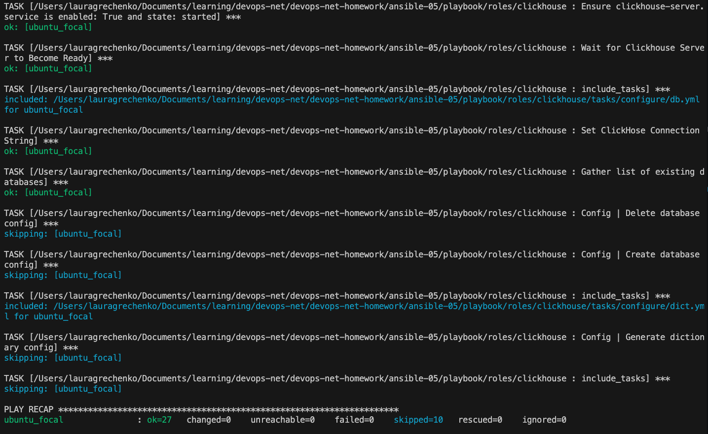
- `PLAY [Verify]`
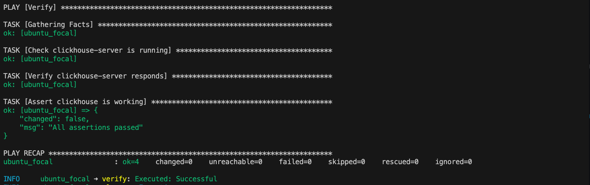

2. Перейдите в каталог с ролью vector-role и создайте сценарий тестирования по умолчанию при помощи `molecule init scenario --driver-name docker`.
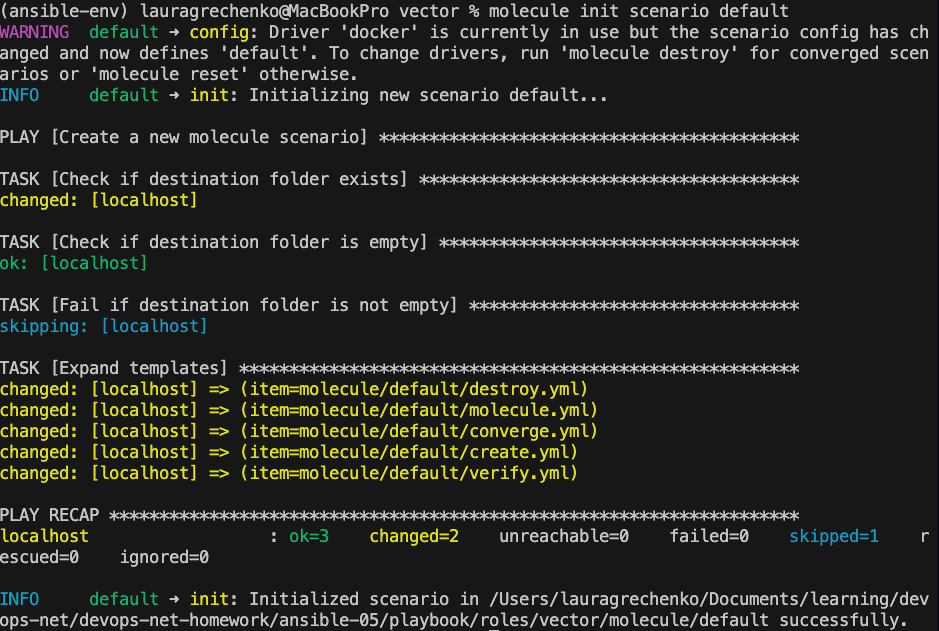
3. Добавили один дистрибутив (rockylinux9:latest) для инстансов и протестировали роль.
4. Добавили несколько assert в verify.yml-файл для  проверки работоспособности vector-role.
5. Запустили тестирование роли повторно и проверили, что оно прошло успешно.
Результаты запуска тестов:
- `PLAY [Converge]`
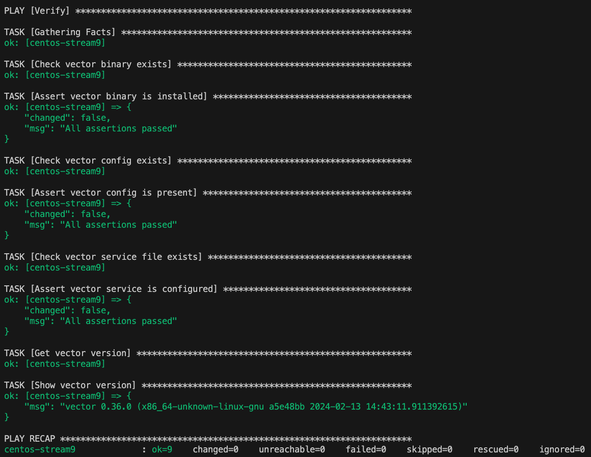
- `PLAY [Verify]`
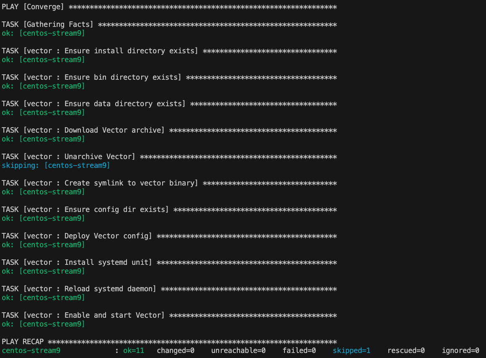

5. Добавьте новый тег на коммит с рабочим сценарием в соответствии с семантическим версионированием.

### Tox

1. Добавили в директорию с vector-role файлы из [директории](./example).
2. Запустили `docker run --privileged=True -v ./:/opt/vector-role -w /opt/vector-role -it aragast/netology:latest /bin/bash`, где path_to_repo — путь до корня репозитория с vector-role на файловой системе.
3. Внутри контейнера выполнили команду `tox`, получили ошибки:
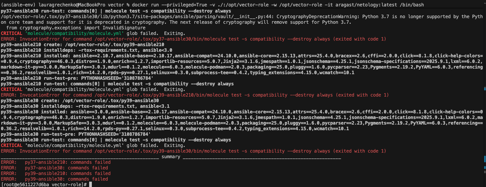

Обновили файлы tox-requirements.txt и tox.ini.
Создали новый docker-image с версиями python 3.9, 3.10, 3,11.
В созданном docker-image нет docker поэтому в качестве команды в tox.ini использовали ansible-lint.

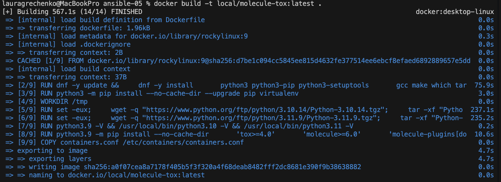

Результаты запуска команды tox (ansible-lint):
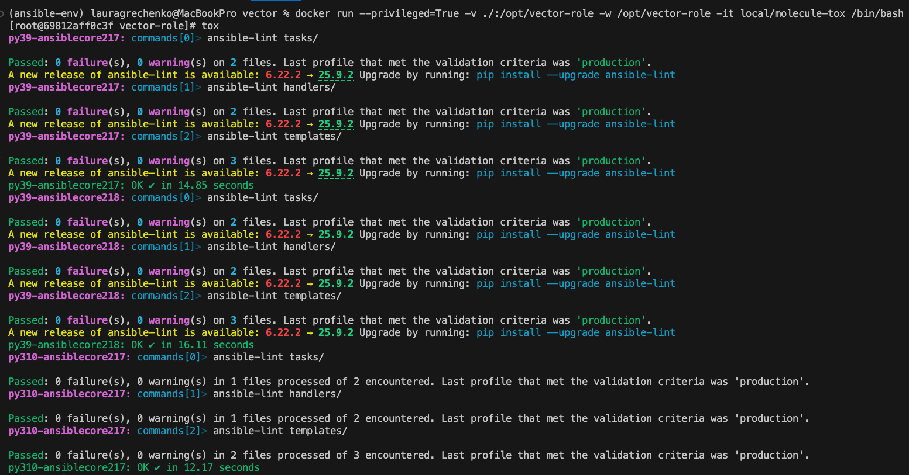
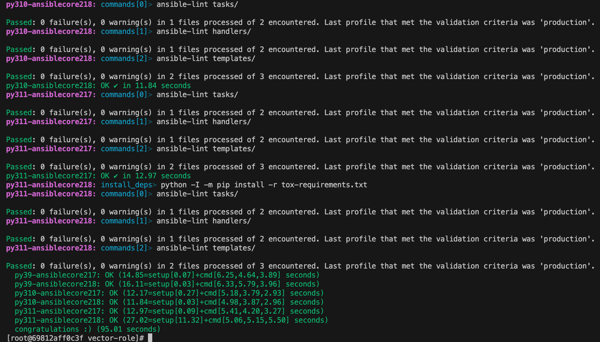

5. Создали облегчённый сценарий для `molecule` с драйвером `molecule_podman`.
6. Прописали правильную команду в `tox.ini`, чтобы запускался облегчённый сценарий.
8. Запустили команду `tox`. Убедились, что всё отработало успешно.
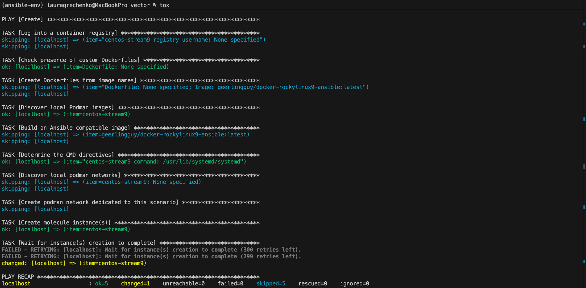
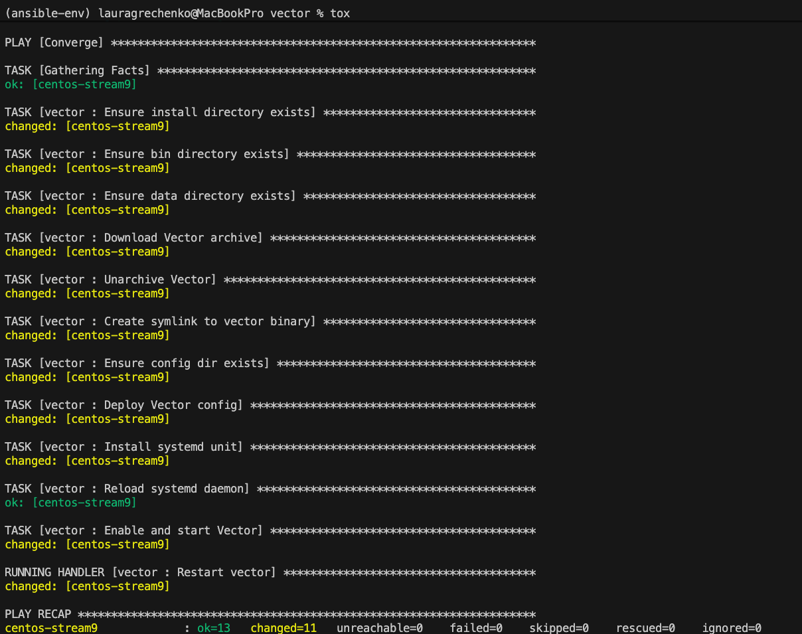
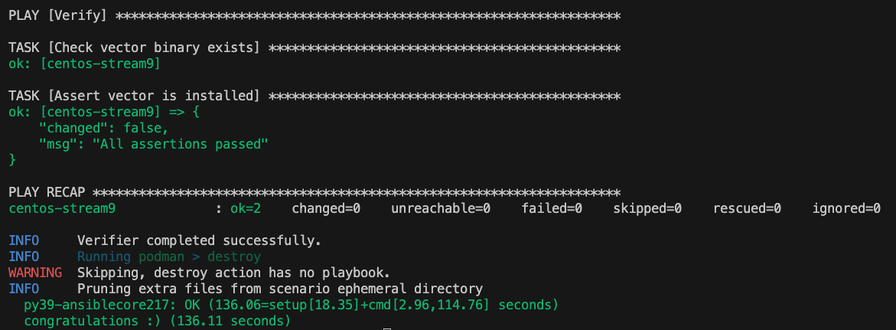

После выполнения у вас должно получится два сценария molecule и один tox.ini файл в репозитории. Не забудьте указать в ответе теги решений Tox и Molecule заданий. В качестве решения пришлите ссылку на  ваш репозиторий и скриншоты этапов выполнения задания. 

## Необязательная часть

1. Проделайте схожие манипуляции для создания роли LightHouse.
2. Создайте сценарий внутри любой из своих ролей, который умеет поднимать весь стек при помощи всех ролей.
3. Убедитесь в работоспособности своего стека. Создайте отдельный verify.yml, который будет проверять работоспособность интеграции всех инструментов между ними.
4. Выложите свои roles в репозитории.

В качестве решения пришлите ссылки и скриншоты этапов выполнения задания.

---

### Как оформить решение задания

Выполненное домашнее задание пришлите в виде ссылки на .md-файл в вашем репозитории.
