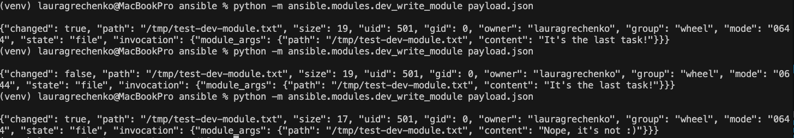
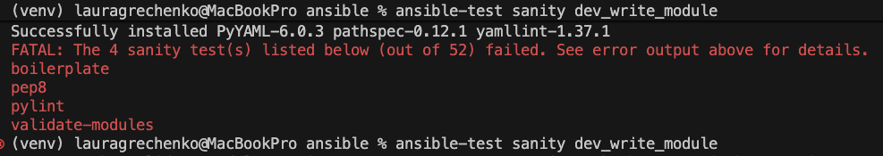
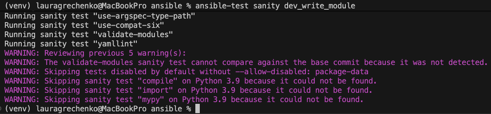
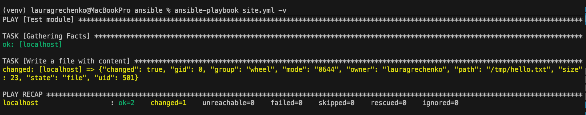
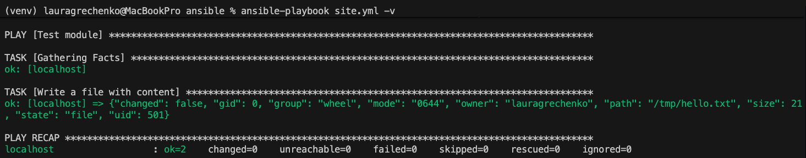
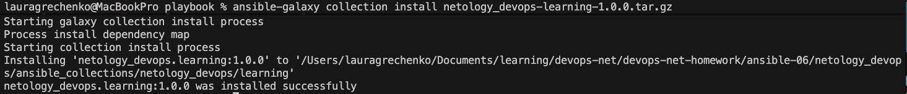
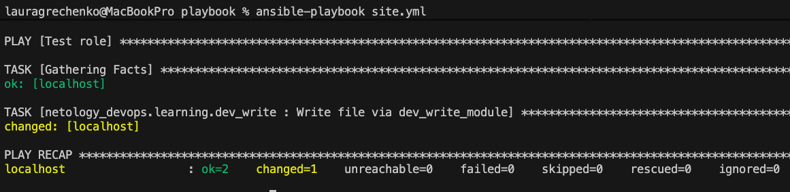

# Домашнее задание к занятию 6 «Создание собственных модулей»

[Ссылка на созданную ansible-galaxy collection](https://github.com/lauragrechenko/net-devops-learning.git)

## Подготовка к выполнению

1. Создайте пустой публичный репозиторий в своём любом проекте: `my_own_collection`.
2. Скачайте репозиторий Ansible: `git clone https://github.com/ansible/ansible.git` по любому, удобному вам пути.
3. Зайдите в директорию Ansible: `cd ansible`.
4. Создайте виртуальное окружение: `python3 -m venv venv`.
5. Активируйте виртуальное окружение: `. venv/bin/activate`. Дальнейшие действия производятся только в виртуальном окружении.
6. Установите зависимости `pip install -r requirements.txt`.
7. Запустите настройку окружения `. hacking/env-setup`.
8. Если все шаги прошли успешно — выйдите из виртуального окружения `deactivate`.
9. Ваше окружение настроено. Чтобы запустить его, нужно находиться в директории `ansible` и выполнить конструкцию `. venv/bin/activate && . hacking/env-setup`.

## Основная часть

Ваша цель — написать собственный module, который вы можете использовать в своей role через playbook. Всё это должно быть собрано в виде collection и отправлено в ваш репозиторий.

**Шаг 1.** В виртуальном окружении создали новый `dev_write_module.py` файл.

**Шаг 2.** Наполнили его содержимым [из статьи](https://docs.ansible.com/ansible/latest/dev_guide/developing_modules_general.html#creating-a-module).

**Шаг 3.** Заполнили файл в соответствии с требованиями Ansible так, чтобы он выполнял основную задачу: module должен создавать текстовый файл на удалённом хосте по пути, определённом в параметре `path`, с содержимым, определённым в параметре `content`.

**Шаг 4.** Проверили module на исполняемость локально.
Результаты запусков:

Результаты `ansible-test sanity dev_write_module`:

Результаты `ansible-test` после исправления всех ошибок:

**Шаг 5.** Написали single task playbook и использовали module в нём.

**Шаг 6.** Проверили через playbook на идемпотентность.

**Шаг 7.** Вышли из виртуального окружения.

**Шаг 8.** Инициализоровали новую collection: `ansible-galaxy collection init netology_devops.learning`.

**Шаг 9.** В эту collection перенесли свой module в соответствующую директорию `plugins/modules`.

**Шаг 10.** Single task playbook преобразовали в single task role `dev_write` и перенесли в collection. У role должны быть default всех параметров module.

**Шаг 11.** Создали playbook для использования этой role.

**Шаг 12.** Заполнили всю документацию по collection, выложили в [свой репозиторий](https://github.com/lauragrechenko/net-devops-learning.git), поставили тег `1.0.0` на этот коммит.

**Шаг 13.** Создали .tar.gz этой collection: `ansible-galaxy collection build` в корневой директории collection.

**Шаг 14.** Создали ещё одну директорию любого наименования, перенесли туда single task playbook и архив c collection.

**Шаг 15.** Установили collection из локального архива: `ansible-galaxy collection install netology_devops-learning-1.0.0.tar.gz`.

**Шаг 16.** Запустили playbook, убедились, что он работает.

**Шаг 17.** В ответ необходимо прислать ссылки на collection и tar.gz архив, а также скриншоты выполнения пунктов 4, 6, 15 и 16.

## Необязательная часть

1. Реализуйте свой модуль для создания хостов в Yandex Cloud.
2. Модуль может и должен иметь зависимость от `yc`, основной функционал: создание ВМ с нужным сайзингом на основе нужной ОС. Дополнительные модули по созданию кластеров ClickHouse, MySQL и прочего реализовывать не надо, достаточно простейшего создания ВМ.
3. Модуль может формировать динамическое inventory, но эта часть не является обязательной, достаточно, чтобы он делал хосты с указанной спецификацией в YAML.
4. Протестируйте модуль на идемпотентность, исполнимость. При успехе добавьте этот модуль в свою коллекцию.
5. Измените playbook так, чтобы он умел создавать инфраструктуру под inventory, а после устанавливал весь ваш стек Observability на нужные хосты и настраивал его.
6. В итоге ваша коллекция обязательно должна содержать: clickhouse-role (если есть своя), lighthouse-role, vector-role, два модуля: my_own_module и модуль управления Yandex Cloud хостами и playbook, который демонстрирует создание Observability стека.

---

### Как оформить решение задания

Выполненное домашнее задание пришлите в виде ссылки на .md-файл в вашем репозитории.

---
