# Домашнее задание к занятию «Вычислительные мощности. Балансировщики нагрузки»  

- Terraform манифесты YC: [src/yc/](src/yc/)

- Terraform манифесты AWS: [src/aws/](src/aws/)

---
## Задание 1. Yandex Cloud

**Что нужно сделать**

1. Создать бакет Object Storage и разместить в нём файл с картинкой:

 - Создать бакет в Object Storage с произвольным именем (например, _имя_студента_дата_).
 - Положить в бакет файл с картинкой.
 - Сделать файл доступным из интернета.

#### Выполнили код Terraform:

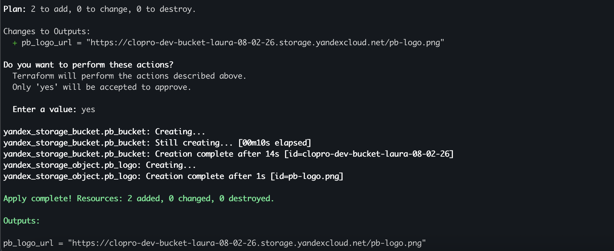

#### Бакет clopro-dev-bucket-laura-08-02-26 содержит файл pb-logo.png (276 КБ), загруженный сервисным аккаунтом clopro-bucket-sa

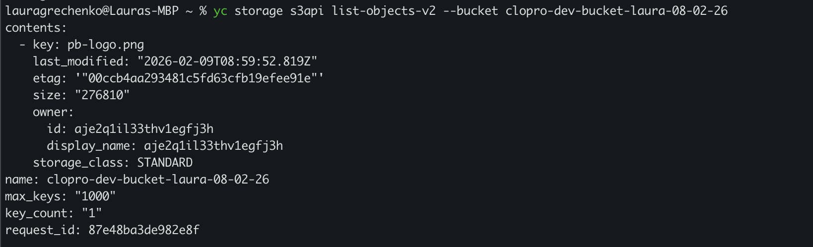

#### Сервисный аккаунт clopro-bucket-sa (aje2q1il33thv1egfj3h) создан для работы с Object Storage. Access bindings: Сервисному аккаунту назначена роль storage.editor

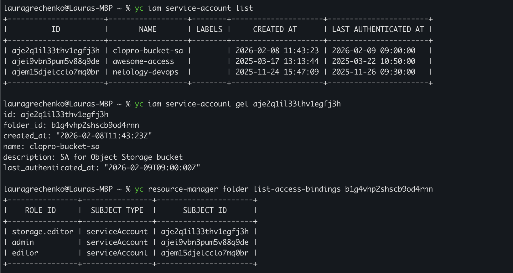

#### Файл доступен из интернета по публичной ссылке. Ответ HTTP 200, content-type: image/png - файл корректно отдаётся как изображение

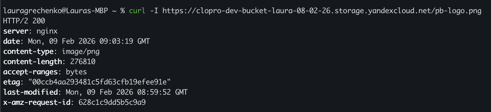
 
2. Создать группу ВМ в public подсети фиксированного размера с шаблоном LAMP и веб-страницей, содержащей ссылку на картинку из бакета:

 - Создать Instance Group с тремя ВМ и шаблоном LAMP. Для LAMP рекомендуется использовать `image_id = fd827b91d99psvq5fjit`.
 - Для создания стартовой веб-страницы рекомендуется использовать раздел `user_data` в [meta_data](https://cloud.yandex.ru/docs/compute/concepts/vm-metadata).
 - Разместить в стартовой веб-странице шаблонной ВМ ссылку на картинку из бакета.
 - Настроить проверку состояния ВМ.
 
3. Подключить группу к сетевому балансировщику:

 - Создать сетевой балансировщик.
 - Проверить работоспособность, удалив одну или несколько ВМ.

### Задания 2-3: Instance Group + NLB
#### Выполнили код Terraform:

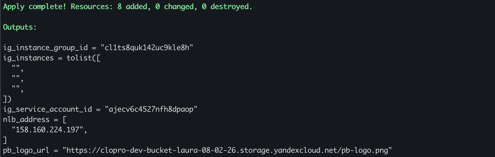

#### Сервисный аккаунт clopro-dev-ig-sa создан для управления Instance Group. 
В access bindings каталога ему назначена роль editor, необходимая для создания и управления ВМ в группе.

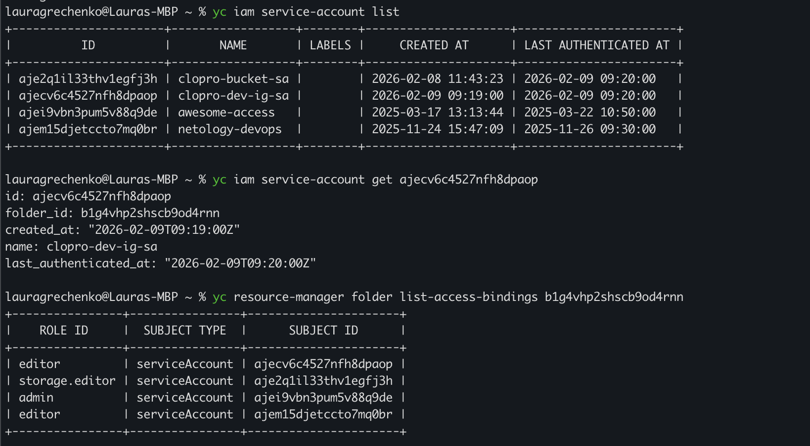

#### Instance Group clopro-dev-pb-vms-group - 3 ВМ (LAMP-образ). 
- Настроена проверка состояния (HTTP GET / на порту 80). 
- Target group clopro-dev-tg создана автоматически для NLB. 
- Группе назначен сервисный аккаунт clopro-dev-ig-sa
- deploy_policy.strategy: PROACTIVE - стратегия проактивной замены: нездоровые ВМ автоматически пересоздаются без ожидания ручного вмешательства. max_unavailable: 2, max_expansion: 2 - при обновлении допускается одновременно 2 недоступных и 2 дополнительных ВМ сверх целевого размера

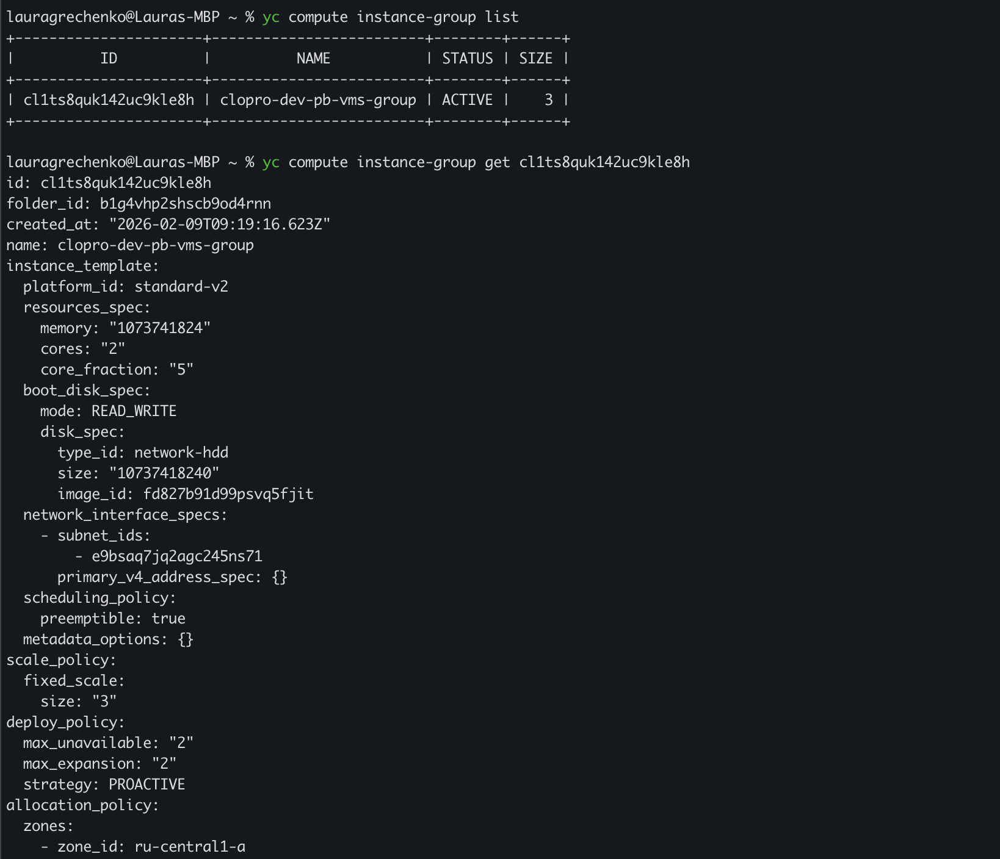

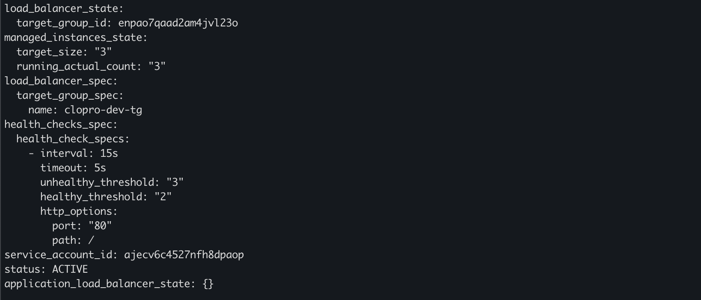

#### Target group clopro-dev-tg - создана автоматически Instance Group. 
Содержит 3 таргета с внутренними адресами (192.168.10.28, .31, .34) в подсети e9bsaq7jq2agc245ns71

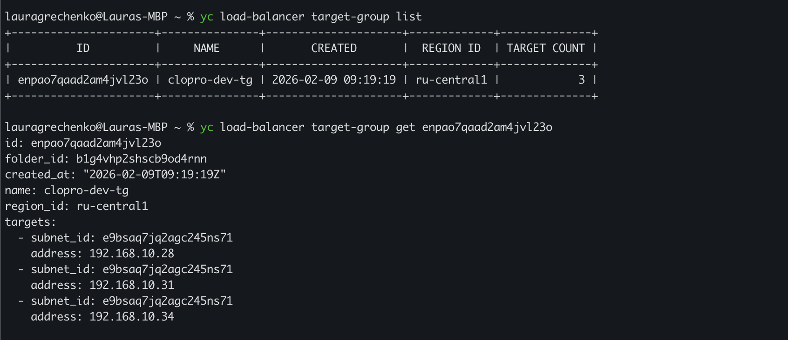

#### NLB clopro-dev-nlb - сетевой балансировщик (L4, TCP) 
- с внешним адресом 158.160.224.197:80. 
- Подключена target group enpao7qaad2am4jvl23o. 
- NLB проверяет доступность бэкендов (HTTP GET / на порту 80, интервал 2s).

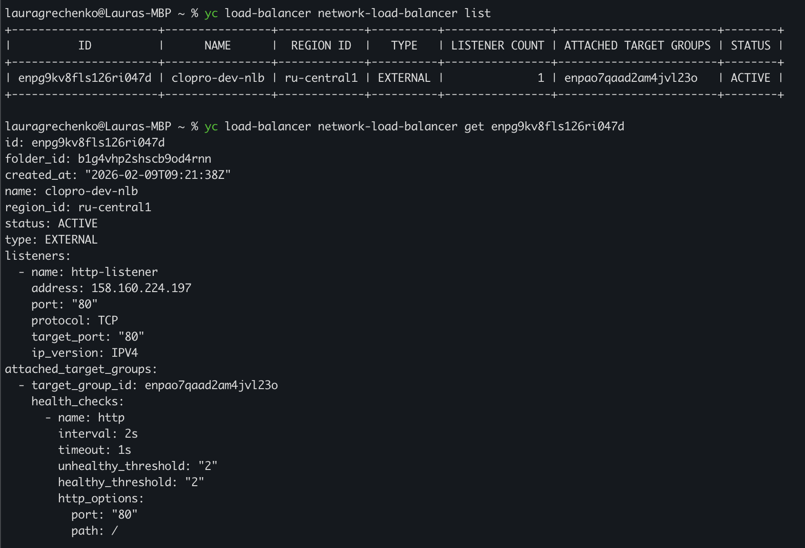

### Тестирование доступа через NLB:
Веб-страница доступна по внешнему адресу NLB `http://158.160.224.197`. Картинка загружается из Object Storage бакета:

#### Тестирование отказоустойчивости
- удалили ВМ fhmd60rh88pd4gup42nj. 
- Instance Group автоматически начала пересоздание (статус CREATING_INSTANCE). 
- Веб-страница по-прежнему доступна через NLB - трафик обслуживается оставшимися 2 ВМ. Картинка из Object Storage загружается корректно.

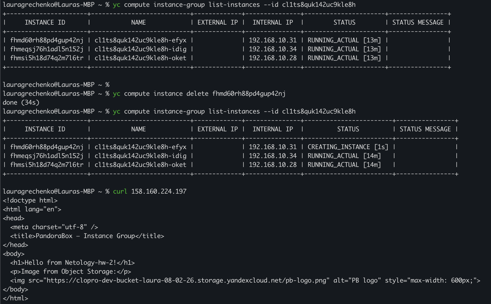
 

4. (дополнительно)* Создать Application Load Balancer с использованием Instance group и проверкой состояния.

### Выполнили код Terraform:

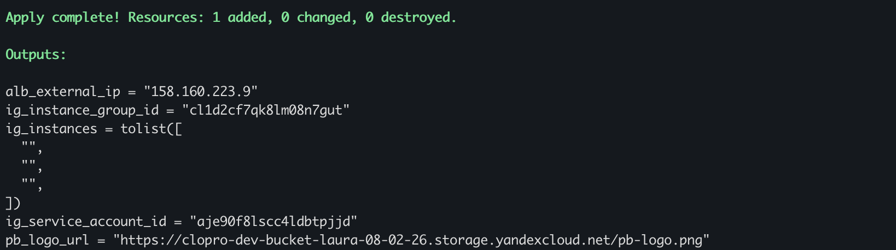

### Проверили созданные ресурсы:

#### ALB с внешним адресом `158.160.223.9`, принимающий трафик на порту `80` и направляющий его через HTTP-router `ds78io0i4tm1f3jk2ef6`

#### HTTP-router (`ds78io0i4tm1f3jk2ef6`) с привязанным virtual host `clopro-dev-virtual-host`

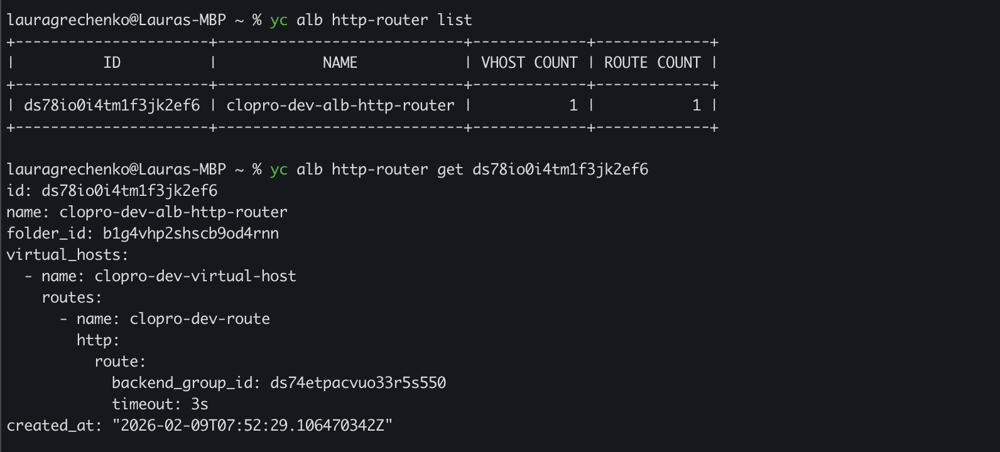

#### Virtual host с маршрутом `clopro-dev-route`, направляющим трафик в backend group `ds74etpacvuo33r5s550`

#### Backend group с HTTP-бэкендом на порту 80, привязанным к target group `ds7e5jtbtf6grhalga35` (healthcheck: HTTP GET / каждую 1s)

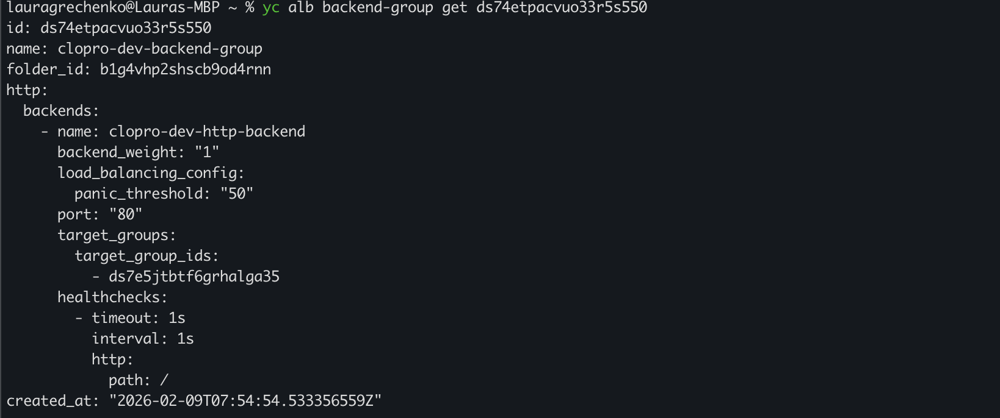

#### Target group (создана автоматически instance group) с 3 таргетами:

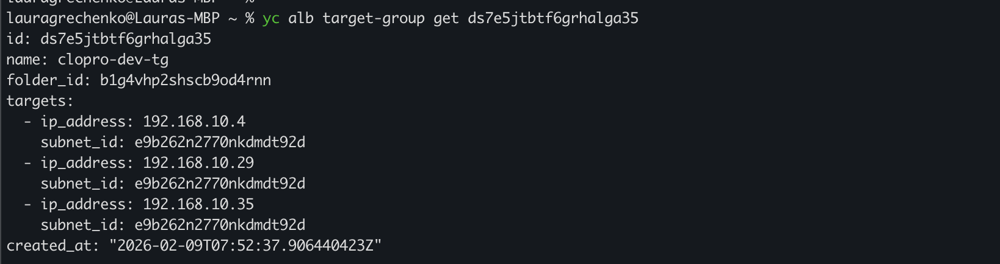

#### Instance group - 3 ВМ запущены и работают:

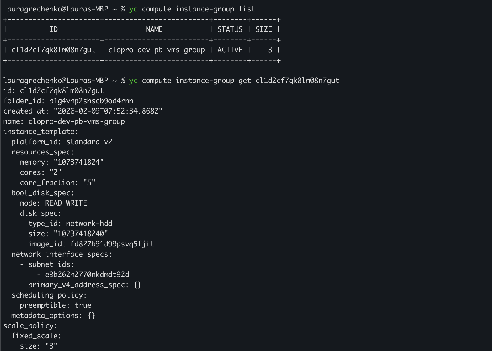

- application_load_balancer_state.target_group_id: ds7e5jtbtf6grhalga35 - target group автоматически создана instance group и совпадает с той, что указана в backend group.

- managed_instances_state.running_actual_count: "3" - все 3 ВМ запущены и работают.

- deploy_policy.strategy: PROACTIVE - стратегия проактивной замены: нездоровые ВМ заменяются автоматически без ожидания триггера деплоя.

- load_balancer_state: {} - пустой, т.к. используется ALB, а не NLB.

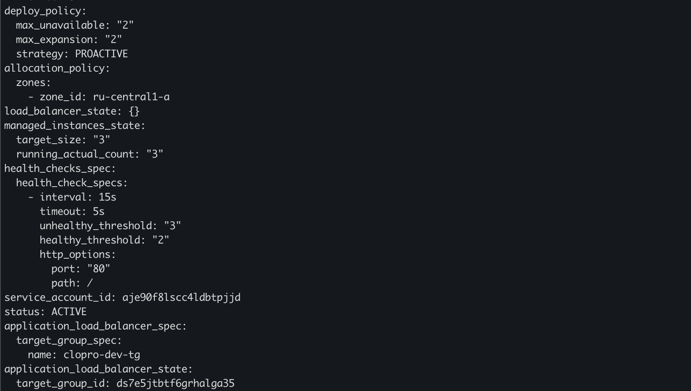

### Тестирование доступа через ALB:
Веб-страница доступна по внешнему адресу ALB `http://158.160.223.9`. Картинка загружается из Object Storage бакета:

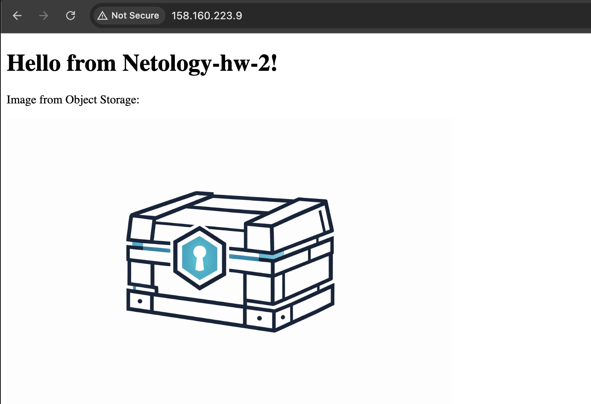

Полезные документы:

- [Compute instance group](https://registry.terraform.io/providers/yandex-cloud/yandex/latest/docs/resources/compute_instance_group).
- [Network Load Balancer](https://registry.terraform.io/providers/yandex-cloud/yandex/latest/docs/resources/lb_network_load_balancer).
- [Группа ВМ с сетевым балансировщиком](https://cloud.yandex.ru/docs/compute/operations/instance-groups/create-with-balancer).

---
## Задание 2*. AWS (задание со звёздочкой)

Это необязательное задание. Его выполнение не влияет на получение зачёта по домашней работе.

**Что нужно сделать**

Используя конфигурации, выполненные в домашнем задании из предыдущего занятия, добавить к Production like сети Autoscaling group из трёх EC2-инстансов с  автоматической установкой веб-сервера в private домен.

1. Создать бакет S3 и разместить в нём файл с картинкой:

 - Создать бакет в S3 с произвольным именем (например, _имя_студента_дата_).
 - Положить в бакет файл с картинкой.
 - Сделать доступным из интернета.

#### Выполнили код Terraform:

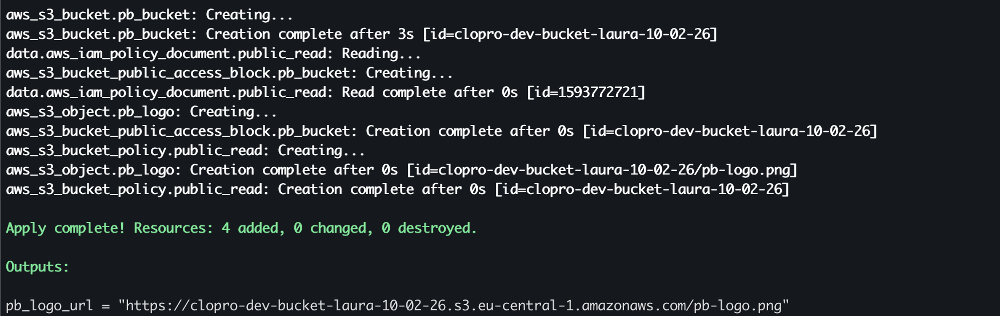

#### Файл доступен из интернета по публичной ссылке. Ответ HTTP 200, content-type: image/png - файл корректно отдаётся как изображение

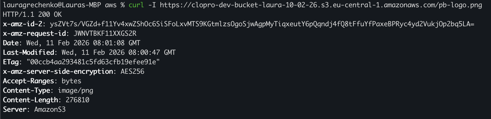

#### Бакет clopro-dev-bucket-laura-10-02-26 содержит файл pb-logo.png

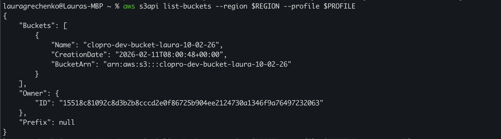

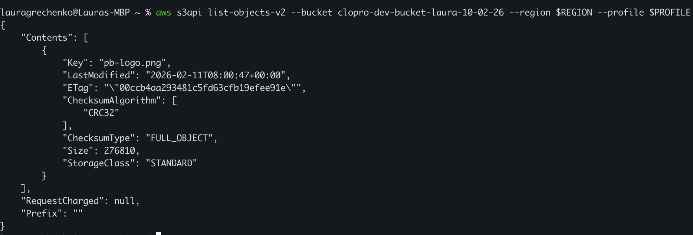

#### Bucket Policy: разрешает публичный доступ (s3:GetObject) к файлу pb-logo.png для любого пользователя (Principal: *).

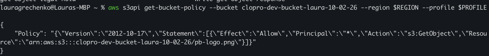

#### Public Access Block полностью отключен (все параметры False), что позволяет bucket policy работать

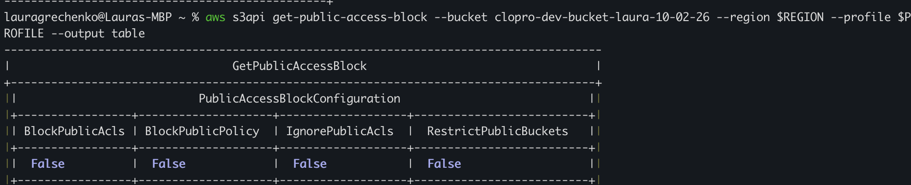

2. Сделать Launch configurations с использованием bootstrap-скрипта с созданием веб-страницы, на которой будет ссылка на картинку в S3. 
3. Загрузить три ЕС2-инстанса и настроить LB с помощью Autoscaling Group.

### Network LB
#### Выполнили код Terraform:

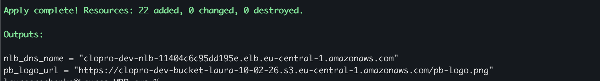

#### Тестирование доступа через NLB:
Веб-страница доступна по адресу NLB `clopro-dev-nlb-11404c6c95dd195e.elb.eu-central-1.amazonaws.com`. Картинка загружается из Object Storage бакета:

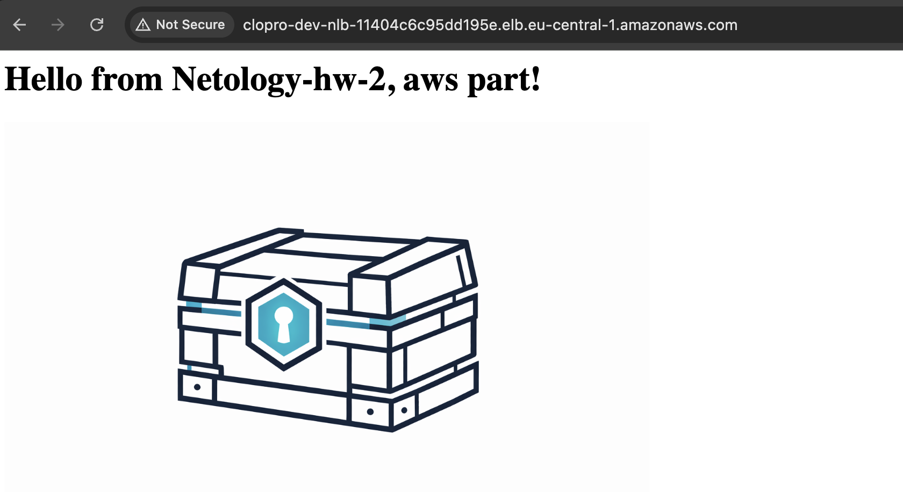

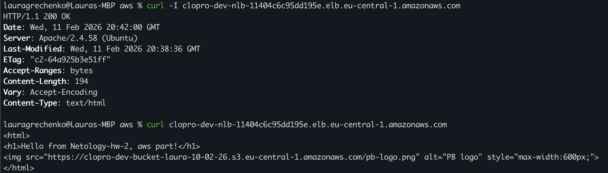

### Проверили созданные ресурсы:

#### VPC `clopro-dev-vpc` создан с CIDR-блоком `10.10.0.0/16`

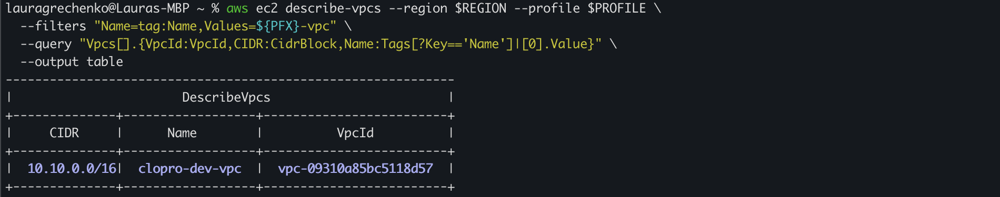

#### Subnets:
- **Public subnet** `10.10.1.0/24` (AZ: eu-central-1a) - `MapPublicIP: True`
- **Private subnet** `10.10.2.0/24` (AZ: eu-central-1a) - `MapPublicIP: False`

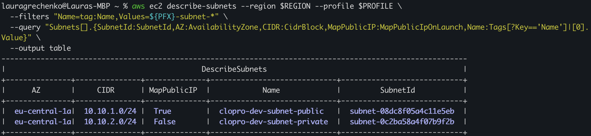

#### Internet Gateway `clopro-dev-igw` подключен к VPC (State: available)

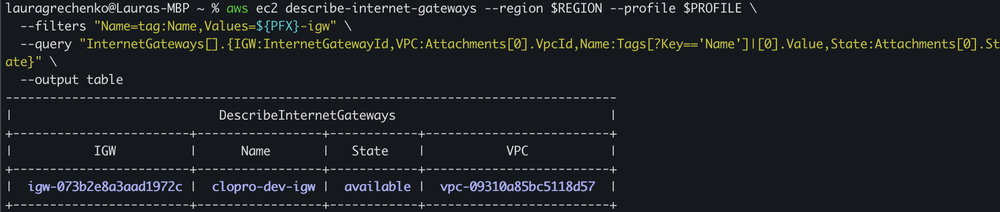

#### NAT Gateway (State: available)
- Расположен в public subnet, Elastic IP: `3.73.176.79`
- Предоставляет исходящий доступ в интернет для инстансов в private subnet

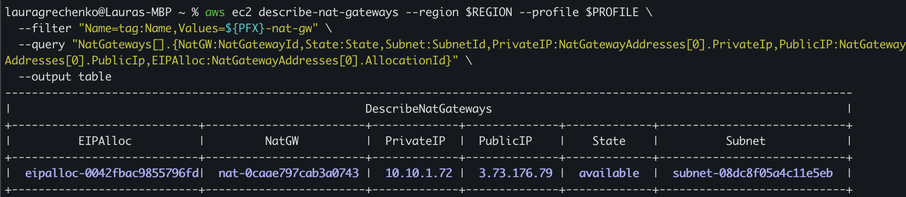

#### Route Tables (таблицы маршрутизации):
- **Public RT** `clopro-dev-public-rt`: ассоциирована с public subnet, маршрут `0.0.0.0/0 → IGW` (прямой выход в интернет)
- **Private RT** `clopro-dev-private-rt`: ассоциирована с private subnet, маршрут `0.0.0.0/0 → NAT Gateway` (выход через NAT, только исходящий трафик)

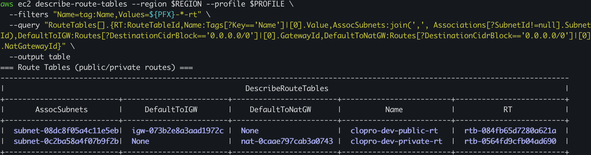

#### Security Group `clopro-dev-web-sg`
- **Ingress**: TCP порт 80 из `0.0.0.0/0` — HTTP-трафик от NLB (NLB не использует собственную SG)
- **Egress**: разрешён весь исходящий трафик — для установки пакетов через NAT Gateway

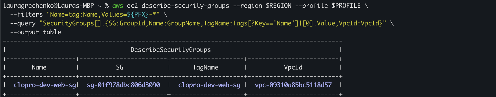

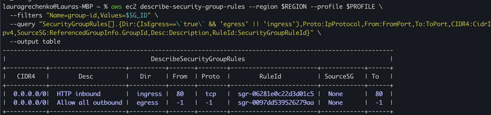

#### Launch Template `clopro-dev-web-*` (версия 1)
- AMI: Ubuntu 24.04 LTS (автоматический поиск последней версии)
- Instance type: t3.micro
- EBS: gp3, 10 GB, `/dev/sda1`
- User data: cloud-init скрипт для установки Apache и создания index.html с картинкой из S3

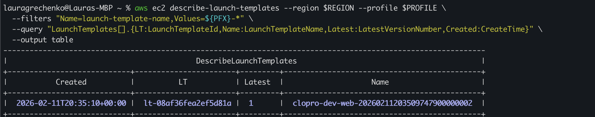

#### Auto Scaling Group `clopro-dev-web-asg`
- **Размер**: Desired/Min/Max = 3 (фиксированный размер)
- **Subnet**: private subnet (инстансы без публичных IP)
- ASG автоматически регистрирует инстансы в Target Group NLB

#### EC2 инстансы (3 шт., управляемые ASG)
- t3.micro, running, private subnet (AZ: eu-central-1a)
- Без публичных IP — доступны только через NLB

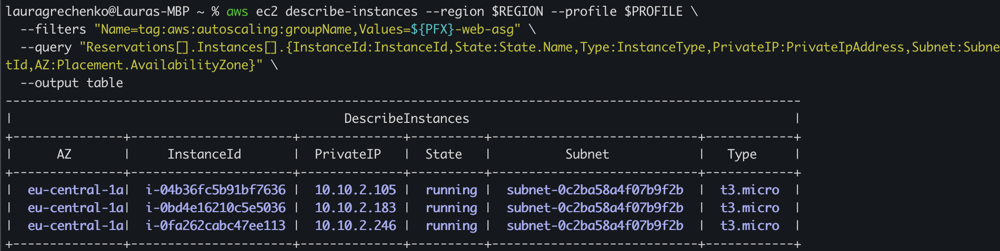

#### Target Group `clopro-dev-tg`
- **Protocol**: TCP, **Port**: 80
- Healthcheck (TCP), 3 таргета healthy

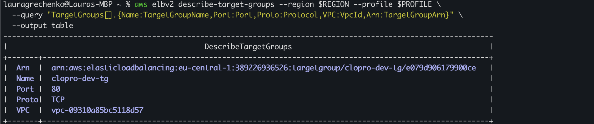

#### Network Load Balancer `clopro-dev-nlb`
- **Type**: network (L4, TCP)
- **Scheme**: internet-facing (публичный, доступен из интернета)
- **DNS**: `clopro-dev-nlb-11404c6c95dd195e.elb.eu-central-1.amazonaws.com`
- **State**: active
- **Listener**: TCP порт 80 → Target Group `clopro-dev-tg`
- NLB распределяет входящий HTTP-трафик между 3 инстансами в private subnet

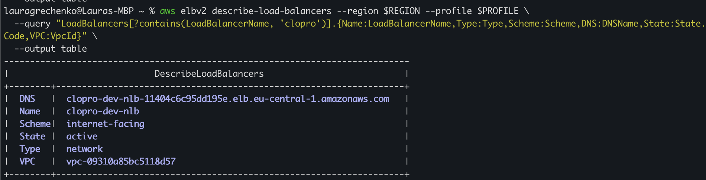

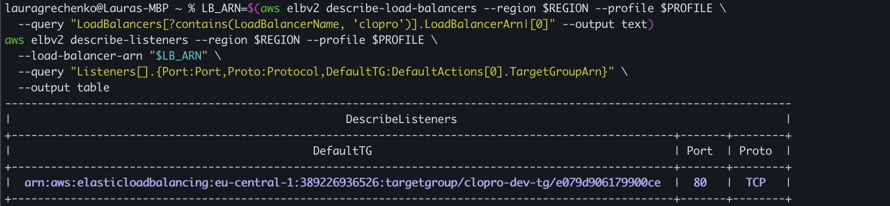

### Application LB
#### Выполнили код Terraform:

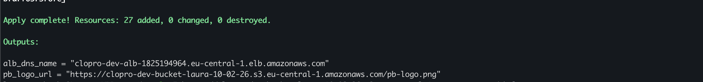

#### Тестирование доступа через ALB:
Веб-страница доступна по адресу ALB `clopro-dev-alb-1825194964.eu-central-1.elb.amazonaws.com`. Картинка загружается из Object Storage бакета:

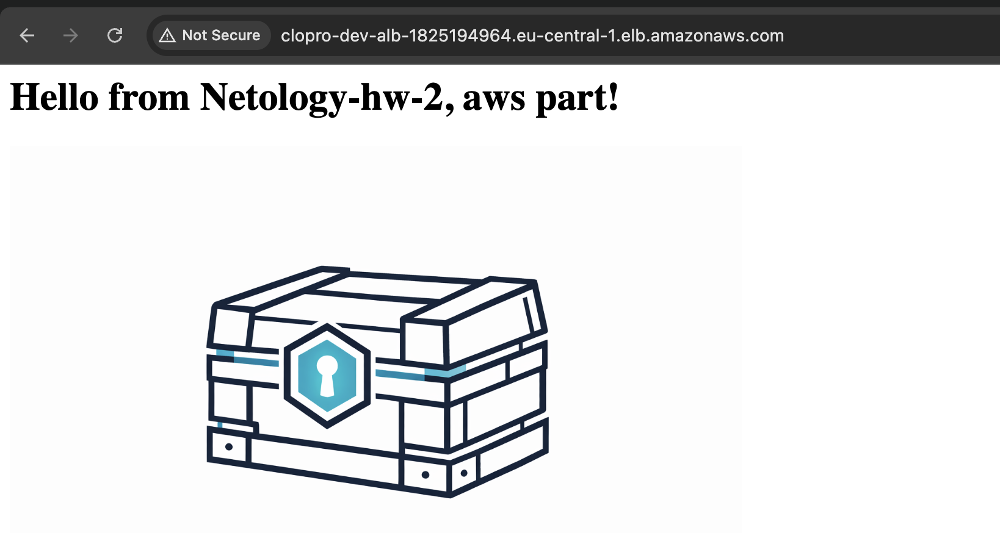

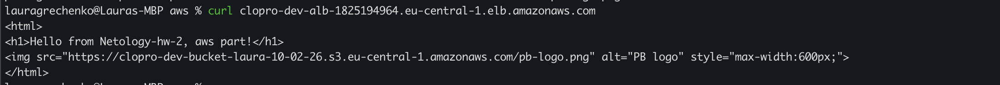

### Проверили созданные ресурсы:

#### VPC `clopro-dev-vpc` создан с CIDR-блоком `10.10.0.0/16`

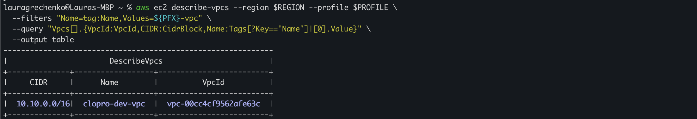

#### Subnets:
- **Public subnet** `10.10.1.0/24` (AZ: eu-central-1a) - `MapPublicIP: True`
- **Public subnet 2** `10.10.3.0/24` (AZ: eu-central-1b) - `MapPublicIP: True` (добавлена для ALB — требует минимум 2 AZ)
- **Private subnet** `10.10.2.0/24` (AZ: eu-central-1a) - `MapPublicIP: False`

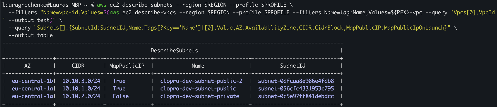

#### Internet Gateway `clopro-dev-igw` подключен к VPC (State: available)

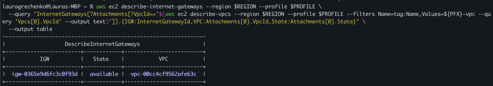

#### NAT Gateway `nat-06d5a13a670521c41` (State: available)
- **Public subnet**: `subnet-056cfc4331953c795`
- **Elastic IP**: `3.79.79.125`
- **Private IP**: `10.10.1.54`
- Предоставляет исходящий доступ в интернет для инстансов в private subnet

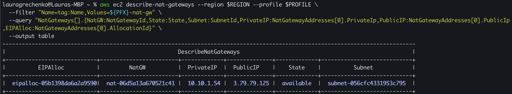

#### Route Tables (таблицы маршрутизации):
- **Public RT** `clopro-dev-public-rt`: ассоциирована с обоими public subnets, маршрут `0.0.0.0/0 → IGW` (прямой выход в интернет)
- **Private RT** `clopro-dev-private-rt`: ассоциирована с private subnet, маршрут `0.0.0.0/0 → NAT Gateway` (выход через NAT, только исходящий трафик)

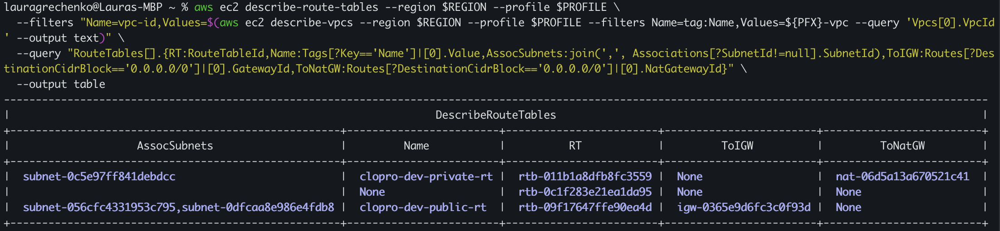

#### Security Groups:
- **`clopro-dev-web-sg`** — SG для EC2 инстансов
- **`clopro-dev-alb-sg`** — SG для ALB

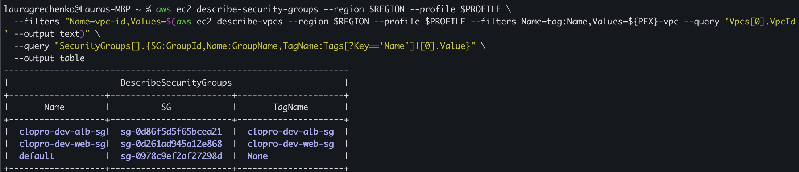

#### Security-group rules:

**ALB SG** (`clopro-dev-alb-sg`):
- **Ingress**: TCP порт 80 из `0.0.0.0/0` — принимает HTTP-трафик из интернета
- **Egress**: разрешён весь исходящий трафик

**Web SG** (`clopro-dev-web-sg`):
- **Ingress**: TCP порт 80 из `0.0.0.0/0` — HTTP-трафик от ALB
- **Egress**: разрешён весь исходящий трафик (`-1` = all protocols, all ports) — необходимо для установки пакетов (`apt install apache2`) через NAT Gateway

#### Auto Scaling Group `clopro-dev-web-asg`
- **Размер**: Desired/Min/Max = 3 (фиксированный размер)
- **Subnet**: `subnet-0c5e97ff841debdcc` (private subnet — инстансы без публичных IP)
- **Health check**: EC2 (проверка доступности инстанса), grace period 300s
- ASG автоматически регистрирует инстансы в Target Group ALB

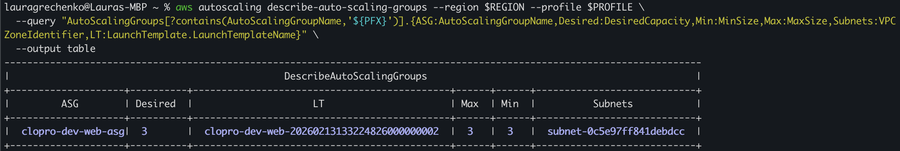

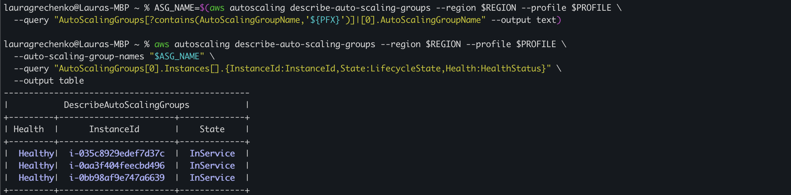

#### Target Group `clopro-dev-tg`
- **Protocol**: HTTP, **Port**: 80
- **VPC**: `vpc-00cc4cf9562afe63c`
- Все 3 таргета в состоянии **healthy**

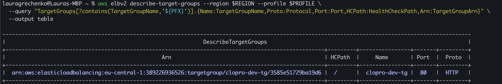

#### Application Load Balancer `clopro-dev-alb`
- **Type**: application (L7, HTTP)
- **Scheme**: internet-facing (публичный, доступен из интернета)
- **DNS**: `clopro-dev-alb-1825194964.eu-central-1.elb.amazonaws.com`
- **State**: active
- **Subnets**: 2 public subnets в разных AZ (eu-central-1a, eu-central-1b) — требование ALB для высокой доступности
- **Security Group**: `clopro-dev-alb-sg`
- ALB распределяет входящий HTTP-трафик между 3 инстансами в private subnet

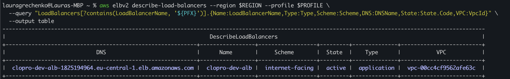

- **Listener**: HTTP порт 80 → Target Group `clopro-dev-tg`

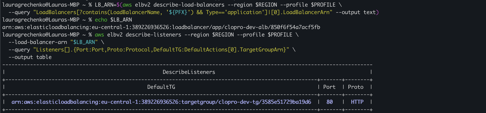

### Правила приёма работы

Домашняя работа оформляется в своём Git репозитории в файле README.md. Выполненное домашнее задание пришлите ссылкой на .md-файл в вашем репозитории.
Файл README.md должен содержать скриншоты вывода необходимых команд, а также скриншоты результатов.
Репозиторий должен содержать тексты манифестов или ссылки на них в файле README.md.
