# Домашнее задание к занятию «Безопасность в облачных провайдерах»  

Используя конфигурации, выполненные в рамках предыдущих домашних заданий, нужно добавить возможность шифрования бакета.

- Terraform манифесты YC (задание 1): [src/yc/](src/yc/)
- Terraform манифесты YC (задание 2 - статический сайт): [src/yc-2/](src/yc-2/)
- Terraform манифесты AWS: [src/aws/](src/aws/)

---
## Задание 1. Yandex Cloud   

1. С помощью ключа в KMS необходимо зашифровать содержимое бакета:

 - создать ключ в KMS;
 - с помощью ключа зашифровать содержимое бакета, созданного ранее.

#### Выполнили код Terraform:
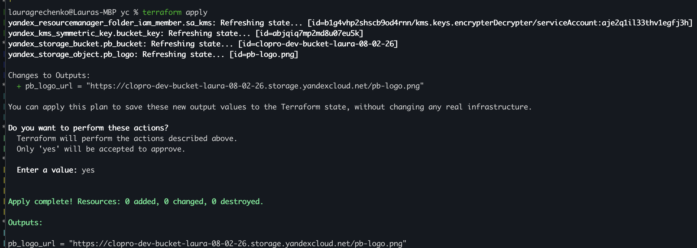

Сервисному аккаунту clopro-bucket-sa `aje2q1il33thv1egfj3h` дополнительно назначена роль `kms.keys.encrypterDecrypter` - разрешает шифрование и расшифровку объектов с помощью KMS-ключа

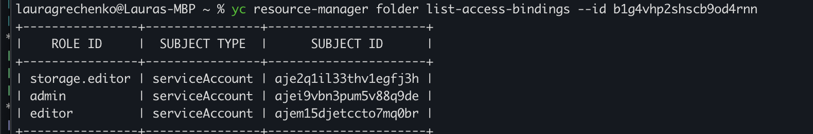

KMS ключ clopro-dev-bucket-key `abjqiq7mp2md8u07eu5k, алгоритм: AES_256, статус: ACTIVE, период ротации: 1 год

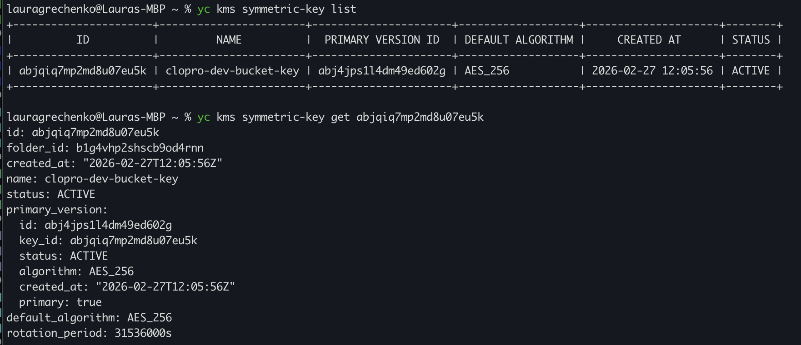

Бакет clopro-dev-bucket-laura-08-02-26 содержит файл pb-logo.png

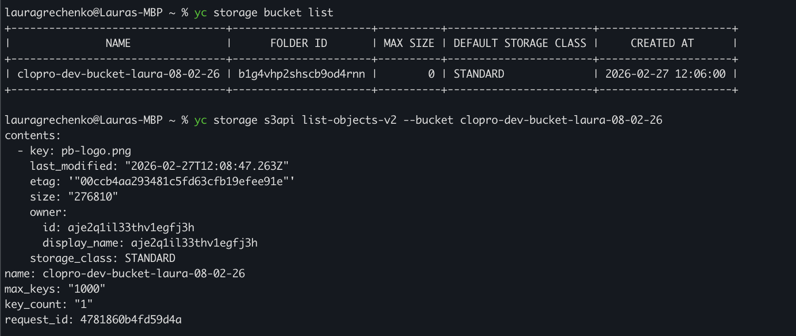

Публичный доступ по прямой ссылке заблокирован (AccessDenied)

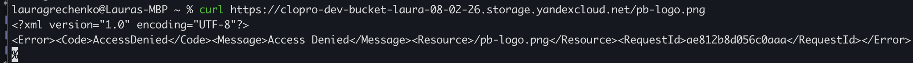

Скачивание через авторизованный запрос (yc storage s3api get-object) работает - файл расшифрован и совпадает по размеру
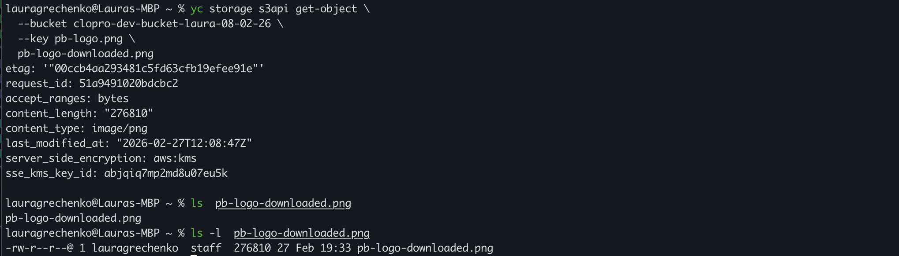

2. (Выполняется не в Terraform)* Создать статический сайт в Object Storage c собственным публичным адресом и сделать доступным по HTTPS:

 - создать сертификат;
 - создать статическую страницу в Object Storage и применить сертификат HTTPS;
 - в качестве результата предоставить скриншот на страницу с сертификатом в заголовке (замочек).

 #### Выполнили код Terraform:

Terraform создаёт: бакет www.openjar.xyz с публичным доступом, объекты index.html и pb-logo.png, managed-сертификат Let's Encrypt в Certificate Manager

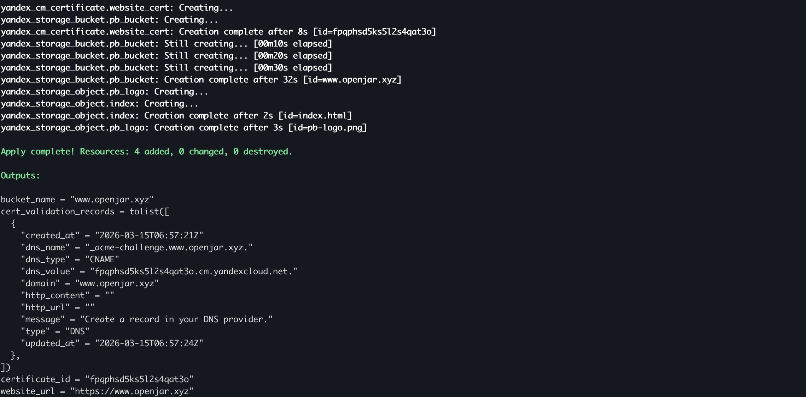

DNS-записи добавлены вручную у регистратора домена:

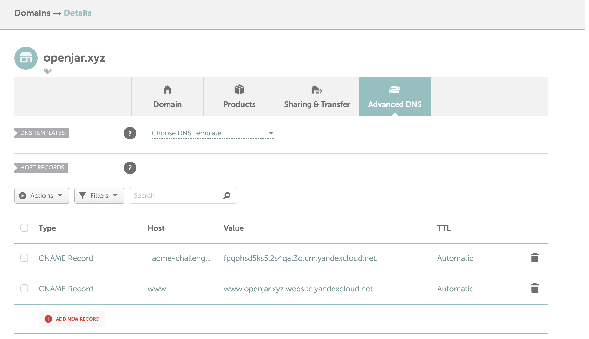

Сертификат clopro-dev-website-cert: тип MANAGED, статус ISSUED, издатель Let's Encrypt, домен www.openjar.xyz:

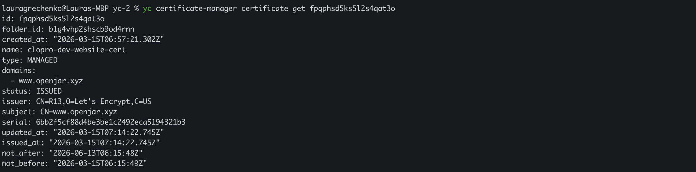

Проверка содержимого сайта:

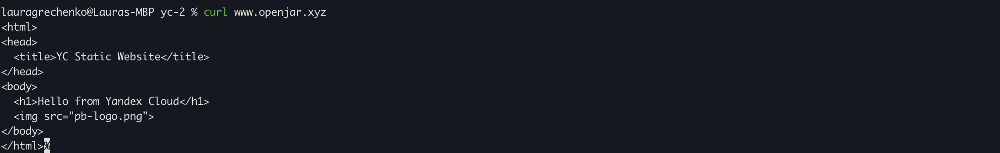

Привязка сертификата к бакету: 

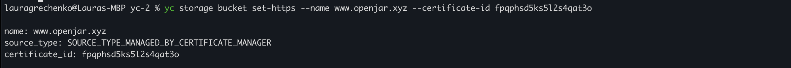

#### Результат выполнения

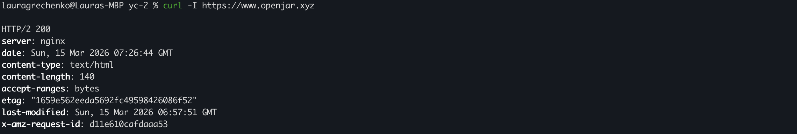

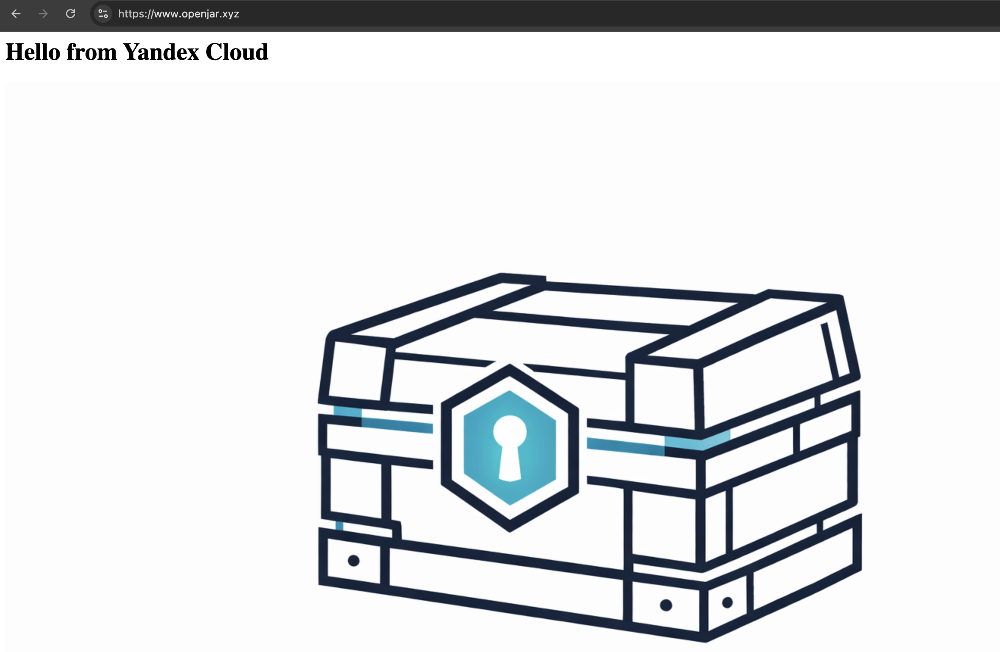

--- 
## Задание 2*. AWS (задание со звёздочкой)

Это необязательное задание. Его выполнение не влияет на получение зачёта по домашней работе.

**Что нужно сделать**

1. С помощью роли IAM записать файлы ЕС2 в S3-бакет:
 - создать роль в IAM для возможности записи в S3 бакет;
 - применить роль к ЕС2-инстансу;
 - с помощью bootstrap-скрипта записать в бакет файл веб-страницы.
2. Организация шифрования содержимого S3-бакета:

 - используя конфигурации, выполненные в домашнем задании из предыдущего занятия, добавить к созданному ранее бакету S3 возможность шифрования Server-Side, используя общий ключ;
 - включить шифрование SSE-S3 бакету S3 для шифрования всех вновь добавляемых объектов в этот бакет.

3. *Создание сертификата SSL и применение его к ALB:

 - создать сертификат с подтверждением по email;
 - сделать запись в Route53 на собственный поддомен, указав адрес LB;
 - применить к HTTPS-запросам на LB созданный ранее сертификат.

*Примечание: сертификат создан с валидацией через DNS (а не email), так как DNS-валидация полностью автоматизируется в Terraform через Route53.*

#### Выполнили код Terraform:

Terraform output:

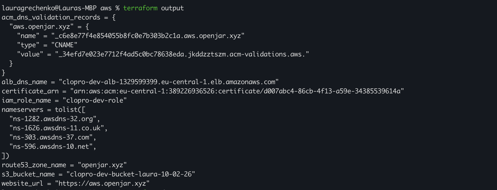

#### Задание 1. IAM роль + EC2 → S3

S3-бакет clopro-dev-bucket-laura-10-02-26 содержит index.html (загружен EC2 через IAM роль при bootstrap) и pb-logo.png (загружен Terraform)

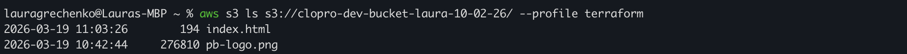

#### Задание 2. Шифрование S3-бакета

SSE-S3 шифрование включено: алгоритм AES256 (общий ключ AWS)

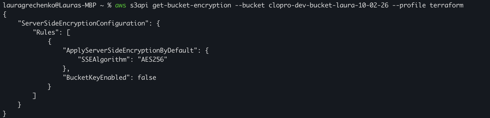

#### Задание 3. SSL сертификат + Route53 + HTTPS на ALB

Делегирование домена openjar.xyz на AWS Route53 - Custom DNS с 4 NS-серверами в Namecheap

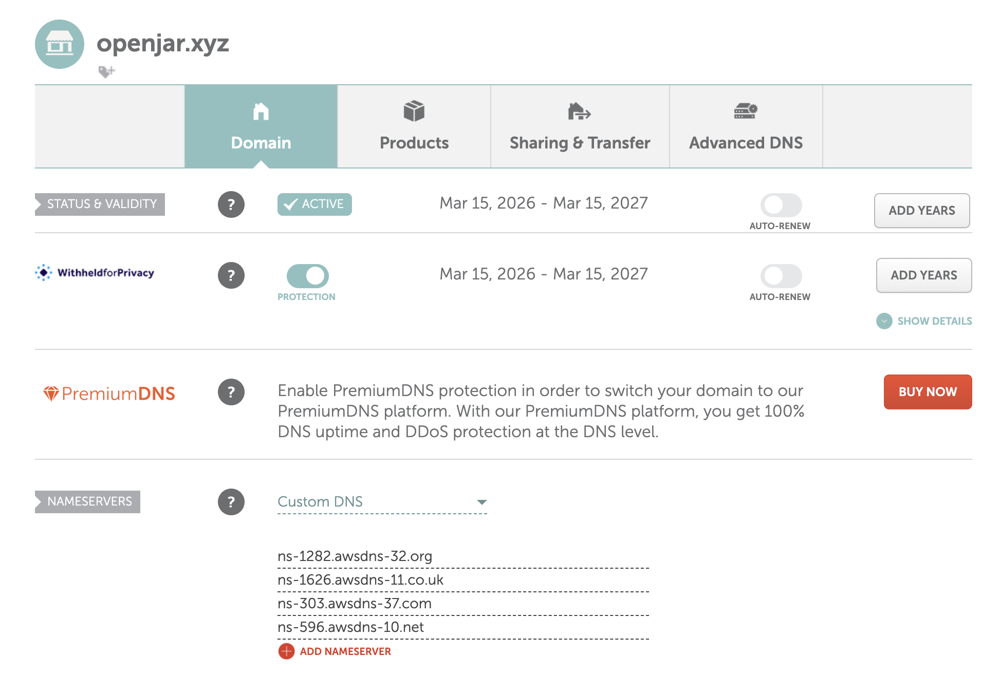

Route53 hosted zone openjar.xyz: публичная зона, 4 записи (NS, SOA, A-alias на ALB, CNAME для валидации ACM)

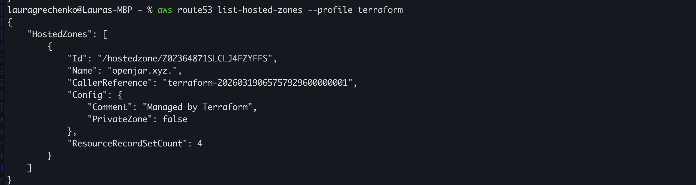

DNS записи в зоне openjar.xyz:
- **NS** (Name Server) - 4 сервера AWS (ns-xxx.awsdns-xx.com/net/org/co.uk), которым делегировано управление доменом. Именно их мы указали в Namecheap как Custom DNS.
- **SOA** (Start of Authority) - служебная запись: главный DNS-сервер зоны, параметры кэширования и синхронизации. Создаётся автоматически при создании зоны.
- **A (alias)** - aws.openjar.xyz → ALB DNS name. Направляет браузер на Application Load Balancer. Alias - специальный тип записи AWS, работает как CNAME, но поддерживает корневые домены и не тарифицируется.
- **CNAME** - _c6e8e77...aws.openjar.xyz → ...acm-validations.aws. Запись для DNS-валидации ACM-сертификата. ACM периодически проверяет её наличие - если удалить, автопродление сертификата перестанет работать.

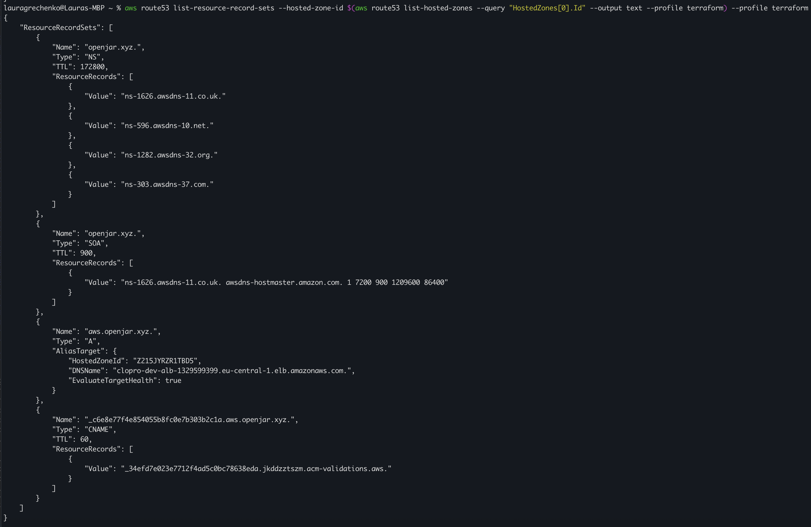

ACM сертификат для aws.openjar.xyz: статус ISSUED, издатель Amazon, действителен до 2026-10-03

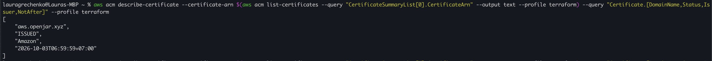

ALB listeners: HTTP (:80) и HTTPS (:443) с SSL-сертификатом ACM и политикой ELBSecurityPolicy-2016-08

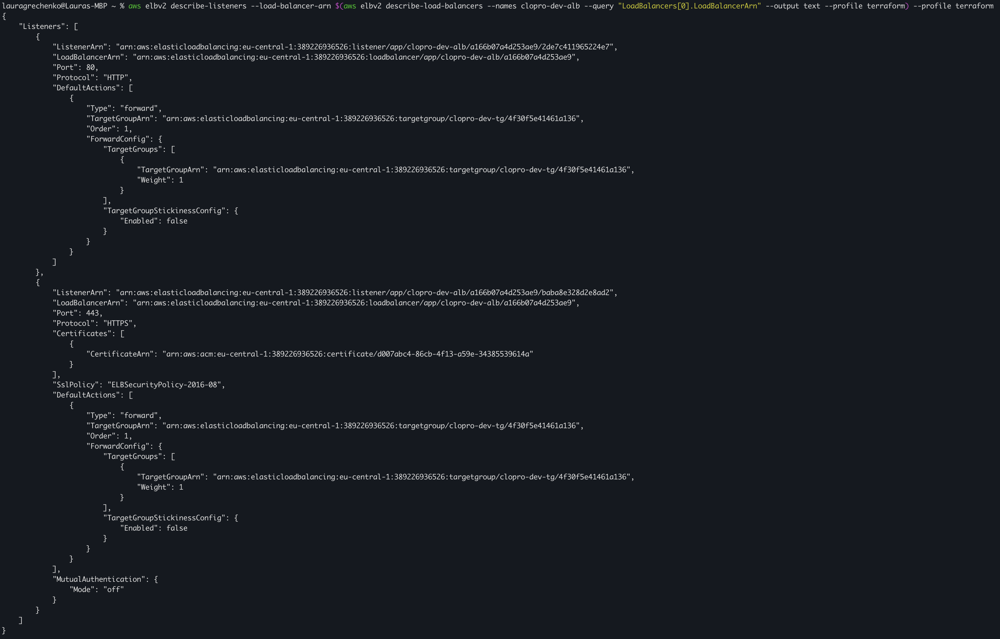

#### Результат выполнения

Сайт доступен по https://aws.openjar.xyz с валидным SSL-сертификатом

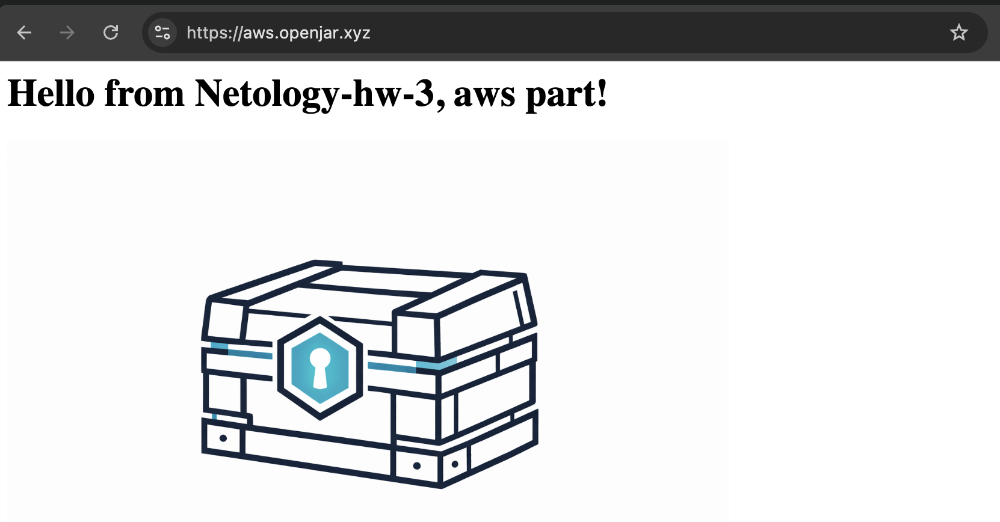

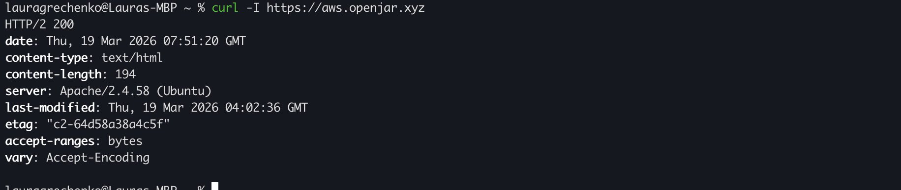

### Правила приёма работы

Домашняя работа оформляется в своём Git репозитории в файле README.md. Выполненное домашнее задание пришлите ссылкой на .md-файл в вашем репозитории.
Файл README.md должен содержать скриншоты вывода необходимых команд, а также скриншоты результатов.
Репозиторий должен содержать тексты манифестов или ссылки на них в файле README.md.
