# Домашнее задание к занятию «Кластеры. Ресурсы под управлением облачных провайдеров»

### Цели задания 

1. Организация кластера Kubernetes и кластера баз данных MySQL в отказоустойчивой архитектуре.
2. Размещение в private подсетях кластера БД, а в public — кластера Kubernetes.

- Terraform манифесты YC: [src/yc/](src/yc/)
- Terraform манифесты AWS: [src/aws/](src/aws/)

---
## Задание 1. Yandex Cloud

1. Настроить с помощью Terraform кластер баз данных MySQL.

 - Используя настройки VPC из предыдущих домашних заданий, добавить дополнительно подсеть private в разных зонах, чтобы обеспечить отказоустойчивость.
 - Разместить ноды кластера MySQL в разных подсетях.
 - Необходимо предусмотреть репликацию с произвольным временем технического обслуживания.
 - Использовать окружение Prestable, платформу Intel Broadwell с производительностью 50% CPU и размером диска 20 Гб.
 - Задать время начала резервного копирования — 23:59.
 - Включить защиту кластера от непреднамеренного удаления.
 - Создать БД с именем `netology_db`, логином и паролем.

#### Выполнение

MySQL кластер clopro-dev-mysql-cluster: хосты в разных зонах (MASTER в ru-central1-a, REPLICA в ru-central1-b), окружение PRESTABLE, b1.medium (50% CPU), диск 20 Гб. Бэкап: 23:59 UTC

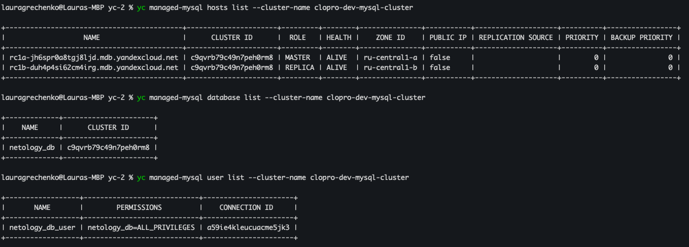

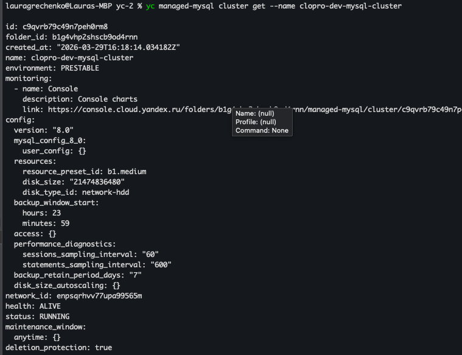

---

2. Настроить с помощью Terraform кластер Kubernetes.

 - Используя настройки VPC из предыдущих домашних заданий, добавить дополнительно две подсети public в разных зонах, чтобы обеспечить отказоустойчивость.
 - Создать отдельный сервис-аккаунт с необходимыми правами.
 - Создать региональный мастер Kubernetes с размещением нод в трёх разных подсетях.
 - Добавить возможность шифрования ключом из KMS, созданным в предыдущем домашнем задании.
 - Создать группу узлов, состояющую из трёх машин с автомасштабированием до шести.
 - Подключиться к кластеру с помощью `kubectl`.
 - *Запустить микросервис phpmyadmin и подключиться к ранее созданной БД.
 - *Создать сервис-типы Load Balancer и подключиться к phpmyadmin. Предоставить скриншот с публичным адресом и подключением к БД.

#### Выполнение

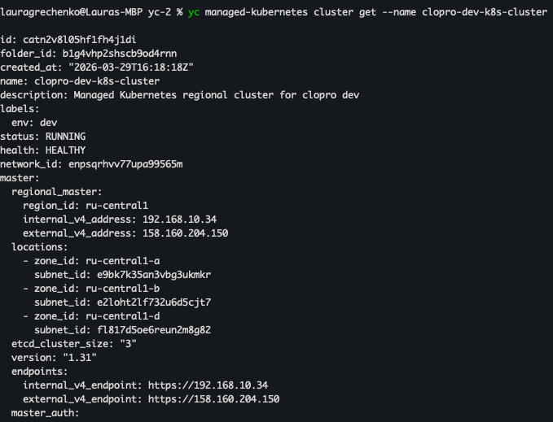

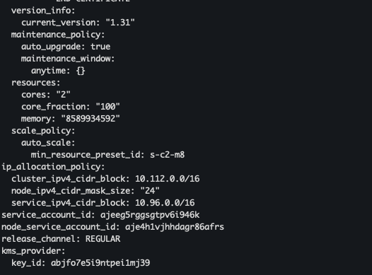

IAM: сервис-аккаунт clopro-dev-k8s-cluster-sa с ролями k8s.clusters.agent, vpc.publicAdmin, load-balancer.admin

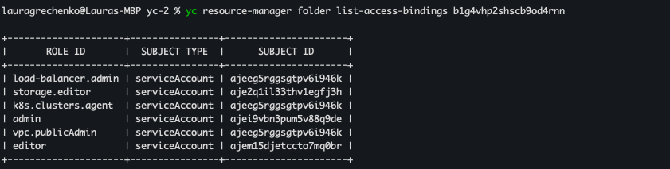

Группа узлов clopro-dev-k8s-node-group: статус RUNNING, автомасштабирование (3-6 нод)

> Примечание: нодам назначены публичные IP (nat = true), чтобы они могли загружать Docker-образы из Docker Hub (phpMyAdmin). В продакшене правильнее настроить NAT Gateway для private подсети, но пересоздание и тестирование инфраструктуры дорого по ресурсам и времени

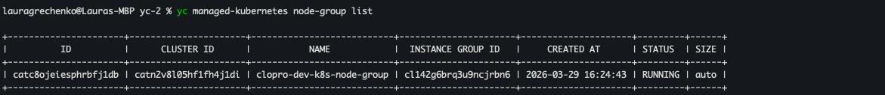

3 ноды Ready, pod phpmyadmin Running

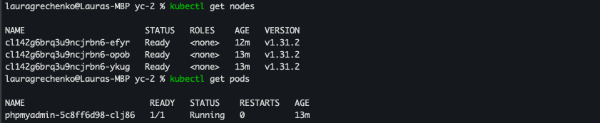

Service типа LoadBalancer с публичным IP 158.160.215.100

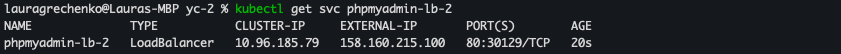

*phpMyAdmin доступен по публичному IP, подключён к netology_db

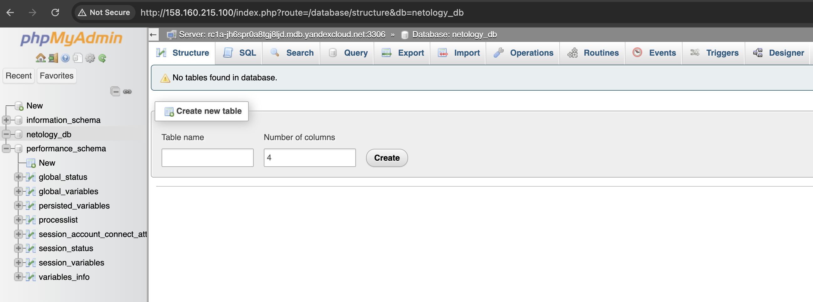

--- 
## Задание 2*. Вариант с AWS (задание со звёздочкой)

Это необязательное задание. Его выполнение не влияет на получение зачёта по домашней работе.

**Что нужно сделать**

1. Настроить с помощью Terraform кластер EKS в три AZ региона, а также RDS на базе MySQL с поддержкой MultiAZ для репликации и создать два readreplica для работы.
 
 - Создать кластер RDS на базе MySQL.
 - Разместить в Private subnet и обеспечить доступ из public сети c помощью security group.
 - Настроить backup в семь дней и MultiAZ для обеспечения отказоустойчивости.
 - Настроить Read prelica в количестве двух штук на два AZ.

2. Создать кластер EKS на базе EC2.

 - С помощью Terraform установить кластер EKS на трёх EC2-инстансах в VPC в public сети.
 - Обеспечить доступ до БД RDS в private сети.
 - С помощью kubectl установить и запустить контейнер с phpmyadmin (образ взять из docker hub) и проверить подключение к БД RDS.
 - Подключить ELB (на выбор) к приложению, предоставить скрин.

#### Выполнение

##### 1. RDS MySQL

RDS кластер: primary инстанс clopro-dev-mysql (MultiAZ = true, standby в другом AZ для failover), read replica clopro-dev-mysql-replica-1. Backup retention: 1 день. Размещены в private подсетях (eu-central-1a, eu-central-1b).

> Примечание: вторая read replica не создана — free tier AWS ограничивает количество RDS инстансов до двух. Backup retention снижен с 7 до 1 дня по той же причине.

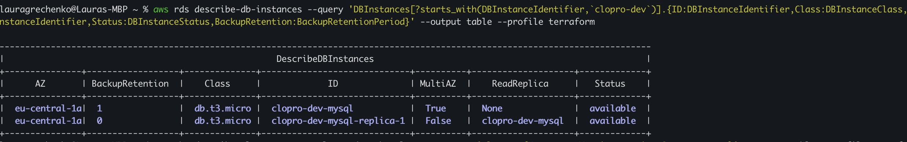

##### 2. EKS кластер

EKS кластер clopro-dev-eks-cluster: версия 1.31, статус ACTIVE, размещён в трёх public подсетях (eu-central-1a, 1b, 1c).

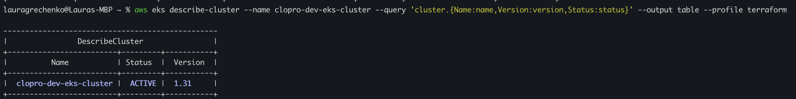

Node group clopro-dev-eks-node-group: 3 ноды t3.small, статус ACTIVE.

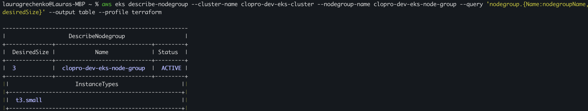

3 ноды Ready в разных AZ, pod phpmyadmin Running, сервис типа LoadBalancer с внешним DNS (Classic ELB).

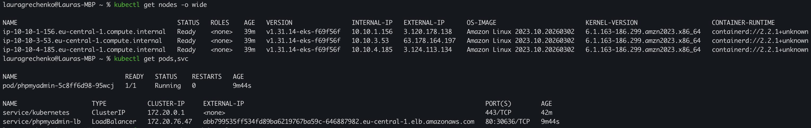

Terraform outputs: URL phpMyAdmin через ELB и endpoint RDS.

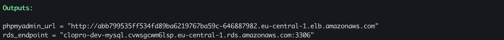

phpMyAdmin доступен по публичному ELB адресу, подключён к netology_db через RDS.

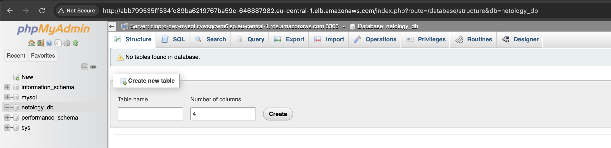

---

Полезные документы:

- [Модуль EKS](https://learn.hashicorp.com/tutorials/terraform/eks).

### Правила приёма работы

Домашняя работа оформляется в своём Git репозитории в файле README.md. Выполненное домашнее задание пришлите ссылкой на .md-файл в вашем репозитории.
Файл README.md должен содержать скриншоты вывода необходимых команд, а также скриншоты результатов.
Репозиторий должен содержать тексты манифестов или ссылки на них в файле README.md.
