# Отчёт по дипломному проекту

> Дипломное задание - [task.md](task.md). Этот отчёт покрывает все этапы и пункты раздела «Что необходимо для сдачи задания».
>
> Все детали реализации и runbook для воспроизведения собраны в [runbook-yc-ru.md](runbook-yc-ru.md).
>
> Репозиторий с инфраструктурным кодом: [infra-pandora-box](https://gitlab.com/laura.grechenko.erlang-group/infra-pandora-box). Прямые ссылки на части:
>
> - Terraform: [`infra/terraform/`](https://gitlab.com/laura.grechenko.erlang-group/infra-pandora-box/-/tree/master/infra/terraform)
> - Ansible/Kubespray: [`infra/ansible/`](https://gitlab.com/laura.grechenko.erlang-group/infra-pandora-box/-/tree/master/infra/ansible)
> - K8s-манифесты: [`infra/k8s/`](https://gitlab.com/laura.grechenko.erlang-group/infra-pandora-box/-/tree/master/infra/k8s)
> - Скрипты: [`infra/scripts/`](https://gitlab.com/laura.grechenko.erlang-group/infra-pandora-box/-/tree/master/infra/scripts)
> - Пайплайн инфраструктуры: [`.gitlab-ci.yml`](https://gitlab.com/laura.grechenko.erlang-group/infra-pandora-box/-/blob/master/.gitlab-ci.yml)
> - Atlantis: [`atlantis.yaml`](https://gitlab.com/laura.grechenko.erlang-group/infra-pandora-box/-/blob/master/atlantis.yaml)
>
> Репозиторий приложения [laura.grechenko.pandora_box](https://gitlab.com/laura.grechenko.erlang-group/laura.grechenko.pandora_box) приватный. Инфраструктурно-релевантные части продублированы в этой папке отчёта - [`pandora-box-infra/`](pandora-box-infra):
>
> - Dockerfile'ы: [`Dockerfile`](pandora-box-infra/Dockerfile), [`Dockerfile.rocksdb`](pandora-box-infra/Dockerfile.rocksdb)
> - Helm-чарт: [`infra/helm/pandora-box/`](pandora-box-infra/infra/helm/pandora-box)
> - K8s-манифесты: [`infra/k8s/`](pandora-box-infra/infra/k8s)
> - Пайплайн приложения: [`.gitlab-ci.yml`](pandora-box-infra/.gitlab-ci.yml)
> - Контракт инфра↔приложение: [`infra/README.md`](pandora-box-infra/infra/README.md)

## Архитектура (общая схема)

Облачный провайдер: **Yandex Cloud**.

Self-hosted Kubernetes (Kubespray, 3 master + 2 worker, прерываемые ВМ). Terraform-конфигурация разделена на четыре независимые TF-конфигурации:

| TF-конфигурация | Кто применяет | Содержимое |
|---|---|---|
| `infra/terraform/yc/bootstrap` | локально (один раз с правами админа) | bucket для tfstate, KMS, сервисные аккаунты, OIDC WIF, Lockboxes, container registry |
| `infra/terraform/yc/platform` | GitLab CI (job `bringup:platform`) | VPC, подсети, NAT, SG, Atlantis VM + NLB |
| `infra/terraform/yc/main` | Atlantis (через MR-комментарии) | bastion, k8s ВМ, ingress NLB |
| `infra/terraform/yc/pandora-box` | Atlantis (через MR-комментарии) | backups-бакет + scoped SA для приложения |

Последовательность развёртывания:

```
bootstrap (локально)
    │
    ▼
platform (CI ▶ bringup:platform)
    │
    ▼
main (Atlantis MR)
    │
    ▼
kubespray (локально)
    │
    ▼
addons (CI ▶ addons)
```

### Схема

Размещение ВМ в подсетях, внешние точки входа (NLB) и исходящий трафик через NAT gateway.

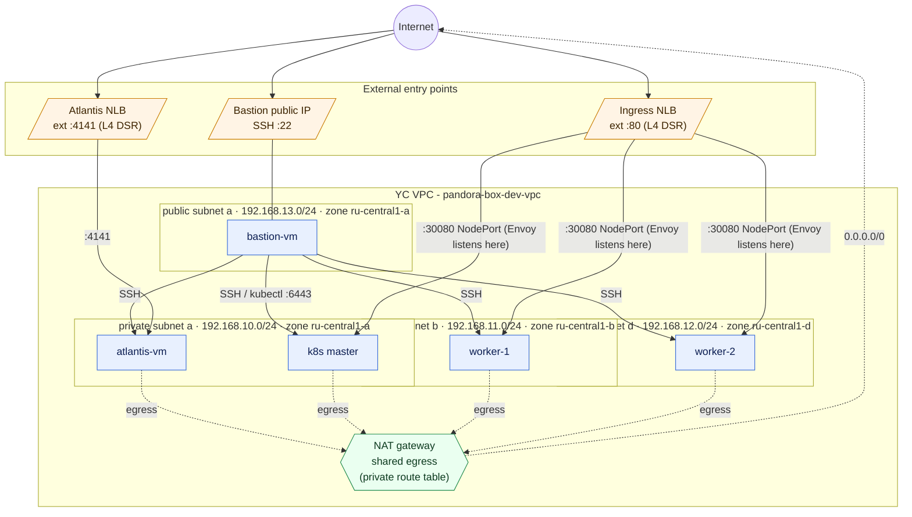
```mermaid
flowchart TB
    internet((Internet))

    subgraph external["External entry points"]
        direction LR
        bastion_pub[/"Bastion public IP<br/>SSH :22"/]
        atlantis_nlb[/"Atlantis NLB<br/>ext :4141 (L4 DSR)"/]
        ingress_nlb[/"Ingress NLB<br/>ext :80 (L4 DSR)"/]
    end

    internet --> bastion_pub
    internet --> atlantis_nlb
    internet --> ingress_nlb

    subgraph vpc["YC VPC - pandora-box-dev-vpc"]
        direction TB

        subgraph pub_a["public subnet a · 192.168.13.0/24 · zone ru-central1-a"]
            bastion["bastion-vm"]
        end

        subgraph priv_a["private subnet a · 192.168.10.0/24 · zone ru-central1-a"]
            atlantis["atlantis-vm"]
            master["k8s master"]
        end

        subgraph priv_b["private subnet b · 192.168.11.0/24 · zone ru-central1-b"]
            worker1["worker-1"]
        end

        subgraph priv_d["private subnet d · 192.168.12.0/24 · zone ru-central1-d"]
            worker2["worker-2"]
        end

        nat{{"NAT gateway<br/>shared egress<br/>(private route table)"}}
    end

    bastion_pub --- bastion
    bastion -- SSH --> atlantis
    bastion -- "SSH / kubectl :6443" --> master
    bastion -- SSH --> worker1
    bastion -- SSH --> worker2

    atlantis_nlb -- ":4141" --> atlantis

    ingress_nlb -- ":30080 NodePort (Envoy listens here)" --> master
    ingress_nlb -- ":30080 NodePort (Envoy listens here)" --> worker1
    ingress_nlb -- ":30080 NodePort (Envoy listens here)" --> worker2

    atlantis -. egress .-> nat
    master   -. egress .-> nat
    worker1  -. egress .-> nat
    worker2  -. egress .-> nat
    nat -. "0.0.0.0/0" .-> internet

    classDef vm fill:#e8f0fe,stroke:#3367d6,color:#0b1d51;
    classDef lb fill:#fff4e5,stroke:#c97a00,color:#3d2400;
    classDef gw fill:#eafff0,stroke:#1f8a4c,color:#0d3a1f;

    class bastion,atlantis,master,worker1,worker2 vm;
    class bastion_pub,atlantis_nlb,ingress_nlb lb;
    class nat gw;
```

#### Маршрут HTTP-запроса (Gateway API)

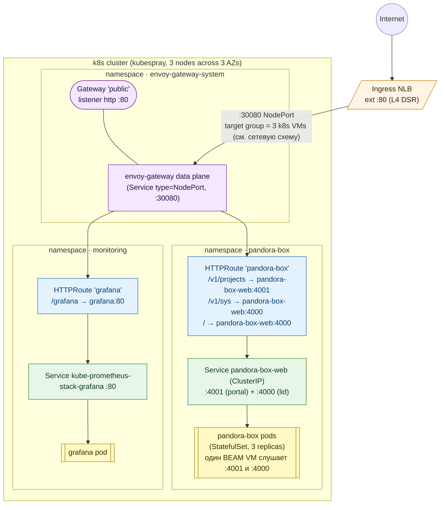
```mermaid
flowchart TB
    internet((Internet))
    ingress_nlb[/"Ingress NLB<br/>ext :80 (L4 DSR)"/]

    internet --> ingress_nlb

    subgraph cluster["k8s cluster (kubespray, 3 nodes across 3 AZs)"]
        direction TB

        subgraph ns_gw["namespace · envoy-gateway-system"]
            gateway(["Gateway 'public'<br/>listener http :80"])
            envoy["envoy-gateway data plane<br/>(Service type=NodePort, :30080)"]
            gateway --- envoy
        end

        subgraph ns_pb["namespace · pandora-box"]
            route_pb["HTTPRoute 'pandora-box'<br/>/v1/projects → pandora-box-web:4001<br/>/v1/sys → pandora-box-web:4000<br/>/ → pandora-box-web:4000"]
            svc_pb_web["Service pandora-box-web (ClusterIP)<br/>:4001 (portal) + :4000 (lid)"]
            pod_pb[["pandora-box pods<br/>(StatefulSet, 3 replicas)<br/>один BEAM VM слушает :4001 и :4000"]]

            route_pb --> svc_pb_web --> pod_pb
        end

        subgraph ns_mon["namespace · monitoring"]
            route_graf["HTTPRoute 'grafana'<br/>/grafana → grafana:80"]
            svc_graf["Service kube-prometheus-stack-grafana :80"]
            pod_graf[["grafana pod"]]

            route_graf --> svc_graf --> pod_graf
        end

        envoy --> route_pb
        envoy --> route_graf
    end

    ingress_nlb -- ":30080 NodePort<br/>target group = 3 k8s VMs (см. сетевую схему)" --> envoy

    classDef lb fill:#fff4e5,stroke:#c97a00,color:#3d2400;
    classDef gw fill:#f3e8ff,stroke:#7b1fa2,color:#2a0d4a;
    classDef route fill:#e3f2fd,stroke:#1565c0,color:#0b3d6e;
    classDef svc fill:#e8f5e9,stroke:#2e7d32,color:#0d3a1f;
    classDef pod fill:#fff9c4,stroke:#9e7c00,color:#3a2a00;

    class ingress_nlb lb;
    class gateway,envoy gw;
    class route_pb,route_graf route;
    class svc_pb_web,svc_graf svc;
    class pod_pb,pod_graf pod;
```

---

## Этап 1. Создание облачной инфраструктуры

**Что сделано:**

- Сервисные аккаунты создаются в `bootstrap` ([infra/terraform/yc/bootstrap/](https://gitlab.com/laura.grechenko.erlang-group/infra-pandora-box/-/tree/master/infra/terraform/yc/bootstrap)) - большинству выдан минимальный набор прав. Права суперпользователя используются только при `bootstrap apply` с личного админ-аккаунта; единственное исключение среди SA - Atlantis SA с ролью folder `admin`.
- Backend для Terraform - S3-бакет в YC, создаётся через TF в `bootstrap`. Versioning + KMS-шифрование. Конфигурации SA/бакета (`bootstrap`) и основной инфраструктуры (`platform`, `main`, `pandora-box`) разнесены по разным папкам, как требует задание.
- VPC и подсети в трёх зонах доступности - [infra/terraform/yc/platform/network.tf](https://gitlab.com/laura.grechenko.erlang-group/infra-pandora-box/-/blob/master/infra/terraform/yc/platform/network.tf).
- Первый запуск TF-конфигурации `bootstrap` автоматизирован скриптом ([infra/scripts/bootstrap-from-scratch.sh](https://gitlab.com/laura.grechenko.erlang-group/infra-pandora-box/-/blob/master/infra/scripts/bootstrap-from-scratch.sh)): он закрывает проблему с S3-бэкендом - бакет для tfstate создаётся тем же `apply`, после чего состояние переносится в этот бакет. Все последующие `terraform apply` и `terraform destroy` запускаются как обычные команды, без скриптов.

**Долговременные секреты:**

- Все долгоживущие ключи к YC API заменены на **OIDC Workload Identity Federation** ([infra/terraform/yc/bootstrap/federation.tf](https://gitlab.com/laura.grechenko.erlang-group/infra-pandora-box/-/blob/master/infra/terraform/yc/bootstrap/federation.tf)). И GitLab CI infra-репозитория, и CI pandora-box обменивают GitLab-OIDC JWT на короткоживущий IAM-токен.
- Единственный неустранимый долгоживущий ключ - `AWS_*` для S3-бэкенда tfstate.

**Демонстрация (запуск `bootstrap-from-scratch.sh`):**

1. **Все ресурсы bootstrap созданы.** `terraform output`:

   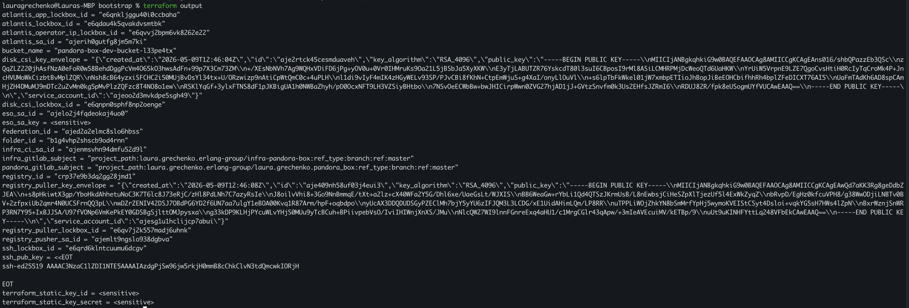

2. **Стейт сохраняется в созданном бакете.** После `terraform init -migrate-state` объект `terraform.tfstate` лежит в свежесозданном S3-бакете:

   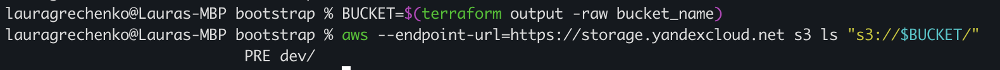

3. **Сервисные аккаунты с минимальными правами (за исключением Atlantis SA).** Большинству SA выдан точечный набор ролей (`storage.admin`, `kms.keys.encrypterDecrypter`, `lockbox.viewer` и т.п.) и только на нужные ресурсы. Atlantis SA - исключение: ему выдан folder `admin`, так как он применяет Terraform в `main` и `pandora-box`, и более точечный набор ролей всё равно покрыл бы практически весь admin на уровне отдельных сервисов:
   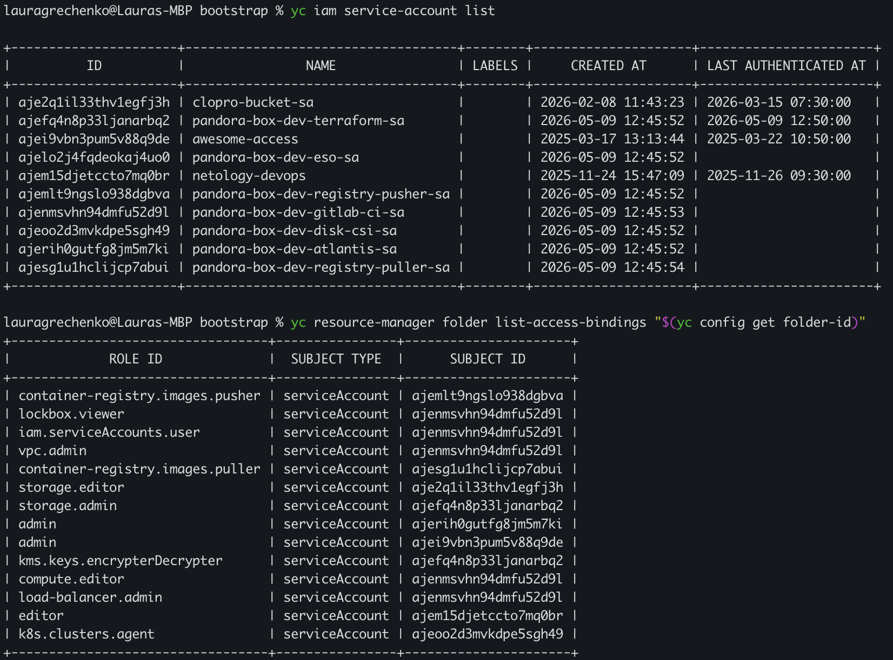

4. **OIDC Workload Identity Federation для CI.** Долговременных ключей к YC API нет - GitLab CI обменивает свой OIDC JWT на короткоживущий IAM-токен через эту федерацию:

   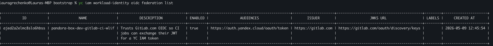

5. **Federated credentials привязаны к конкретным GitLab-проектам.** Каждая привязка указывает не только SA, но и `project_id` + `ref` GitLab-репозитория - runner не может получить токен SA, для которого не зарегистрирована соответствующая привязка:

   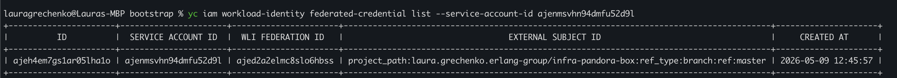

**Демонстрация:**

После bootstrap два Lockbox созданы пустыми и заполняются перед первым `terraform apply` через Atlantis.

6. **`atlantis-operator-ip` заполняется с ноутбука.** Оператор знает свой публичный IP и пишет его напрямую в Lockbox через `yc lockbox secret add-version`. Это значение читается из data-source в `main/` при каждом `atlantis plan` и используется в правиле SG для bastion.
Заполнение Lockboxes для Atlantis:

   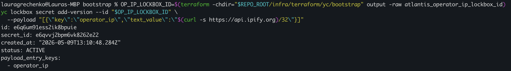

7. **`atlantis-app` заполняется через CI-job** (`seed:atlantis-lockbox`). Этот job читает `ATLANTIS_GITLAB_TOKEN` (токен GitLab API, под которым Atlantis постит комментарии в MR и читает репозиторий) и `ATLANTIS_WEBHOOK_SECRET` (HMAC-секрет, которым GitLab подписывает webhook'и) из CI vars и пишет их в Lockbox. 
Выполнили первый этап CI - check и seed:

   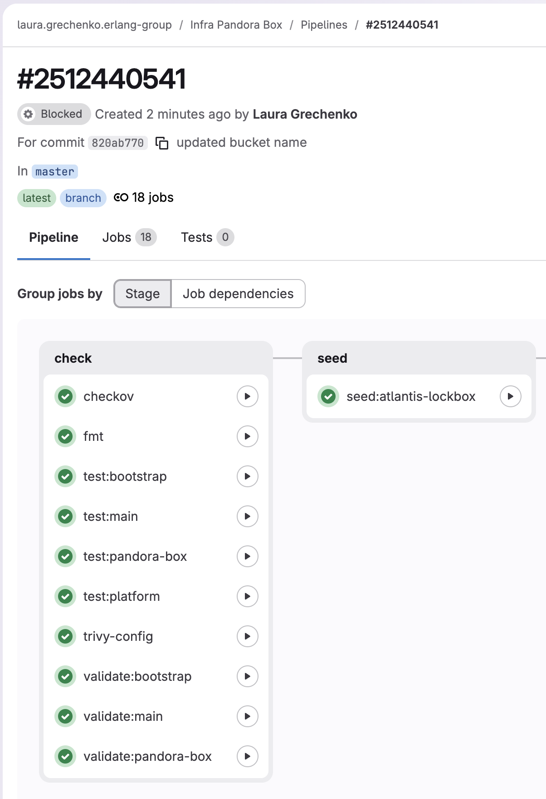

**Демонстрация (применение `platform/` через CI):**

`platform/` (VPC + Atlantis VM + NLB) применяется не Atlantis'ом, в CI (т.к. Atlantis еще не запущен).

8. **`bringup:platform` - Terraform apply выполнен в CI:**

   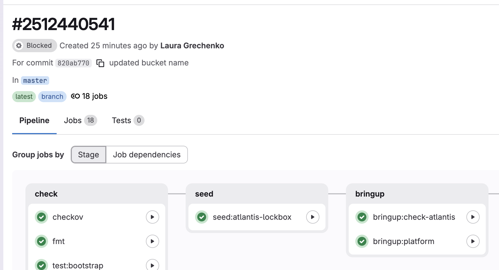

9. **Результат terraform apply**:

   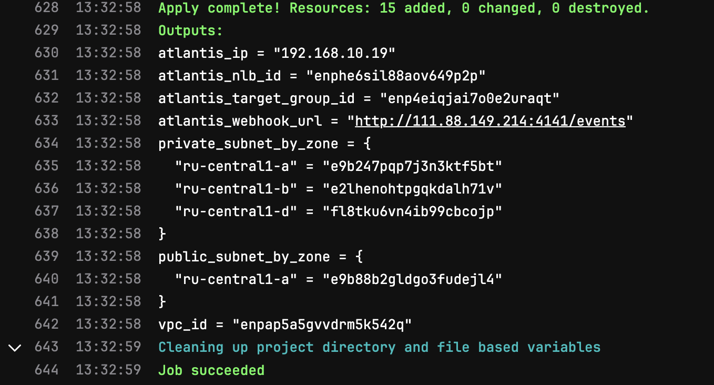

10. **`bringup:check-atlantis`** через YC API проверяет, что Atlantis NLB target в состоянии `HEALTHY`. Это подтверждает, что daemon поднялся, слушает на :4141 и проходит health-check'и:

    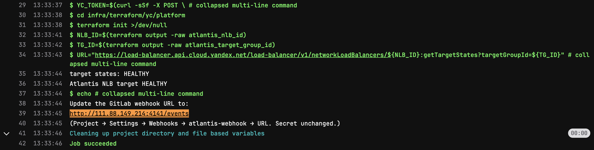

11. **Webhook GitLab → Atlantis настроен и работает** - webhook зарегистрирован в настройках проекта (Settings → Webhooks): URL из output `atlantis_webhook_url`, секрет из `ATLANTIS_WEBHOOK_SECRET`. Тестовый запрос по кнопке «Test» доходит до Atlantis и возвращает 200:

    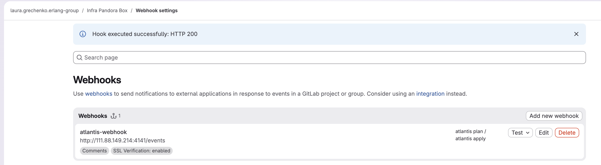

**Демонстрация (применение `main/` и `pandora-box/` через Atlantis - GitOps-flow):**

После того как Atlantis запущен, оставшиеся две TF-конфигурации (`main/` - bastion + k8s VMs + ingress NLB; `pandora-box/` - backups bucket + scoped SA + Lockbox) применяются через комментарии в MR. Никаких локальных `terraform apply` для них - все изменения проходят ревью и применяются Atlantis-демоном. Конфигурация проектов и workflow'ов - в [atlantis.yaml](https://gitlab.com/laura.grechenko.erlang-group/infra-pandora-box/-/blob/master/atlantis.yaml).

12. **Atlantis в комментариях описывает план для `main/`** в ответ на `atlantis plan -p main`:

    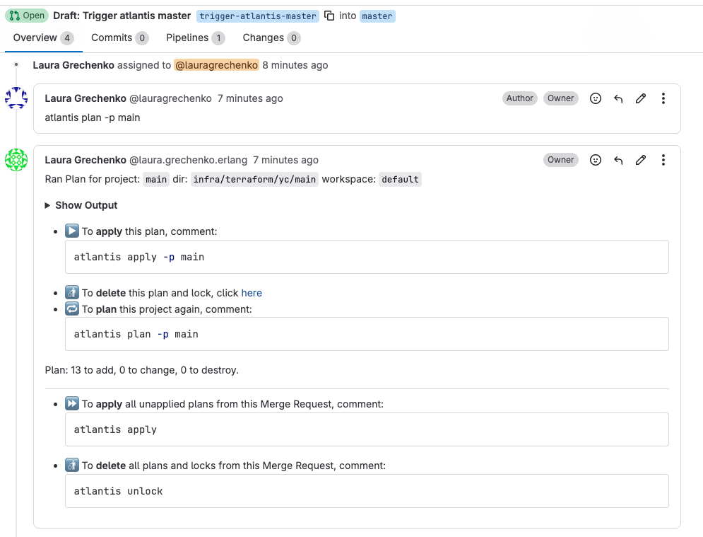

13. **`atlantis apply -p main`** запускается из комментария к MR:

    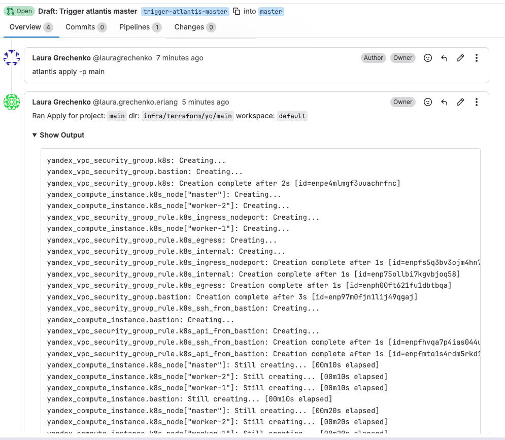

14. **Apply прошёл - Atlantis публикует результат комментарием в MR:**

    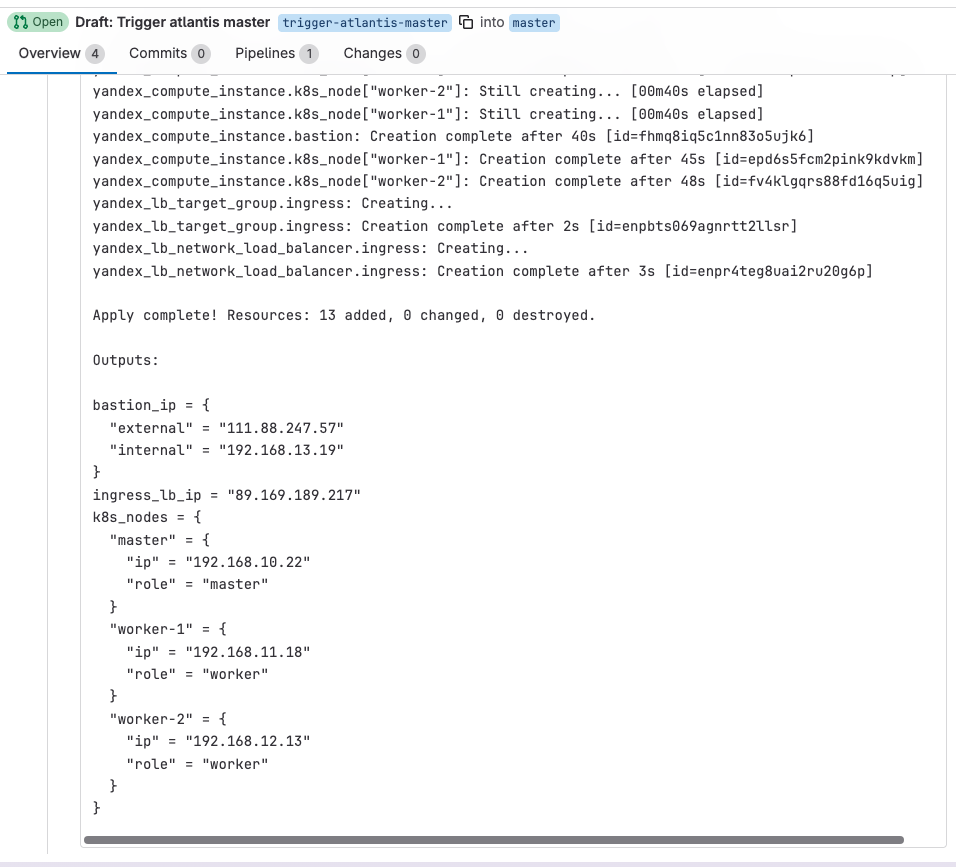

15. **Bastion работает - SSH к приватной Atlantis VM через bastion:** прямого доступа в приватную сеть нет, оператор подключается по SSH с ProxyJump через bastion. Используется ключ ed25519, который генерирует Terraform и кладёт в Lockbox - оператор забирает оттуда приватную часть:

    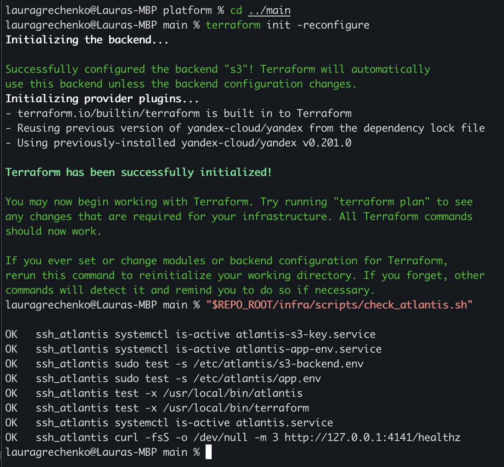

16. **Atlantis в комментариях описывает план для `pandora-box/`** (`atlantis plan -p pandora-box`):

    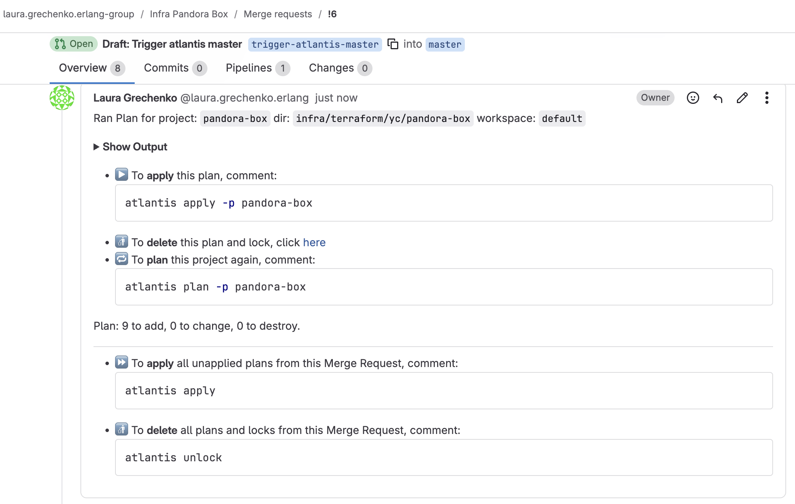

17. **`atlantis apply -p pandora-box`** - apply комментируется в MR:

    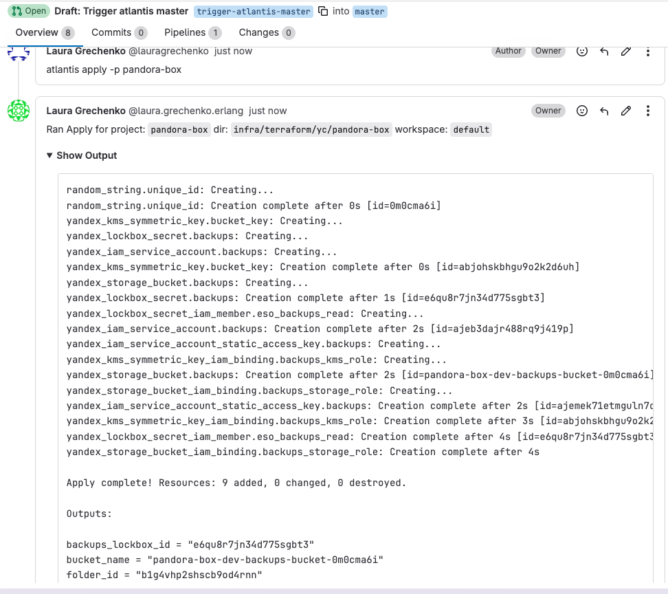


---

## Этап 2. Создание Kubernetes кластера

**Что сделано:**

- Self-hosted K8s через **Kubespray** ([infra/ansible/kubespray/](https://gitlab.com/laura.grechenko.erlang-group/infra-pandora-box/-/tree/master/infra/ansible/kubespray)) - 3 master + 2 worker. Worker-ноды на прерываемых ВМ, как требует задание.
- Inventory генерируется из TF outputs скриптом [infra/scripts/generate_inventory.sh](https://gitlab.com/laura.grechenko.erlang-group/infra-pandora-box/-/blob/master/infra/scripts/generate_inventory.sh) - без ручных правок.
- Доступ к API из интернета - только через bastion SSH разрешён только с operator-IP, который хранится в Lockbox.

**Демонстрация:**

1. **Sanity-check нод (локально).** [`infra/scripts/check_nodes.sh`](https://gitlab.com/laura.grechenko.erlang-group/infra-pandora-box/-/blob/master/infra/scripts/check_nodes.sh) подключается по SSH через bastion к каждой ноде и проверяет связность нода↔нода и исходящий трафик (`registry.k8s.io`):

   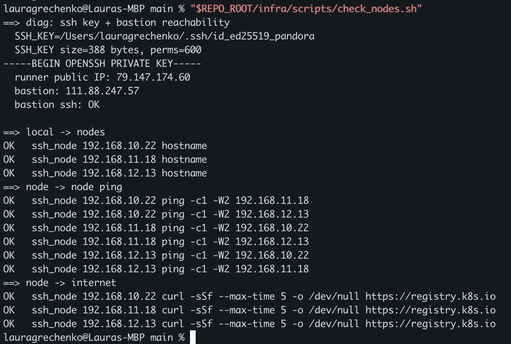

2. **Sanity-check нод (CI).** Тот же скрипт запускается из job `cluster:check-nodes`:

   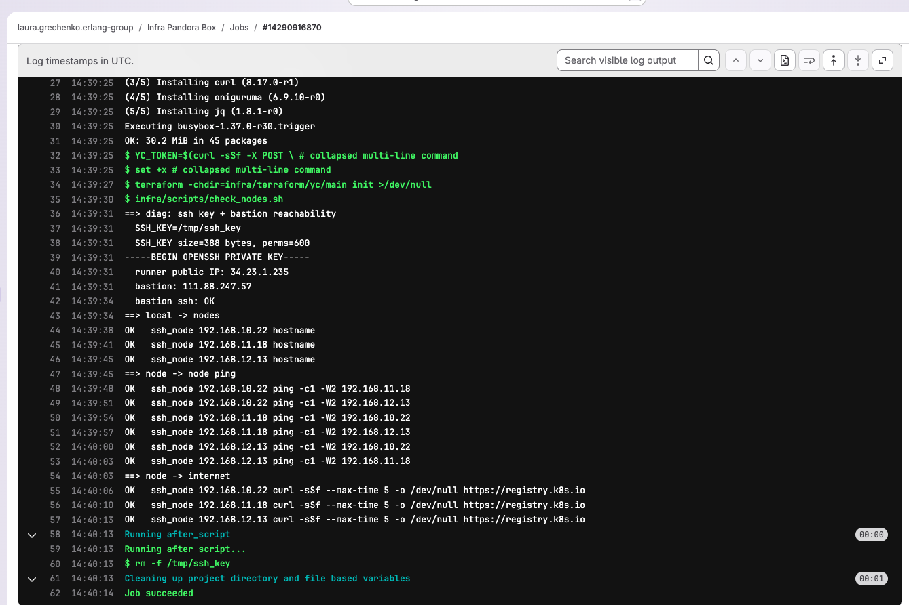

3. **Inventory сгенерирован из TF outputs.** [`infra/scripts/generate_inventory.sh`](https://gitlab.com/laura.grechenko.erlang-group/infra-pandora-box/-/blob/master/infra/scripts/generate_inventory.sh) пишет `infra/ansible/kubespray/inventory/mycluster/hosts.yaml` (пример - [`infra/ansible/hosts-example.yaml`](https://gitlab.com/laura.grechenko.erlang-group/infra-pandora-box/-/blob/master/infra/ansible/hosts-example.yaml)):

   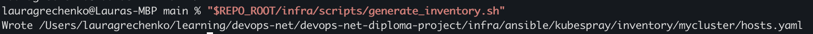

4. **Kubespray успешно установил кластер.** В Ansible play-recap у всех хостов `failed=0`, кластер готов:

   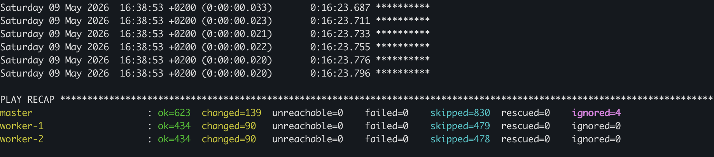

5. **`kubectl get nodes` после fetch-kubeconfig.** [`infra/scripts/fetch_kubeconfig.sh`](https://gitlab.com/laura.grechenko.erlang-group/infra-pandora-box/-/blob/master/infra/scripts/fetch_kubeconfig.sh) забирает `admin.conf` с master-ноды через bastion, переписывает API endpoint на `localhost:6443` и печатает команду для SSH-туннеля. После запуска туннеля `kubectl get nodes` показывает 3 master + 2 worker в состоянии `Ready`:

   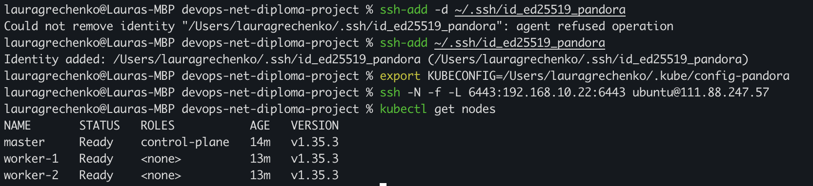

---

## Этап 3. Подготовка системы мониторинга и деплой приложения

**Что сделано:**

- **GitLab Agent** установлен в кластер (namespace `gitlab-agent-pandora-k8s`, [infra/scripts/install_gitlab_agent.sh](https://gitlab.com/laura.grechenko.erlang-group/infra-pandora-box/-/blob/master/infra/scripts/install_gitlab_agent.sh)) - он проксирует обращения CI-job'ов к Kubernetes API через исходящее соединение от агента к GitLab, поэтому job'ы могут применять манифесты в кластере с приватным API-сервером, не храня kubeconfig в CI vars и не открывая API-сервер наружу. Используется и job'ами установки addons'ов, и job'ом `deploy` в репозитории приложения.
- **kube-prometheus-stack** через Helm - Prometheus, Grafana, Alertmanager, node-exporter, kube-state-metrics ([infra/k8s/monitoring/](https://gitlab.com/laura.grechenko.erlang-group/infra-pandora-box/-/tree/master/infra/k8s/monitoring), [infra/scripts/install_monitoring.sh](https://gitlab.com/laura.grechenko.erlang-group/infra-pandora-box/-/blob/master/infra/scripts/install_monitoring.sh)).
- **Envoy Gateway** - точка входа HTTP-трафика в кластер, конфигурируется через **Gateway API** (преемник legacy Ingress) ([infra/k8s/gateway/](https://gitlab.com/laura.grechenko.erlang-group/infra-pandora-box/-/tree/master/infra/k8s/gateway)).
- HTTP-доступ на :80 к Grafana и приложению - через ingress NLB (`infra/terraform/yc/main`).
- **External Secrets Operator** непрерывно синхронизирует секреты из YC Lockbox в Kubernetes Secrets ([infra/k8s/eso/](https://gitlab.com/laura.grechenko.erlang-group/infra-pandora-box/-/tree/master/infra/k8s/eso), [infra/scripts/install_eso.sh](https://gitlab.com/laura.grechenko.erlang-group/infra-pandora-box/-/blob/master/infra/scripts/install_eso.sh)). После установки `kubectl create secret` вручную не требуется.

**Демонстрация:**

1. **GitLab Agent установлен и подключён.** Скрипт [`install_gitlab_agent.sh`](https://gitlab.com/laura.grechenko.erlang-group/infra-pandora-box/-/blob/master/infra/scripts/install_gitlab_agent.sh) разворачивает agentk через официальный Helm-чарт; после установки под агента в namespace `gitlab-agent-pandora-k8s` в состоянии `Running`, а в GitLab UI кластер отображается как `Connected`:

   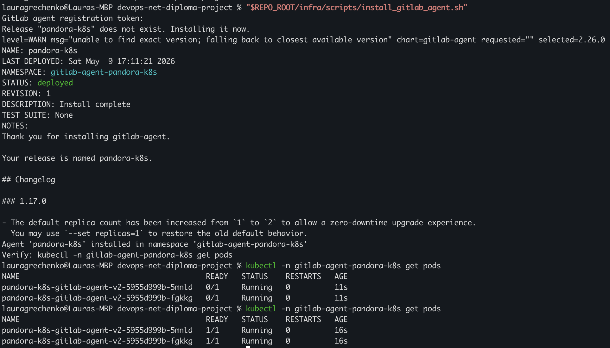

2. **ESO установлен через CI (`addons:eso`).** Job выполняет [`install_eso.sh`](https://gitlab.com/laura.grechenko.erlang-group/infra-pandora-box/-/blob/master/infra/scripts/install_eso.sh) - `helm install external-secrets`, `ClusterSecretStore` к YC Lockbox, три `ExternalSecret`'а (`yc-csi-sa-key`, `yc-registry`, `backups-s3`).

   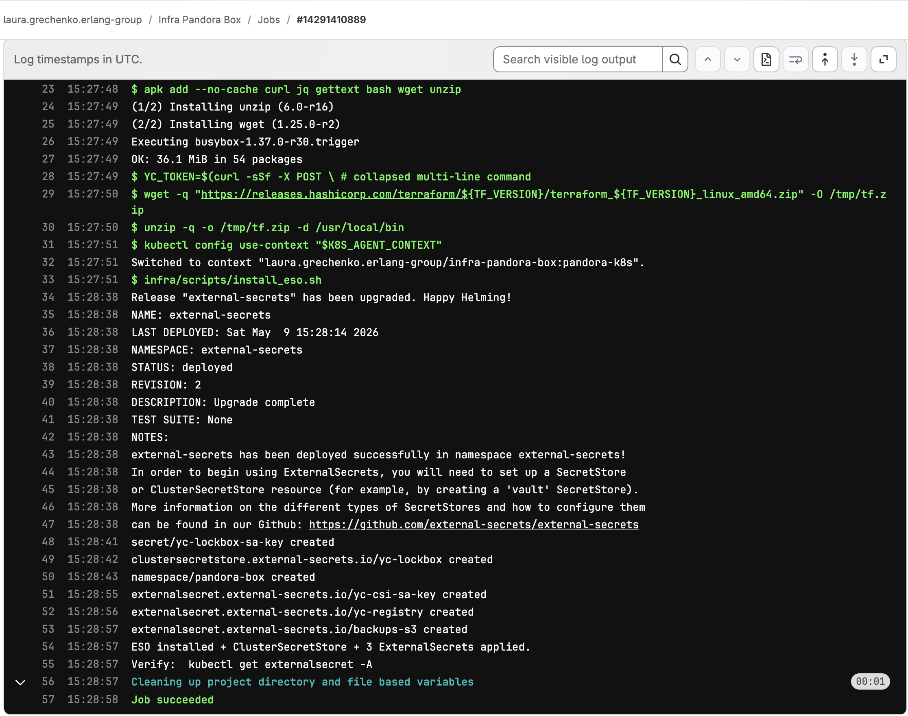

После завершения ESO-контроллер в состоянии `Running`, все три ExternalSecret - в `SecretSynced`:

   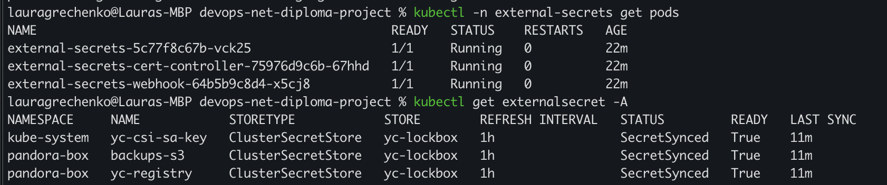

3. **CSI driver установлен через CI (`addons:csi`).** Job применяет vendored-манифесты из [k8s/csi/v1.2.0/](https://gitlab.com/laura.grechenko.erlang-group/infra-pandora-box/-/tree/master/infra/k8s/csi/v1.2.0) и создаёт ConfigMap `yc-csi-config`.

   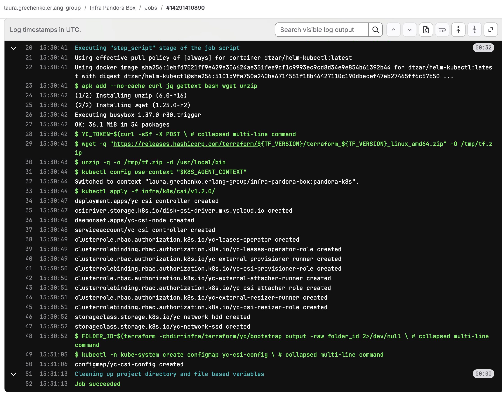

После завершения controller- и node-поды CSI - в `Running`, а StorageClass `yc-network-hdd` помечен как default:

   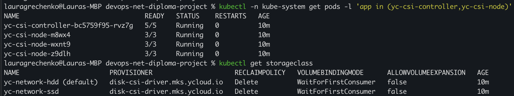

4. **Envoy Gateway установлен через CI (`addons:gateway`).** Job выполняет [`install_gateway.sh`](https://gitlab.com/laura.grechenko.erlang-group/infra-pandora-box/-/blob/master/infra/scripts/install_gateway.sh) - Helm-чарт контроллера + `GatewayClass` + общий `Gateway public`.

   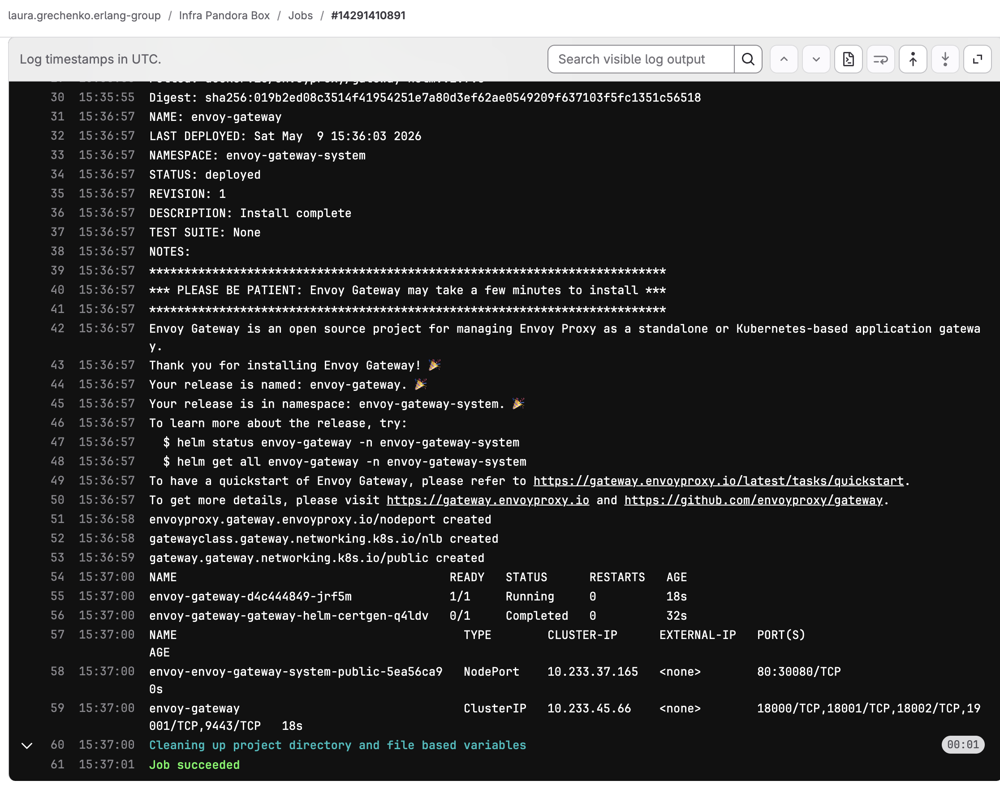

После завершения контроллер в `Running`, Gateway - в состоянии `PROGRAMMED=True`:

   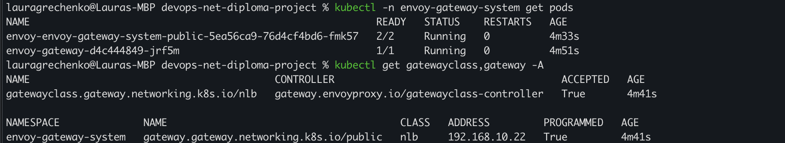

5. **kube-prometheus-stack установлен через CI (`addons:monitoring`).** Job выполняет [`install_monitoring.sh`](https://gitlab.com/laura.grechenko.erlang-group/infra-pandora-box/-/blob/master/infra/scripts/install_monitoring.sh) - Helm-чарт `kube-prometheus-stack` + `HTTPRoute` для Grafana через общий `Gateway public`.

   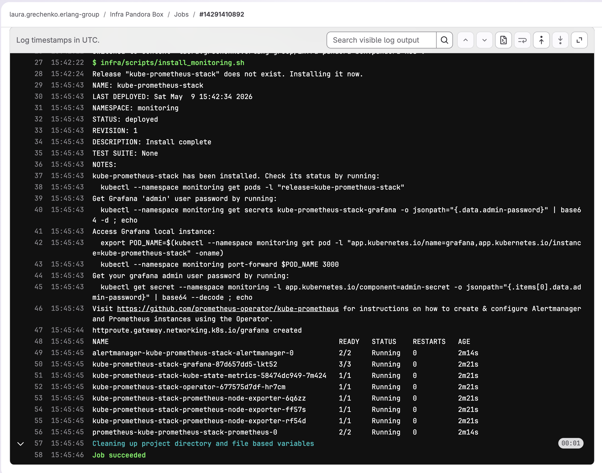

После завершения Prometheus, Grafana, Alertmanager, node-exporter и kube-state-metrics в namespace `monitoring` находятся в состоянии `Running`:

   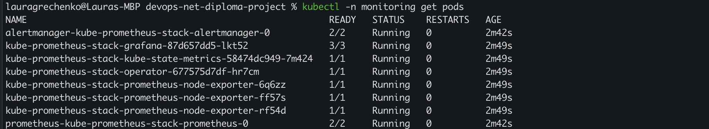

6. **HTTP-доступ к Grafana на :80.** Grafana доступна через ingress NLB по адресу `http://<ingress_lb_ip>/grafana/` (IP читается из `terraform -chdir=infra/terraform/yc/main output -raw ingress_lb_ip`). Логин/пароль по умолчанию - `admin/admin`.

   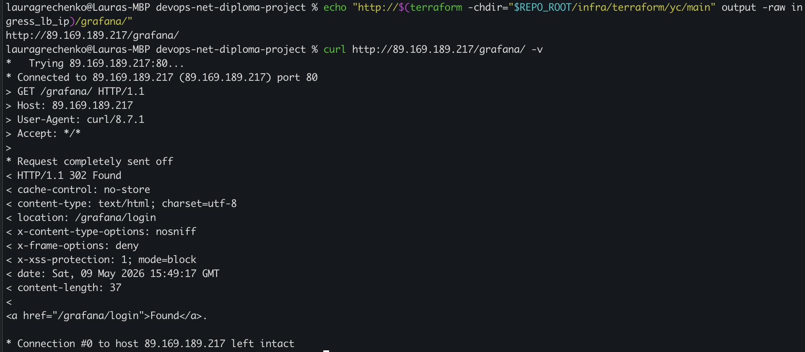

7. **Grafana-дашборды состояния K8s.** Дашборды из kube-prometheus-stack доступны сразу - выпадающий список namespace позволяет смотреть нагрузку на любую часть кластера (ноды, поды, deployments и т.п.):

   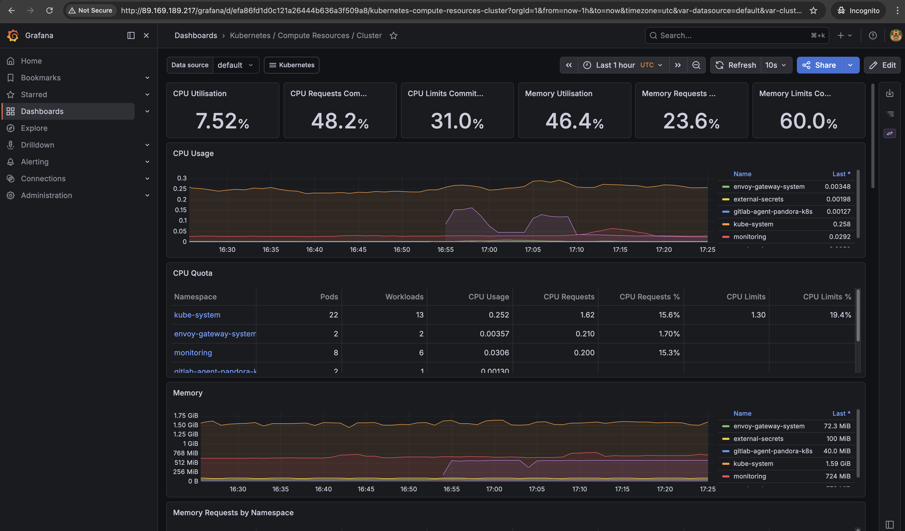

- Репозиторий с конфигурацией K8s: [infra-pandora-box/infra/k8s/](https://gitlab.com/laura.grechenko.erlang-group/infra-pandora-box/-/tree/master/infra/k8s).
- [Пример MR с комментариями Atlantis](https://gitlab.com/laura.grechenko.erlang-group/infra-pandora-box/-/merge_requests/6)


---

## Этап 4. Установка и настройка CI/CD

**Приложение.** Тестовый сервис - **Pandora Box** ([отдельный репозиторий](https://gitlab.com/laura.grechenko.erlang-group/laura.grechenko.pandora_box)): Elixir/OTP-приложение на базе Raft-консенсуса, по задачам близкое к HashiCorp Vault. Сервис stateful, storage backend pluggable (на выбор - RocksDB / Mnesia / SQLite); периодический бэкап уходит в YC Object Storage (бакет `pandora-box-backups`, scoped SA из `infra/terraform/yc/pandora-box`). Это реальное приложение, а не заглушка.

**Сборка образов - два Dockerfile, два образа в реестре.**

- [`Dockerfile.rocksdb`](https://gitlab.com/laura.grechenko.erlang-group/laura.grechenko.pandora_box/-/blob/master/Dockerfile.rocksdb) собирает RocksDB-NIF из исходников ("тяжёлый" build: `build-base`, `cmake`, `snappy/zlib/bzip2/lz4/zstd`-dev) и пушится как `cr.yandex/.../pandora_box-rocksdb:latest`. Пересобирается только при изменении rocksdb-зависимости в `mix.lock`.
- [`Dockerfile`](https://gitlab.com/laura.grechenko.erlang-group/laura.grechenko.pandora_box/-/blob/master/Dockerfile) - multi-stage (`rocksdb-cache` → `build` → `runtime`). Уже скомпилированный NIF подмонтируется через `ARG ROCKSDB_CACHE_IMAGE` + `--mount=from=rocksdb-cache`, поэтому per-commit-сборка не тянет C-toolchain. Тег: `cr.yandex/.../pandora_box:$CI_COMMIT_SHORT_SHA`.
- Оба образа собираются с BuildKit registry cache (`--cache-from`/`--cache-to type=registry,ref=...:buildcache,mode=max`) - слои переиспользуются между runner'ами без локального диска.

**Реестр и аутентификация.** Container Registry - **Yandex Container Registry**, создаётся Terraform'ом ([infra/terraform/yc/bootstrap/registry.tf](https://gitlab.com/laura.grechenko.erlang-group/infra-pandora-box/-/blob/master/infra/terraform/yc/bootstrap/registry.tf)). CI-job обменивает GitLab OIDC JWT на короткоживущий YC IAM-токен и логинится в `cr.yandex` через `docker login --username iam` (шаблон `.yc-auth` в `.gitlab-ci.yml`). Долгоживущих учётных данных для реестра нет.

**Пайплайн.** [pandora_box/.gitlab-ci.yml](https://gitlab.com/laura.grechenko.erlang-group/laura.grechenko.pandora_box/-/blob/master/.gitlab-ci.yml) описывает 5 стадий: `lint → test → build → system → deploy`.

| Stage | Job | Триггер | Назначение |
|---|---|---|---|
| `lint` | `lint:elixir` | manual (любая ветка) / **auto на tag** | `mix compile --warnings-as-errors`, `mix format --check`, `mix credo`, `mix hex.audit` |
| `test` | `test:elixir`, `test:external` | manual (любая ветка) / **auto на tag** | `mix test` (+ external suite против сервиса MinIO в DinD) |
| `build` | `build:rocksdb-cache` | manual только на `master` | Пересборка RocksDB-cache образа (триггерится вручную при бампе rocksdb-зависимости) |
| `build` | `build:image` | manual на `master` / **auto на tag** | Сборка и пуш per-commit образа в `cr.yandex` |
| `system` | `test:system` | manual на `master` / **auto на tag**, `needs: [build:image]` | Чёрный ящик: `docker pull $IMAGE` + `mix test --include system` против собранного контейнера в DinD |
| `deploy` | `deploy` | manual на `master` / **auto на tag**, `needs: [lint, test, test:external, build:image, test:system]` | `helm upgrade --install` через GitLab Agent context |

Правила сгруппированы в четыре шаблона:
- `.rules-any-branch-manual` - manual на любой ветке (единственный шаблон, который не используется на tag-pipeline'ах);
- `.rules-any-branch-manual-or-tag-auto` - manual на любой ветке, auto на tag (используется в `lint`, `test:elixir`, `test:external`);
- `.rules-master-manual` - manual только на `master` (используется в `build:rocksdb-cache`);
- `.rules-master-manual-or-tag-auto` - manual на `master`, auto на tag (используется в `build:image`, `test:system`, `deploy`).

**Tag-релиз** (`git tag vX.Y.Z && git push --tags`) автоматически проходит цепочку `lint → test:elixir + test:external → build:image → test:system → deploy` без ручных кликов. На push в `master` все job'ы остаются manual: `deploy.needs:` перечисляет 5 апстримов, но так как все они manual + `allow_failure: true`, GitLab разрешает нажать `deploy` напрямую, не прокликивая остальные - `needs:` в этом случае только фиксирует порядок кликов, если оператор всё-таки решит прокликать всю цепочку. Мотивацию (экономия GitLab CI minutes на free tier) см. в компромиссе [«Пайплайны на push - ручные»](#известные-компромиссы) ниже.

**Build cache.** `build:image` переиспользует BuildKit registry cache (`:buildcache`) и предварительно скомпилированный RocksDB-NIF из `*-rocksdb:latest` - per-commit-сборка занимает минуты, а не десятки минут.

**Аутентификация.** В YC из CI - OIDC WIF (шаблон `.yc-auth`, обмен GitLab JWT на YC IAM token). В кластер из CI - контекст GitLab Agent (`KUBE_CONTEXT="laura.grechenko.erlang-group/infra-pandora-box:pandora-k8s"`); kubeconfig-файлов в CI vars нет.

**Секреты при деплое.** Job `deploy` создаёт только Secret `pandora-box` (5 app-секретов из CI vars: `SECRET_KEY_BASE`, `API_TOKEN_PEPPER`, `RELEASE_COOKIE`, `PANDORA_KEK`, `PBX_INIT_SECRET`). Остальные два Secret в namespace (`backups-s3`, `yc-registry`) синхронизирует ESO из YC Lockbox - CI их не трогает. Контракт зафиксирован в [pandora_box/infra/README.md](https://gitlab.com/laura.grechenko.erlang-group/laura.grechenko.pandora_box/-/blob/master/infra/README.md).

**Деплой-команда.** `helm upgrade --install pandora-box infra/helm/pandora-box -f values-prod.yaml --set image.tag=$CI_COMMIT_SHORT_SHA`, затем `kubectl rollout restart statefulset/pandora-box` (чтобы поды подхватили обновлённые извне секреты), затем `kubectl rollout status --timeout=300s` (явный gate на успех).

**Демонстрация:**

- CI/CD-интерфейс по HTTP - gitlab.com (HTTPS из коробки): [laura.grechenko.pandora_box](https://gitlab.com/laura.grechenko.erlang-group/laura.grechenko.pandora_box).
- **Успешный pipeline.** `build:rocksdb-cache` → `build:image` → `deploy` - все стадии зелёные. Скриншот сделан на push в `master` до перехода на auto-on-tag; после перехода набор стадий и команды не изменились - поменялся только триггер (см. таблицу выше).

  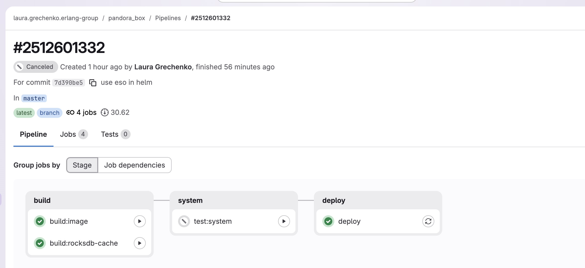

- **Образы в YC Container Registry.** В реестре лежат оба образа: `pandora_box-rocksdb:latest` (cache-образ с предварительно собранным RocksDB-NIF) и `pandora_box:<sha>` (per-commit образ приложения):

  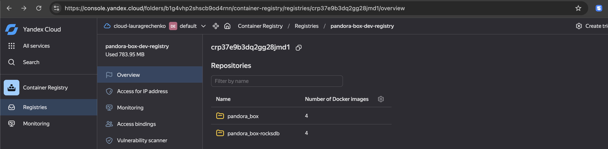

- **Job `deploy` - `helm upgrade --install` через GitLab Agent.** Лог job'а показывает применение чарта, `kubectl rollout restart` (на случай если ESO обновил секреты извне) и `kubectl rollout status statefulset/pandora-box` как явный gate на успех:

  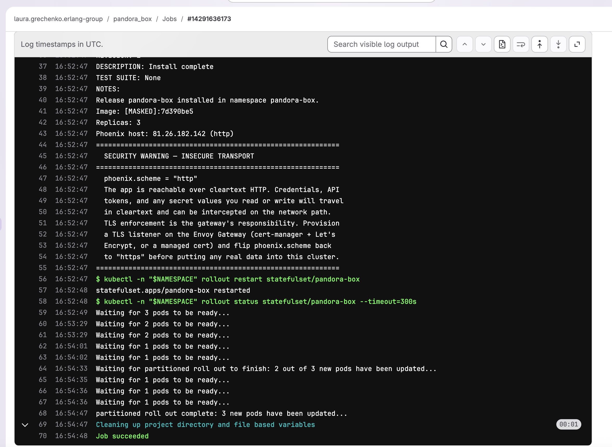

- **HTTP-доступ к приложению на :80.** Pandora Box доступна по адресу ingress NLB. `/bootstrap` отдаёт LiveView-форму первичной инициализации, после которой приложение переходит в рабочее состояние с дашбордом проектов:

  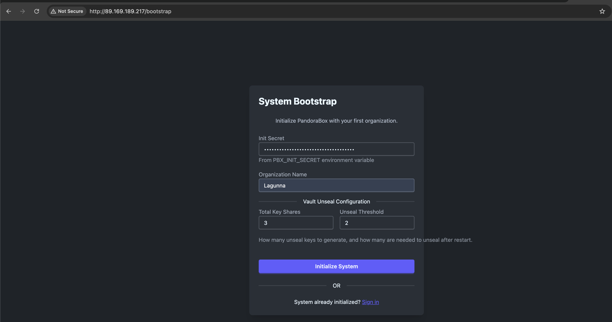
  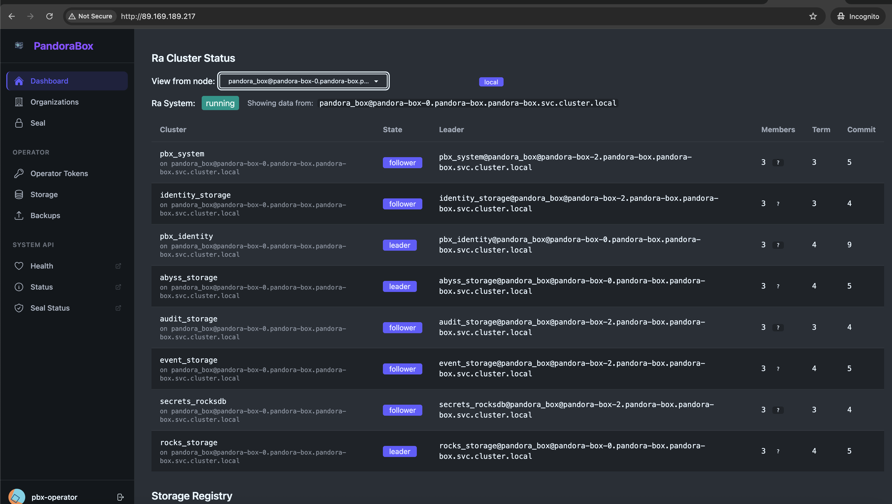

- **Prometheus собирает метрики из развёрнутого приложения.** PodMonitor из чарта pandora-box (`release: kube-prometheus-stack`) подхватывается Prometheus Operator'ом; `vm_memory_total` и Phoenix-метрики из приложения видны в Grafana Explore - данные непрерывно снимаются с трёх pod'ов `pandora-box-{0,1,2}`. Дашборд по namespace `pandora-box` показывает CPU/Memory/Network на уровне подов:

  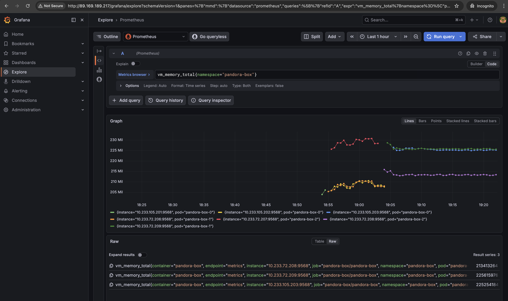
  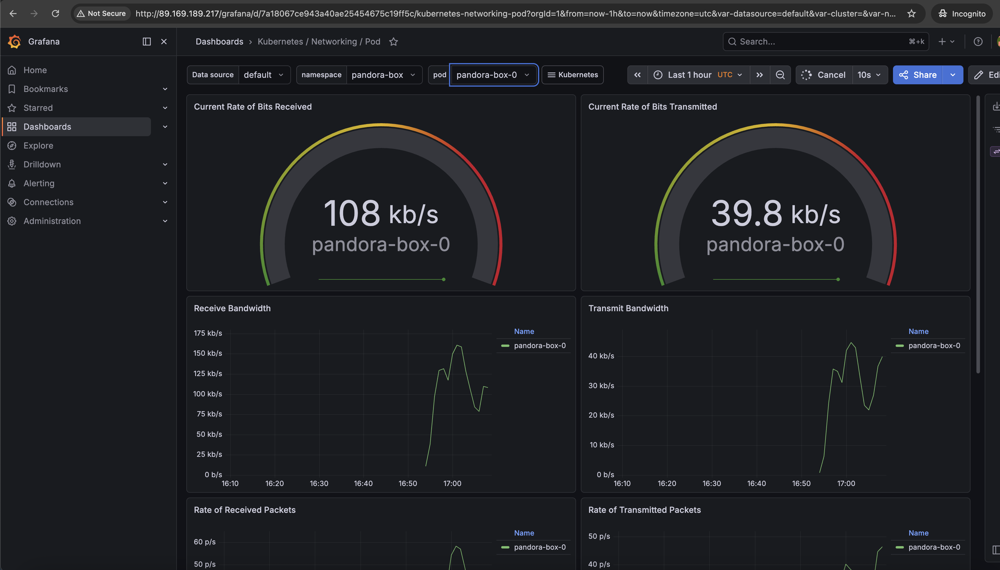

---

## Заключение

**Сделано:**

- Облачная инфраструктура через Terraform: OIDC WIF вместо долгоживущих ключей, минимальные права у SA, tfstate в S3-бакете с KMS.
- Self-hosted Kubernetes через Kubespray, 3 master + 2 worker на прерываемых ВМ.
- Тестовое приложение (Pandora Box) с двухступенчатой сборкой образа в Yandex Container Registry.
- Мониторинг (kube-prometheus-stack) с дашбордами и HTTP-доступом к Grafana через ingress NLB.
- CI/CD с auto-on-tag сборкой и деплоем через GitLab Agent.
- GitOps-flow для основной инфраструктуры: Atlantis применяет `main/` и `pandora-box/` через комментарии в MR.

**Не сделано (отложено за рамки дипломного срока):**

- **DNS.** В текущей работе доступ по IP NLB.
- **TLS / cert-manager.** HTTPS не настроен, всё на :80. Зависит от DNS.

---

## Известные компромиссы

- **Addons (ESO, CSI, Envoy Gateway, monitoring) ставятся CI-job'ами, а не GitOps-инструментом.** Каждый `addons:*` job через GitLab Agent делает `helm install` / `kubectl apply` - императивный процесс поверх декларативного Kubernetes. Изменение addon'а - это правка `.gitlab-ci.yml` и ручной запуск job'а, а не PR с желаемым состоянием. Естественнее был бы ArgoCD или Flux (кластер непрерывно сводится к состоянию из репозитория), но миграция в дипломный срок не укладывается.

- **Пайплайны на push - ручные (grey jobs), auto только на tag - ради экономии free CI minutes.** GitLab.com даёт 400 CI-минут в месяц на free tier, а каждая полная сборка `build:rocksdb-cache` + `build:image` + `test:system` съедает заметную долю лимита. Поэтому push в feature-ветку или в `master` показывает все job'ы как manual-кнопки (`.rules-any-branch-manual`, `.rules-master-manual`); автоматически срабатывает только tag-pipeline (`git tag vX.Y.Z && git push --tags` → `lint → test:elixir + test:external → build:image → test:system → deploy`). Это закрывает требование задания «сборка автоматически по тегу» и одновременно удерживает расход CI-минут в рамках лимита.

  Полный вид *ручных* пайплайнов на push в `master` - infra-репозиторий:

  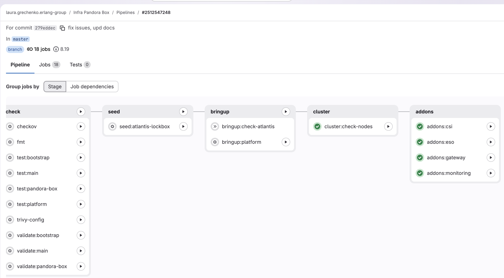

  И репозиторий приложения:

  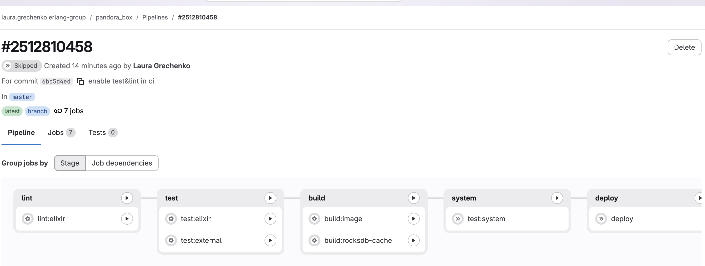
