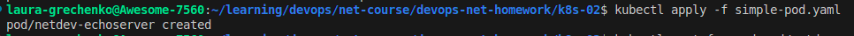
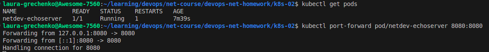
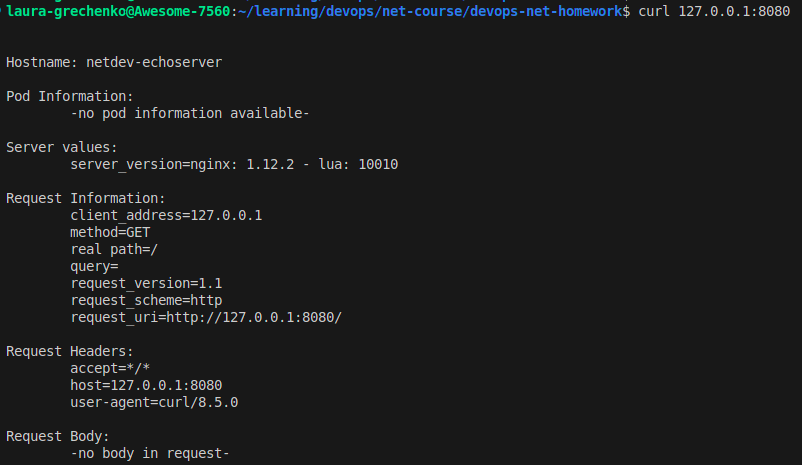
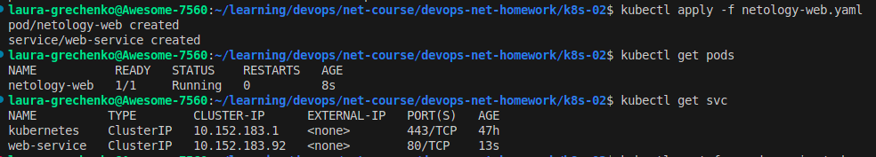
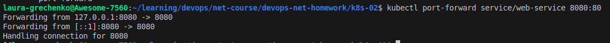
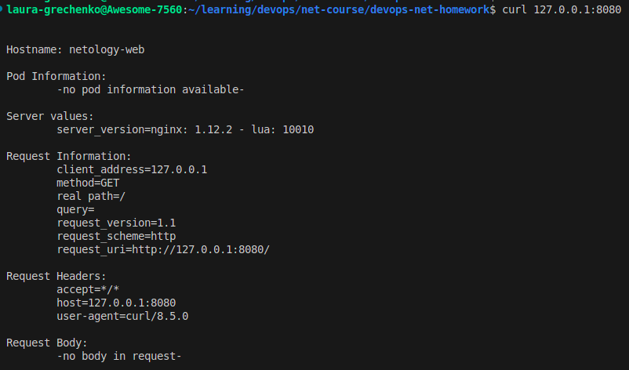

# Домашнее задание к занятию «Базовые объекты K8S»

[Ссылка на yaml pod](https://github.com/lauragrechenko/devops-net-homework/blob/master/k8s-02/simple-pod.yaml)

[Ссылка на yaml pod + service](https://github.com/lauragrechenko/devops-net-homework/blob/master/k8s-02/netology-web.yaml)

### Цель задания

В тестовой среде для работы с Kubernetes, установленной в предыдущем ДЗ, необходимо развернуть Pod с приложением и подключиться к нему со своего локального компьютера. 

------

### Чеклист готовности к домашнему заданию

1. Установленное k8s-решение (например, MicroK8S).
2. Установленный локальный kubectl.
3. Редактор YAML-файлов с подключенным Git-репозиторием.

------

### Инструменты и дополнительные материалы, которые пригодятся для выполнения задания

1. Описание [Pod](https://kubernetes.io/docs/concepts/workloads/pods/) и примеры манифестов.
2. Описание [Service](https://kubernetes.io/docs/concepts/services-networking/service/).

------

### Задание 1. Создать Pod с именем hello-world

1. Создали манифест (yaml-конфигурацию) Pod.
2. Использовали image - gcr.io/kubernetes-e2e-test-images/echoserver:2.2.

3. Подключились локально к Pod с помощью `kubectl port-forward` и вывелм значение curl.

------

### Задание 2. Создать Service и подключить его к Pod

1. Создали Pod с именем netology-web.
2. Использовали image — gcr.io/kubernetes-e2e-test-images/echoserver:2.2.
3. Создали Service с именем netology-svc и подключили к netology-web.
4. Подключились локально к Service с помощью `kubectl port-forward` и вывели значение curl.

------

### Правила приёма работы

1. Домашняя работа оформляется в своем Git-репозитории в файле README.md. Выполненное домашнее задание пришлите ссылкой на .md-файл в вашем репозитории.
2. Файл README.md должен содержать скриншоты вывода команд `kubectl get pods`, а также скриншот результата подключения.
3. Репозиторий должен содержать файлы манифестов и ссылки на них в файле README.md.

------

### Критерии оценки
Зачёт — выполнены все задания, ответы даны в развернутой форме, приложены соответствующие скриншоты и файлы проекта, в выполненных заданиях нет противоречий и нарушения логики.

На доработку — задание выполнено частично или не выполнено, в логике выполнения заданий есть противоречия, существенные недостатки.
