# Домашнее задание к занятию «Запуск приложений в K8S»

[Ссылка на yaml файлы Задания 1](https://github.com/lauragrechenko/devops-net-homework/tree/master/k8s-03/1)

[Ссылка на yaml файлы Задания 2](https://github.com/lauragrechenko/devops-net-homework/tree/master/k8s-03/2)

### Цель задания

В тестовой среде для работы с Kubernetes, установленной в предыдущем ДЗ, необходимо развернуть Deployment с приложением, состоящим из нескольких контейнеров, и масштабировать его.

------

### Чеклист готовности к домашнему заданию

1. Установленное k8s-решение (например, MicroK8S).
2. Установленный локальный kubectl.
3. Редактор YAML-файлов с подключённым git-репозиторием.

------

### Инструменты и дополнительные материалы, которые пригодятся для выполнения задания

1. [Описание](https://kubernetes.io/docs/concepts/workloads/controllers/deployment/) Deployment и примеры манифестов.
2. [Описание](https://kubernetes.io/docs/concepts/workloads/pods/init-containers/) Init-контейнеров.
3. [Описание](https://github.com/wbitt/Network-MultiTool) Multitool.

------

### Задание 1. Создать Deployment и обеспечить доступ к репликам приложения из другого Pod

1. Создали Deployment приложения, состоящего из двух контейнеров — nginx и multitool.

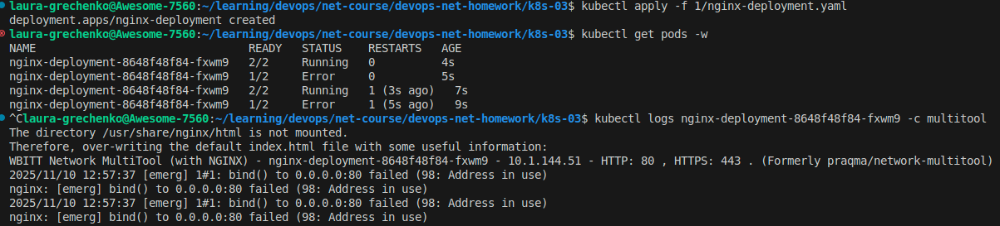

Решили возникшую ошибку (nginx и multitool конфликтуют за порт 80 в одном Pod-е).

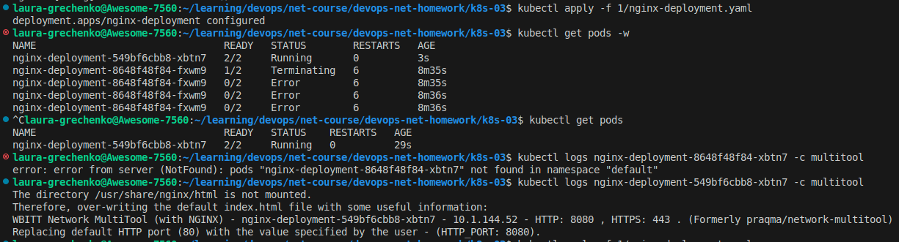

2. После запуска увеличили количество реплик работающего приложения до 2.
3. Продемонстрировали количество подов до и после масштабирования. На скриншоте видно что один под был запущен ранее на п.1 и второй под позже.

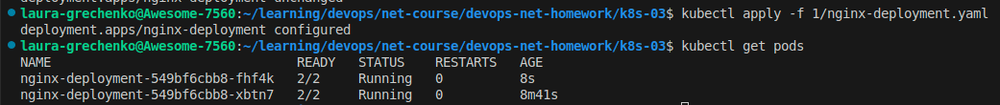

4. Создали Service, который обеспечит доступ до реплик приложений из п.1.

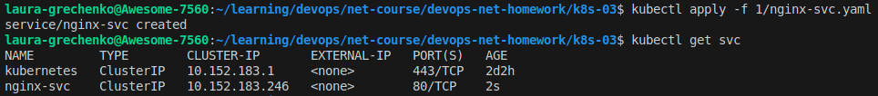

5. Создали отдельный Pod с приложением multitool.

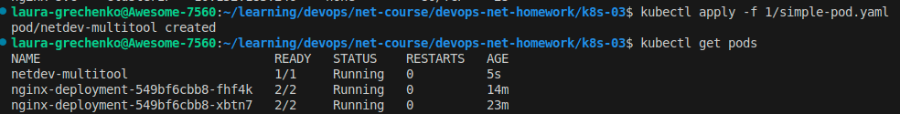

Убедились с помощью `curl`, что из пода есть доступ до приложений из п.1.

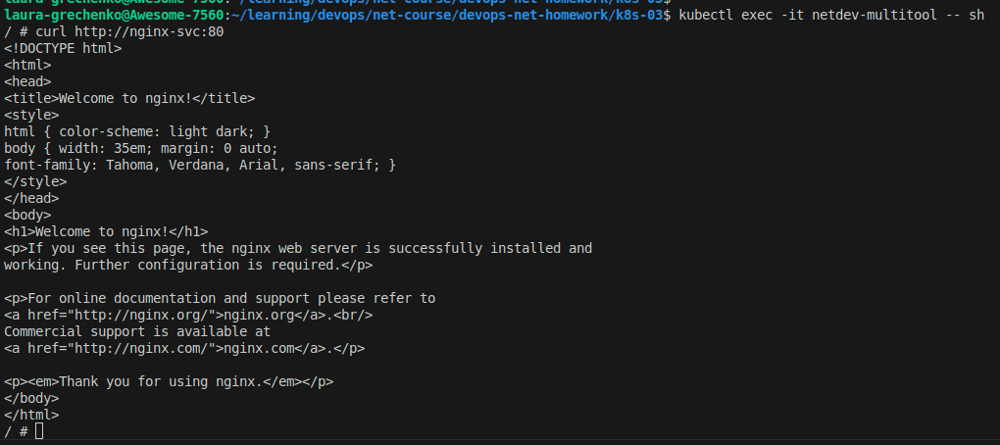

------

### Задание 2. Создать Deployment и обеспечить старт основного контейнера при выполнении условий

1. Создали Deployment приложения nginx и обеспечили старт контейнера только после того, как будет запущен сервис этого приложения.
2. Убедились, что nginx не стартует. В качестве Init-контейнера взяли busybox.

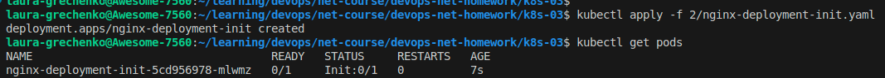

Использовали команду describe, чтобы посмотреть текущий статус Pending и последние события Events для пода:

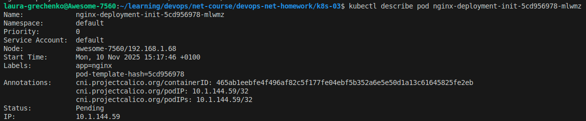

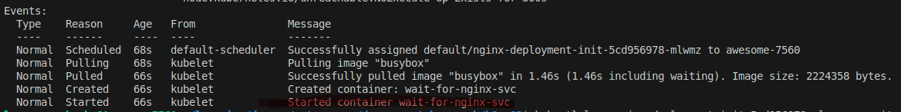

Проверили логи в инит-контейнере (ожидается запуск nginx-svc):

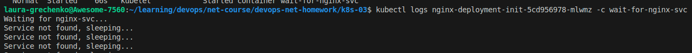

3. Создали и запустили Service. Убедились, что Init запустился.

Использовали команду describe, чтобы посмотреть текущий статус Running и последние события Events для пода:

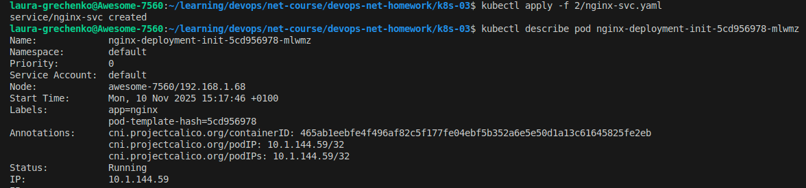

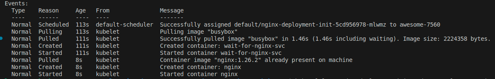

Проверили логи в инит-контейнере (произошел запуск nginx-svc):

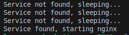

4. Состояния пода до и после запуска сервиса.

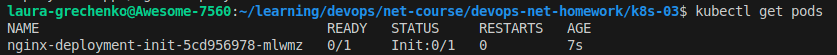

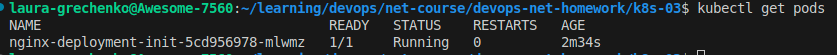

------

### Правила приема работы

1. Домашняя работа оформляется в своем Git-репозитории в файле README.md. Выполненное домашнее задание пришлите ссылкой на .md-файл в вашем репозитории.
2. Файл README.md должен содержать скриншоты вывода необходимых команд `kubectl` и скриншоты результатов.
3. Репозиторий должен содержать файлы манифестов и ссылки на них в файле README.md.

------
