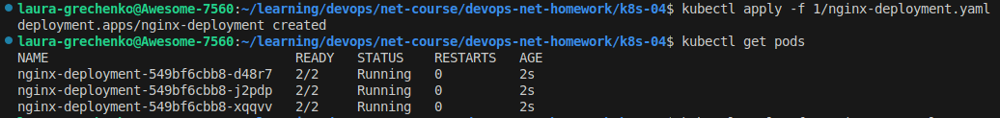
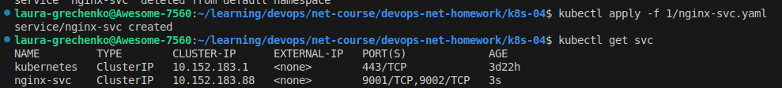
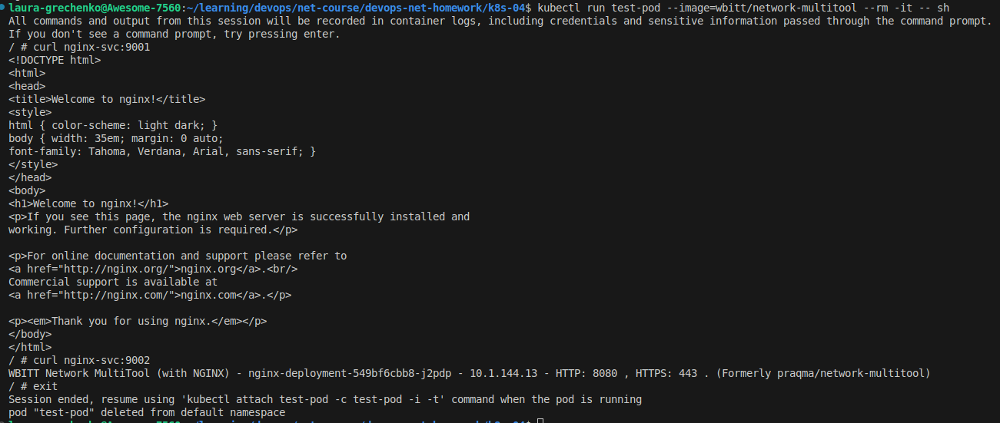
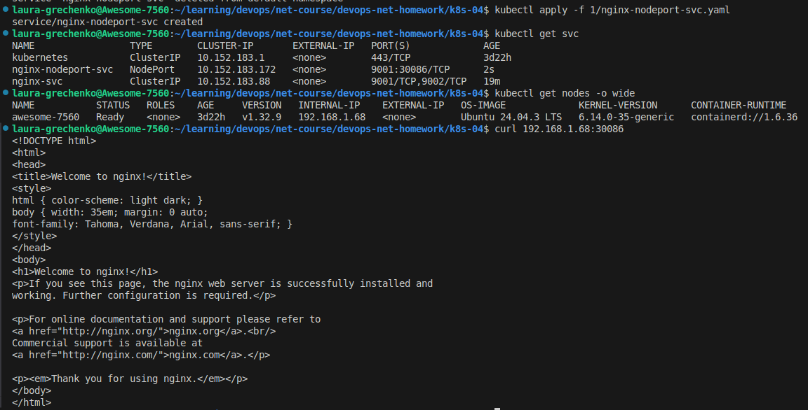
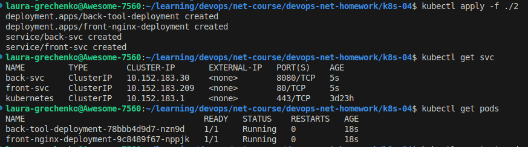
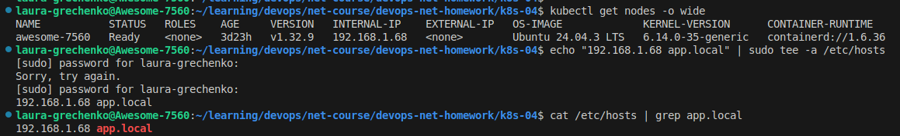
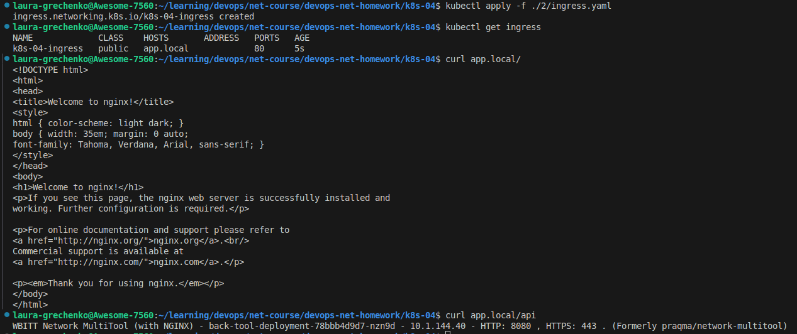

# Домашнее задание к занятию «Сетевое взаимодействие в Kubernetes»

### Примерное время выполнения задания

120 минут

### Цель задания

Научиться настраивать доступ к приложениям в Kubernetes:
- Внутри кластера через **Service** (ClusterIP, NodePort).
- Снаружи кластера через **Ingress**.

Это задание поможет вам освоить базовые принципы сетевого взаимодействия в Kubernetes — ключевого навыка для работы с кластерами.
На практике Service и Ingress используются для доступа к приложениям, балансировки нагрузки и маршрутизации трафика. Понимание этих механизмов поможет вам упростить управление сервисами в рабочих окружениях и снизит риски ошибок при развёртывании.

------

## **Подготовка**
### **Чеклист готовности**
- Установлен Kubernetes (MicroK8S, Minikube или другой).
- Установлен `kubectl`.
- Редактор для YAML-файлов (VS Code, Vim и др.).

------

### Инструменты, которые пригодятся для выполнения задания

1. [Инструкция](https://microk8s.io/docs/getting-started) по установке MicroK8S.
2. [Инструкция](https://minikube.sigs.k8s.io/docs/start/?arch=%2Fwindows%2Fx86-64%2Fstable%2F.exe+download) по установке Minikube. 
3. [Инструкция](https://kubernetes.io/docs/tasks/tools/install-kubectl-windows/)по установке kubectl.
4. [Инструкция](https://marketplace.visualstudio.com/items?itemName=ms-kubernetes-tools.vscode-kubernetes-tools) по установке VS Code

### Дополнительные материалы, которые пригодятся для выполнения задания

1. [Описание](https://kubernetes.io/docs/concepts/workloads/controllers/deployment/) Deployment и примеры манифестов.
2. [Описание](https://kubernetes.io/docs/concepts/services-networking/service/) Описание Service.
3. [Описание](https://kubernetes.io/docs/concepts/services-networking/ingress/) Ingress.
4. [Описание](https://github.com/wbitt/Network-MultiTool) Multitool.

------

## **Задание 1: Настройка Service (ClusterIP и NodePort)**
### **Задача**
Развернуть приложение из двух контейнеров (`nginx` и `multitool`) и обеспечить доступ к ним:
- Внутри кластера через **ClusterIP**.
- Снаружи через **NodePort**.

### **Шаги выполнения**
1. **Создали Deployment** с двумя контейнерами:
   - `nginx` (порт `80`).
   - `multitool` (порт `8080`).
   - Количество реплик: `3`.

   

2. **Создали Service типа ClusterIP**, который:
   - Открывает `nginx` на порту `9001`.
   - Открывает `multitool` на порту `9002`.

   

3. **Проверили доступность** изнутри кластера:
```bash
 kubectl run test-pod --image=wbitt/network-multitool --rm -it -- sh
 curl <service-name>:9001 # Проверить nginx
 curl <service-name>:9002 # Проверить multitool
```



4. **Создали Service типа NodePort** для доступа к `nginx` снаружи.
5. **Проверили доступ** с локального компьютера:
```bash
 curl <node-ip>:<node-port>
   ```

 
 

---
## **Задание 2: Настройка Ingress**
### **Задача**
Развернуть два приложения (`frontend` и `backend`) и обеспечить доступ к ним через **Ingress** по разным путям.

### **Шаги выполнения**
1. **Развернули два Deployment**:
   - `frontend` (образ `nginx`).
   - `backend` (образ `wbitt/network-multitool`).
2. **Создали Service** для каждого приложения.

 

3. **Включили Ingress-контроллер**:
```bash
 microk8s enable ingress
   ```

Выбрали имя хоста `app.local` и добавили его в /etc/hosts.
  

4. **Создали Ingress**, который:
   - Открывает `frontend` по пути `/`.
   - Открывает `backend` по пути `/api`.
   
5. **Проверили доступность**:
```bash
 curl <host>/
 curl <host>/api
   ```

 


---
