# Домашнее задание к занятию «Хранение в K8s»

### Примерное время выполнения задания — 180 минут

### Цель задания

Научиться работать с хранилищами в тестовой среде Kubernetes:
- обеспечить обмен файлами между контейнерами пода;
- создавать **PersistentVolume** (PV) и использовать его в подах через **PersistentVolumeClaim** (PVC);
- объявлять свой **StorageClass** (SC) и монтировать его в под через **PVC**.

Это задание поможет вам освоить базовые принципы взаимодействия с хранилищами в Kubernetes — одного из ключевых навыков для работы с кластерами. На практике Volume, PV, PVC используются для хранения данных независимо от пода, обмена данными между подами и контейнерами внутри пода. Понимание этих механизмов поможет вам упростить проектирование слоя данных для приложений, разворачиваемых в кластере k8s.

------

## **Подготовка**
### **Чеклист готовности**

1. Установленное K8s-решение (допустим, MicroK8S).
2. Установленный локальный kubectl.
3. Редактор YAML-файлов с подключенным GitHub-репозиторием.

------

### Инструменты, которые пригодятся для выполнения задания

1. [Инструкция](https://microk8s.io/docs/getting-started) по установке MicroK8S.
2. [Инструкция](https://minikube.sigs.k8s.io/docs/start/?arch=%2Fwindows%2Fx86-64%2Fstable%2F.exe+download) по установке Minikube. 
3. [Инструкция](https://kubernetes.io/docs/tasks/tools/install-kubectl-windows/) по установке kubectl.
4. [Инструкция](https://marketplace.visualstudio.com/items?itemName=ms-kubernetes-tools.vscode-kubernetes-tools) по установке VS Code

### Дополнительные материалы, которые пригодятся для выполнения задания
1. [Описание Volumes](https://kubernetes.io/docs/concepts/storage/volumes/).
2. [Описание Ephemeral Volumes](https://kubernetes.io/docs/concepts/storage/volumes/).
3. [Описание PersistentVolume](https://kubernetes.io/docs/concepts/storage/persistent-volumes/).
4. [Описание PersistentVolumeClaim](https://kubernetes.io/docs/concepts/storage/persistent-volumes/#persistentvolumeclaims).
5. [Описание StorageClass](https://kubernetes.io/docs/concepts/storage/storage-classes/).
6. [Описание Multitool](https://github.com/wbitt/Network-MultiTool).

------

## Задание 1. Volume: обмен данными между контейнерами в поде
### Задача

Создать Deployment приложения, состоящего из двух контейнеров, обменивающихся данными.

### Шаги выполнения
1. Создать Deployment приложения, состоящего из контейнеров busybox и multitool.
2. Настроить busybox на запись данных каждые 5 секунд в некий файл в общей директории.
3. Обеспечить возможность чтения файла контейнером multitool.

Вывод команды чтения файла:

  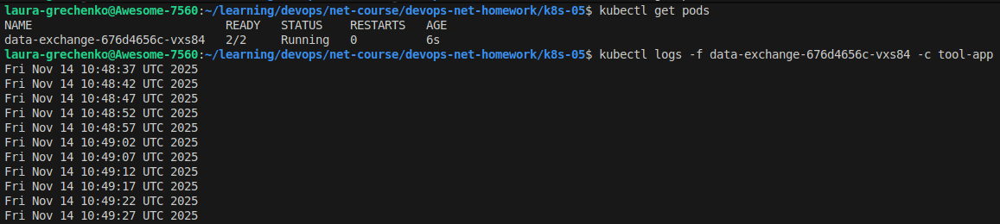

Описание пода с контейнерами:
  
  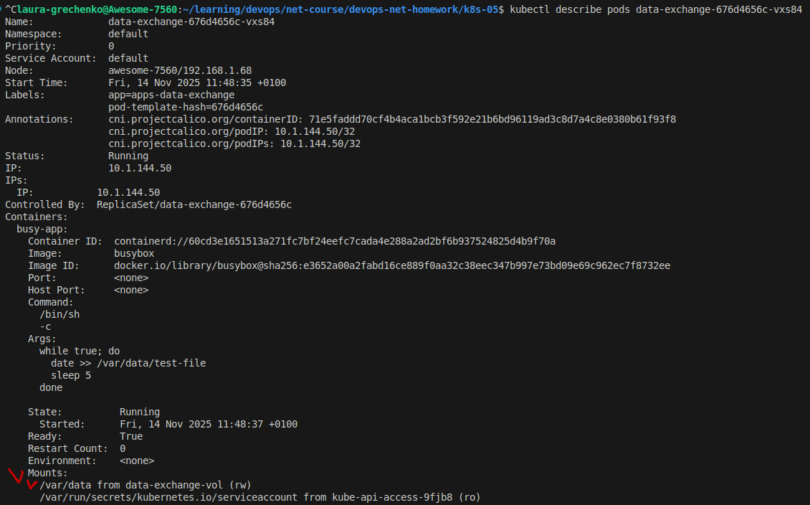

  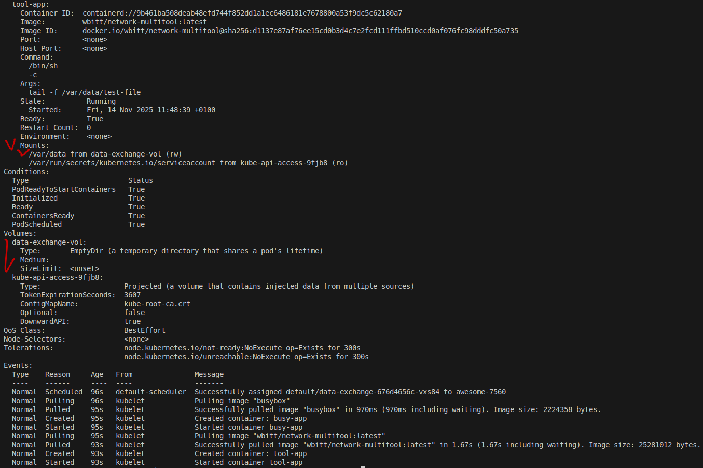

### Что сдать на проверку
- Манифесты:
  - `containers-data-exchange.yaml`
- Скриншоты:
  - описание пода с контейнерами (`kubectl describe pods data-exchange`)
  - вывод команды чтения файла (`tail -f <имя общего файла>`)

------

## Задание 2. PV, PVC
### Задача
Создать Deployment приложения, использующего локальный PV, созданный вручную.

### Шаги выполнения
1. Создать Deployment приложения, состоящего из контейнеров busybox и multitool, использующего созданный ранее PVC
2. Создать PV и PVC для подключения папки на локальной ноде, которая будет использована в поде.

  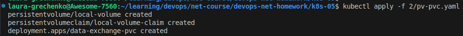

  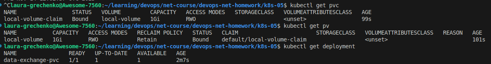

3. Продемонстрировать, что контейнер multitool может читать данные из файла в смонтированной директории, в который busybox записывает данные каждые 5 секунд. 

  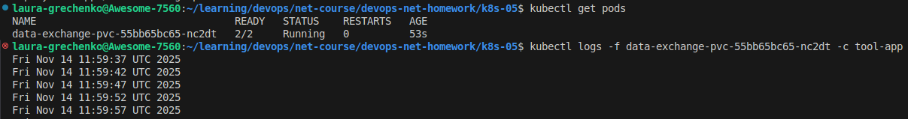

4. Удалить Deployment и PVC. Продемонстрировать, что после этого произошло с PV. Пояснить, почему. (Используйте команду `kubectl describe pv`).

  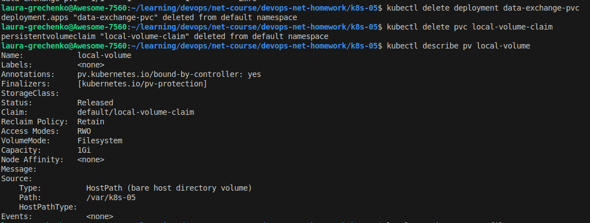

 - `Status: Released` - PVC уже нет, поэтому PV “освобождён”.
 - `Reclaim Policy: Retain` — Kubernetes не удаляет PV и не трогает данные.
 - В `Claim`: всё ещё отображается старая ссылка на PVC (она уже неактуальна).

5. Продемонстрировать, что файл сохранился на локальном диске ноды. Удалить PV.  Продемонстрировать, что произошло с файлом после удаления PV. Пояснить, почему.

  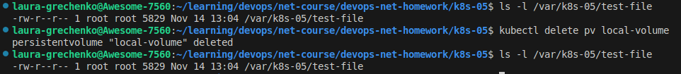

- После удаления PV файл сохранился, потому что hostPath представляет собой локальную директорию. Kubernetes управляет только объектом PV, но не удаляет данные на хосте.

### Что сдать на проверку
- Манифесты:
  - `pv-pvc.yaml`
- Скриншоты:
  - каждый шаг выполнения задания, начиная с шага 2.
- Описания:
  - объяснение наблюдаемого поведения ресурсов в двух последних шагах.

------

## Задание 3. StorageClass
### Задача
Создать Deployment приложения, использующего PVC, созданный на основе StorageClass.

### Шаги выполнения

1. Создать Deployment приложения, состоящего из контейнеров busybox и multitool, использующего созданный ранее PVC.
2. Создать SC и PVC для подключения папки на локальной ноде, которая будет использована в поде.
3. Продемонстрировать, что контейнер multitool может читать данные из файла в смонтированной директории, в который busybox записывает данные каждые 5 секунд.

При запуске манифеста с Deployment, PVC и StorageClass c `provisioner: kubernetes.io/no-provisioner` возникла ситуация, что и PVC, и Pod находились в состоянии Pending.

Причина:
- StorageClass c типом `provisioner: kubernetes.io/no-provisioner` не поддерживает динамическое создание PV.
- PVC запрашивает том, но в кластере нет ни одного подходящего PersistentVolume.
- Пока PVC остаётся в состоянии Pending, Pod, который ожидает примонтированный том, также не может быть запущен и остаётся Pending.

  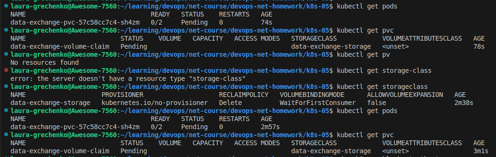

Для разрешения ситуации можно: 

- вручную создать PV, соответствующий параметрам PVC и StorageClass
  
  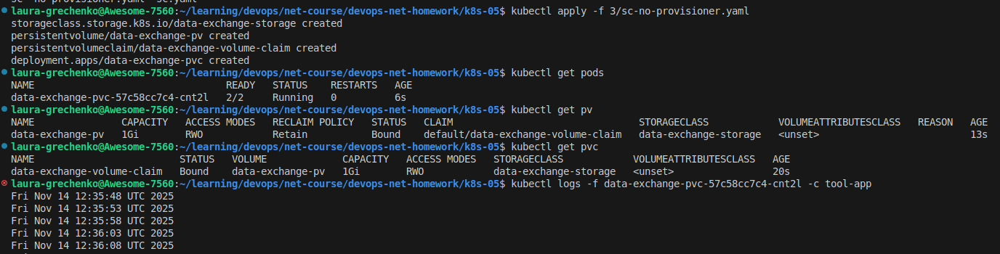

- использовать StorageClass с реальным provisioner (например, microk8s.io/hostpath)
  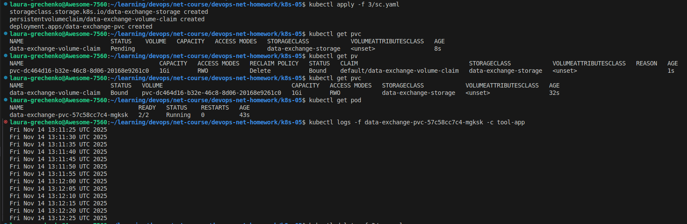

  Видим, что PV был динамически создан.

P.S. я забыла удалять данные `/var/k8s-05/test-file` между разными заданиями - поэтому данные в файле содержат результаты предыдущих заданий.

### Что сдать на проверку
- Манифесты:
  - `sc.yaml`
- Скриншоты:
  - каждый шаг выполнения задания, начиная с шага 2
---
