# Домашнее задание к занятию «Установка Kubernetes»

### Цель задания

Установить кластер K8s.

### Чеклист готовности к домашнему заданию

1. Развёрнутые ВМ с ОС Ubuntu 20.04-lts.


### Инструменты и дополнительные материалы, которые пригодятся для выполнения задания

1. [Инструкция по установке kubeadm](https://kubernetes.io/docs/setup/production-environment/tools/kubeadm/create-cluster-kubeadm/).
2. [Документация kubespray](https://kubespray.io/).

-----

### Задание 1. Установить кластер k8s с 1 master node

1. Подготовка работы кластера из 5 нод: 1 мастер и 4 рабочие ноды.
2. В качестве CRI — containerd.
3. Запуск etcd производить на мастере.
4. Способ установки выбрать самостоятельно.

### Решение (kubeadm)
[Terraform code](https://github.com/lauragrechenko/devops-net-homework/tree/master/k8s-09/1/src)
[Ansible code](https://github.com/lauragrechenko/devops-net-homework/tree/master/k8s-09/1/playbook)

#### 1. Изначально произвели установку вручную с 2 нодами: 1 мастер и 1 рабочая нода.

После установки и настройки согласно инструкции - инициализация мастер-ноды.

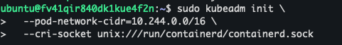

Установили CNI plugin:

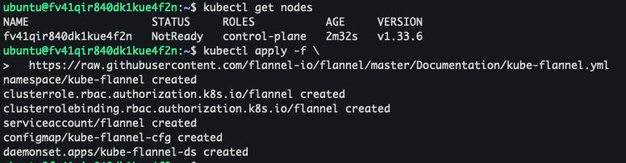

Проверили состояние кластера:

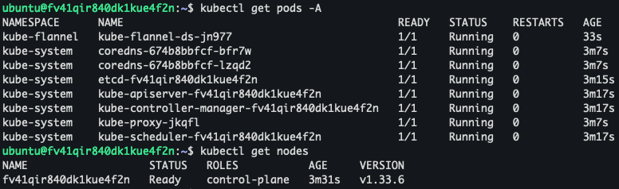
    
На рабочей ноде выполнили команду для присоединения ноды к кластеру.

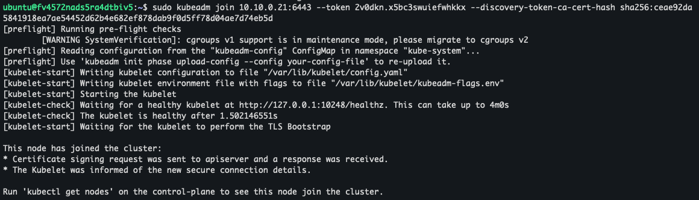

Проверили состояние нод

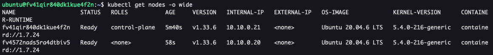

#### 2. Произвели установку с 5 нодами: 1 мастер и 4 рабочих нод. С использованием Terraform, Ansible.

Развёртывание инфраструктуры в Yandex Cloud:
```
terraform apply
```

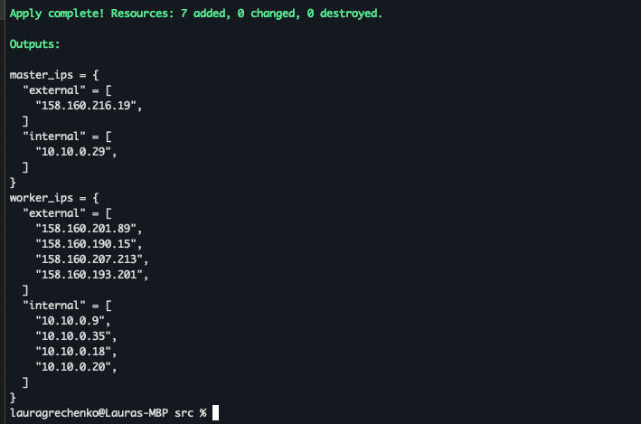

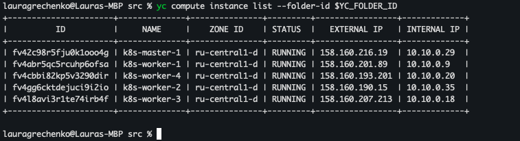

Автоматическая конфигурация K8s-кластера:

```
ansible-playbook -i inventory.ini k8s-cluster.yml
```

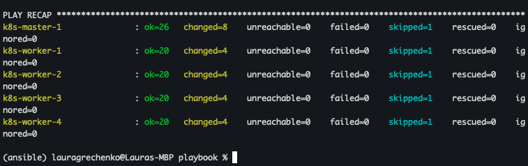

Проверили состояние кластера:

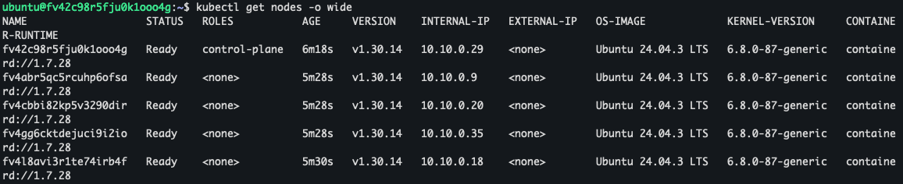

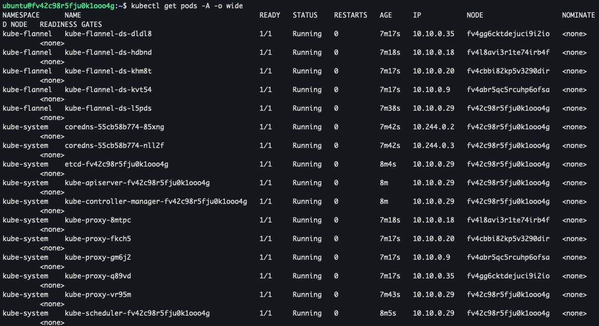

Протестировали работу кластера с помощью nginx-deployment, nginx-svc, busybox контейнера.

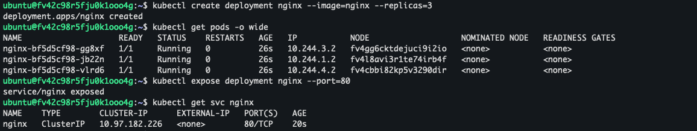

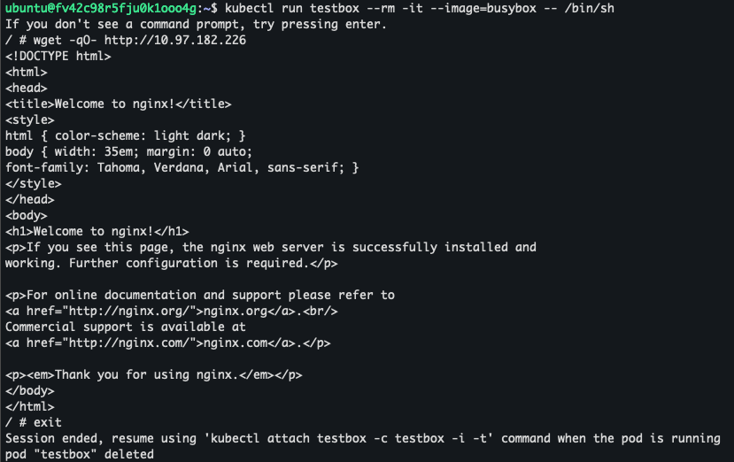


------
### Задание 2*. Установить HA кластер

1. Установить кластер в режиме HA.
2. Использовать нечётное количество Master-node.
3. Для cluster ip использовать keepalived или другой способ.

### Решение (kubeadm)

Из предыдущего задания использовали Terraform для создания 3 мастер-нод:


Автоматическая конфигурация K8s-кластера (play "Prepare all Kubernetes nodes (master + workers)" из первого задания):
```
ansible-playbook -i inventory.ini k8s-cluster.yml --tags "prepare_nodes"
```

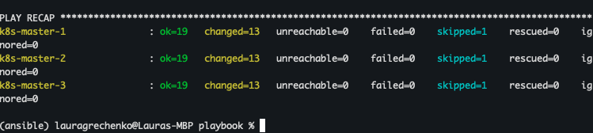

На всех трёх мастерах установлен:
```
haproxy
keepalived
```

Конфигурация HAProxy: `/etc/haproxy/haproxy.cfg`:
```
frontend kube_api_frontend
    bind 0.0.0.0:8443
    mode tcp
    option tcplog
    default_backend kube_api_backend

backend kube_api_backend
    mode tcp
    option tcp-check
    balance roundrobin
    server master1 10.10.0.21:6443 check
    server master2 10.10.0.22:6443 check
    server master3 10.10.0.23:6443 check
```

Конфигурация Keepalived `/etc/keepalived/keepalived.conf`:

VIP = 10.10.0.100

|Нода	| State	|Priority|
|-----------|---------------|----------|
|Master-1|	MASTER|	110|
|Master-2|	BACKUP|	100|
|Master-3|	BACKUP|	90|

```
vrrp_instance VI_1 {
    state <STATE>
    interface eth0
    virtual_router_id 51
    priority <PRIORITY>
    advert_int 1

    authentication {
        auth_type PASS
        auth_pass kubevip123
    }

    virtual_ipaddress {
        10.10.0.100/24
    }
}
```

Инициализация первого master:

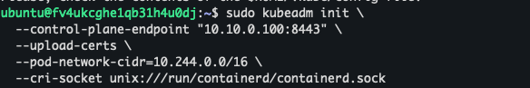

Установка CNI (Flannel) (на одном из мастеров):
```
kubectl apply -f https://raw.githubusercontent.com/flannel-io/flannel/master/Documentation/kube-flannel.yml
```

Подключение оставшихся master-нод:

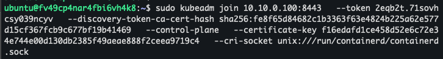

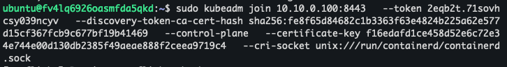

Проверка кластера:

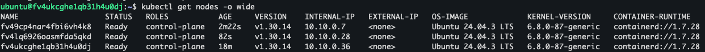

Проверили что нода является лидером кластера:

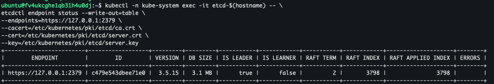

Выключили ВМ (мастер):

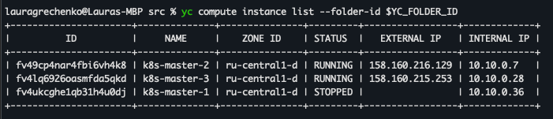

Проверили, что другая нода теперь является лидером кластера:


### Решение (kubespray)
[inventor.ini](https://github.com/lauragrechenko/devops-net-homework/blob/master/k8s-09/2-1/inventory.ini)

Из предыдущего задания использовали Terraform для создания 3 мастер-нод, 2 рабочих нод:

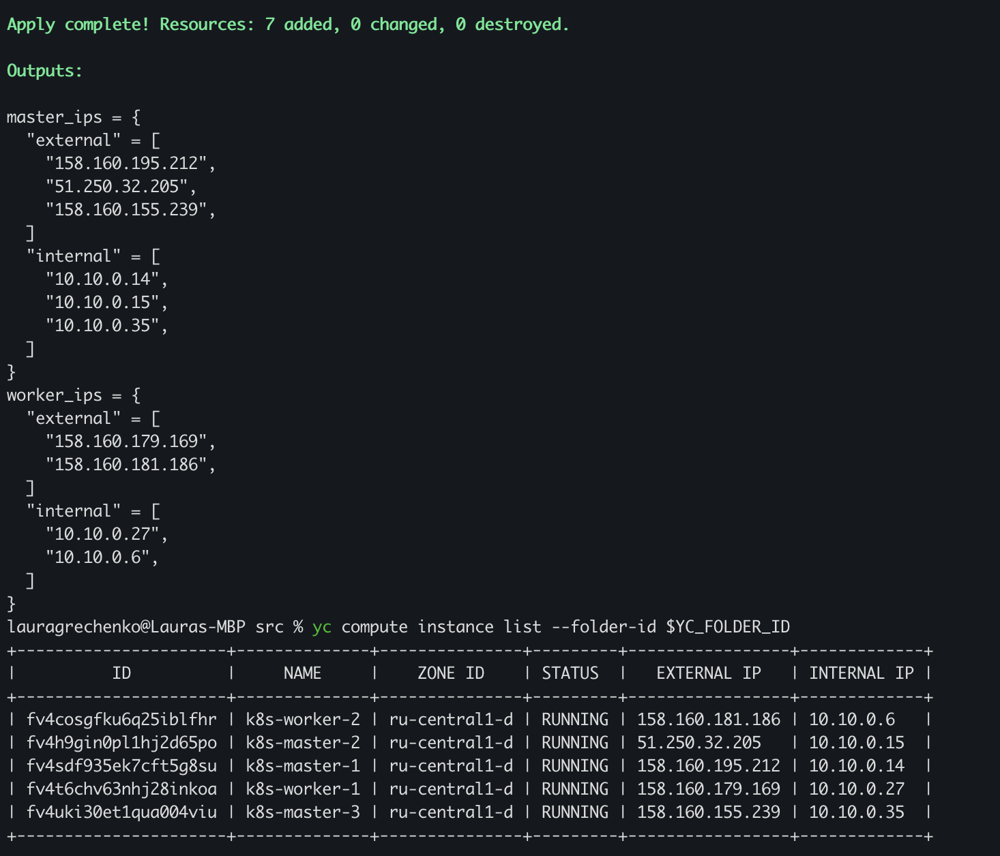

Запускаем установку:
```
ansible-playbook -i inventory/mycluster/hosts.yaml \
  --become --become-user=root cluster.yml
```

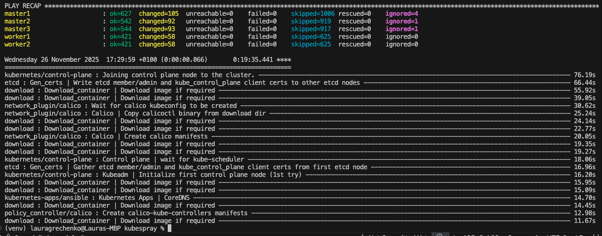

Проверка кластера:

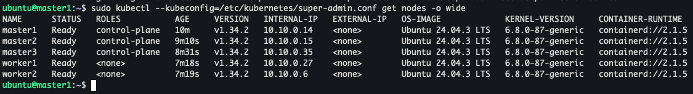

### Правила приёма работы

1. Домашняя работа оформляется в своем Git-репозитории в файле README.md. Выполненное домашнее задание пришлите ссылкой на .md-файл в вашем репозитории.
2. Файл README.md должен содержать скриншоты вывода необходимых команд `kubectl get nodes`, а также скриншоты результатов.
3. Репозиторий должен содержать тексты манифестов или ссылки на них в файле README.md.
