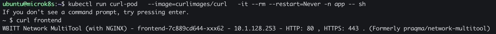
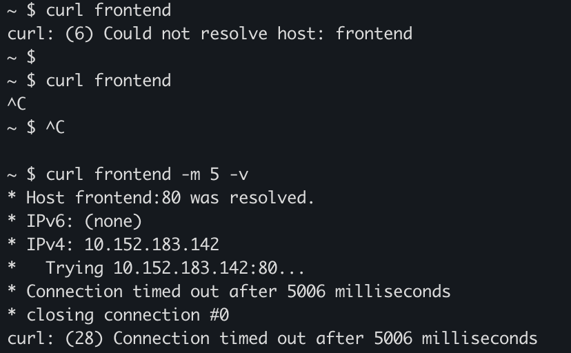
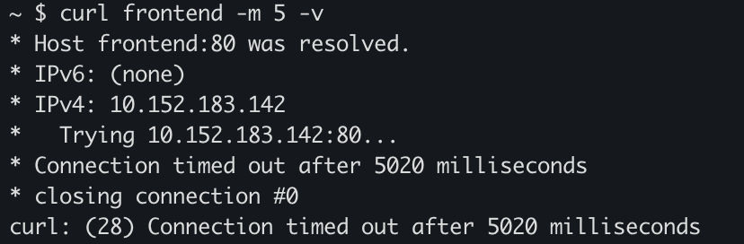
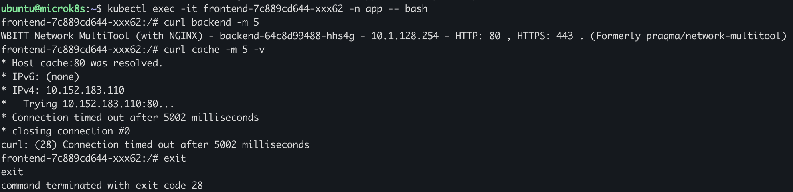
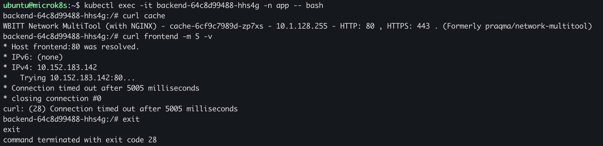
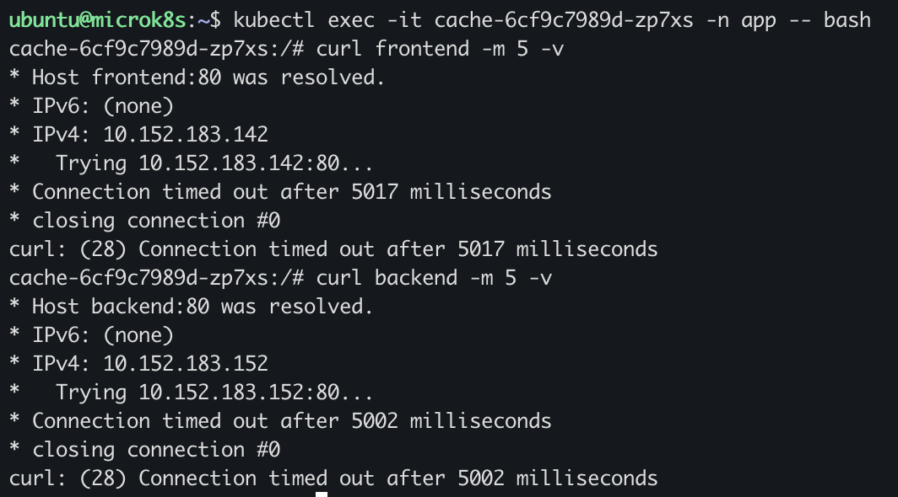

# Домашнее задание к занятию «Как работает сеть в K8s»

- [allow_nothing.yaml](https://github.com/lauragrechenko/devops-net-homework/blob/master/k8s-10/shared/allow_nothing.yaml)
- [deployment.yaml](https://github.com/lauragrechenko/devops-net-homework/blob/master/k8s-10/shared/deployment.yaml)
- [policy.yaml](https://github.com/lauragrechenko/devops-net-homework/blob/master/k8s-10/shared/policy.yaml)

### Цель задания

Настроить сетевую политику доступа к подам.

### Чеклист готовности к домашнему заданию

1. Кластер K8s с установленным сетевым плагином Calico.

### Инструменты и дополнительные материалы, которые пригодятся для выполнения задания

1. [Документация Calico](https://www.tigera.io/project-calico/).
2. [Network Policy](https://kubernetes.io/docs/concepts/services-networking/network-policies/).
3. [About Network Policy](https://docs.projectcalico.org/about/about-network-policy).

-----

### Задание 1. Создать сетевую политику или несколько политик для обеспечения доступа

1. Создали deployment'ы приложений frontend, backend и cache и соответсвующие сервисы.
2. В качестве образа использовали network-multitool.
3. Разместили поды в namespace App.


Проверили доступ к `frontend`:



4.1 Запретили все подключения.

Применили базовую политику `allow_nothing.yaml`:
```
ubuntu@microk8s:~$ kubectl apply -f hw/allow_nothing.yaml
networkpolicy.networking.k8s.io/default-deny-all configured
```

Проверили, что сетевой доступ запрещён:


Добавили доступ к kube-dns, [инструкция](https://www.cncf.io/blog/2020/02/10/guide-to-kubernetes-egress-network-policies/):
```
  egress:
  - to:
    - namespaceSelector:
        matchLabels:
          kubernetes.io/metadata.name: kube-system
      podSelector:
        matchLabels:
          k8s-app: kube-dns
    ports:
    - protocol: TCP
      port: 53
    - protocol: UDP
      port: 53
```      

Проверили, что DNS работает, но сетевой доступ по-прежнему запрещён:



4.2 Проверили, что DNS работает, но сетевой доступ по-прежнему запрещён:
```
ubuntu@microk8s:~$ kubectl apply -f hw/policy.yaml
networkpolicy.networking.k8s.io/frontend-policy created
networkpolicy.networking.k8s.io/backend-policy created
networkpolicy.networking.k8s.io/cache-policy created
```

5. Продемонстрировать, что трафик разрешён и запрещён.

frontend -> backend, cache



backend -> frontend, cache



cache -> frontend, backend



### Правила приёма работы

1. Домашняя работа оформляется в своём Git-репозитории в файле README.md. Выполненное домашнее задание пришлите ссылкой на .md-файл в вашем репозитории.
2. Файл README.md должен содержать скриншоты вывода необходимых команд, а также скриншоты результатов.
3. Репозиторий должен содержать тексты манифестов или ссылки на них в файле README.md.
