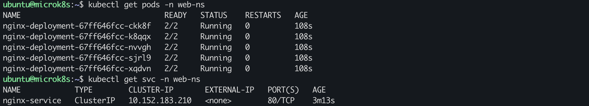
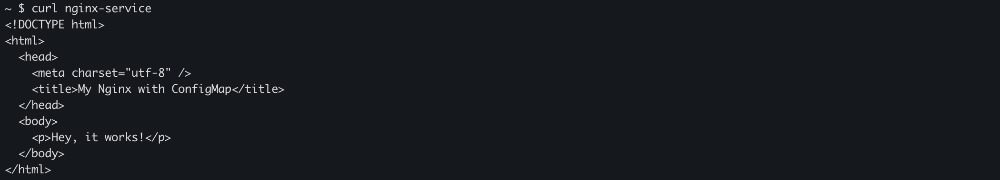
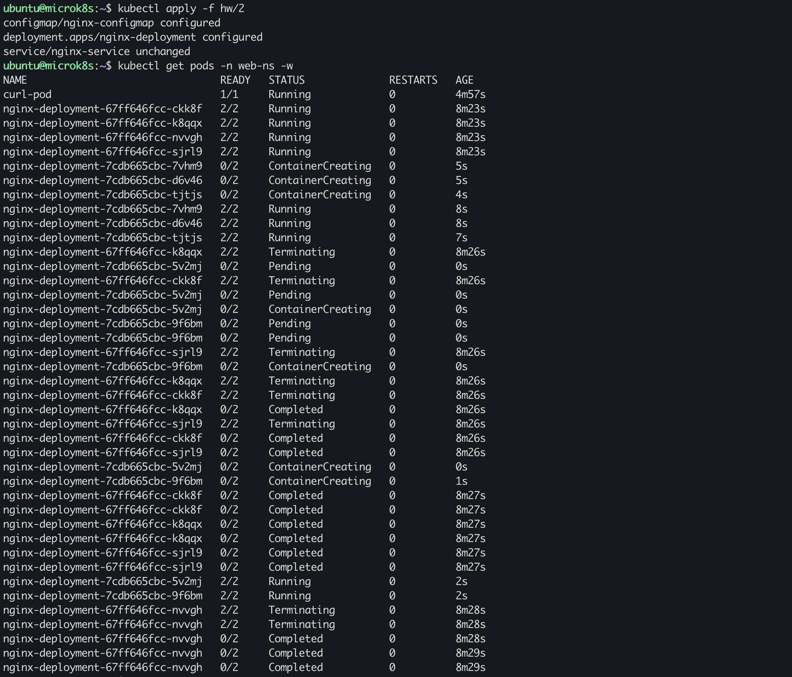
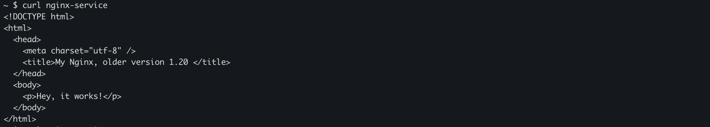
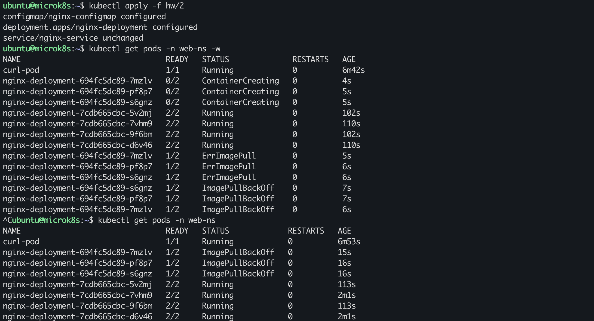
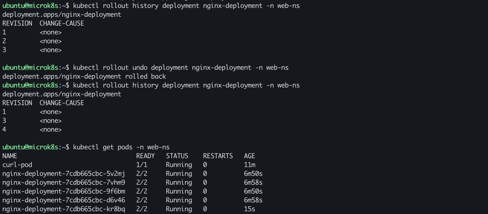
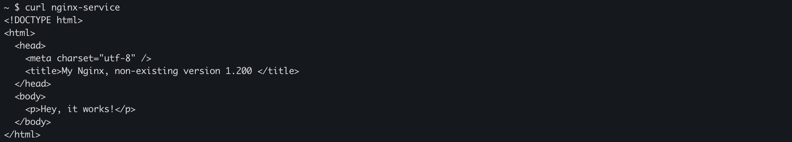
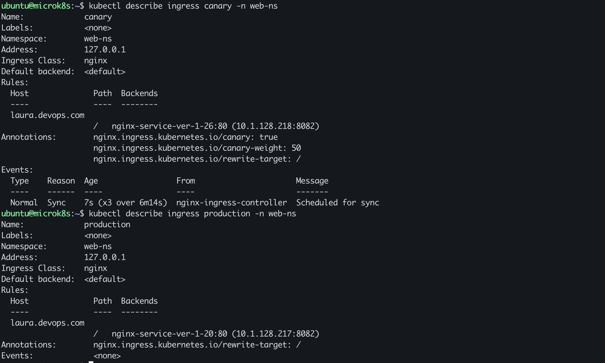
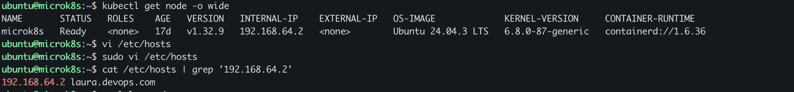
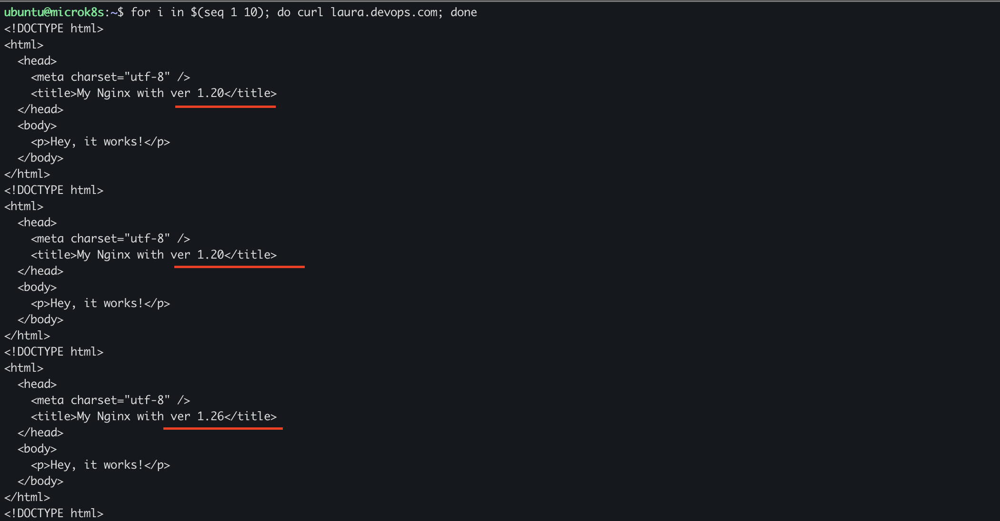

# Домашнее задание к занятию «Обновление приложений»

### Цель задания

Выбрать и настроить стратегию обновления приложения.

### Чеклист готовности к домашнему заданию

1. Кластер K8s.

### Инструменты и дополнительные материалы, которые пригодятся для выполнения задания

1. [Документация Updating a Deployment](https://kubernetes.io/docs/concepts/workloads/controllers/deployment/#updating-a-deployment).
2. [Статья про стратегии обновлений](https://habr.com/ru/companies/flant/articles/471620/).

-----

### Задание 1. Выбрать стратегию обновления приложения и описать ваш выбор

1. Имеется приложение, состоящее из нескольких реплик, которое требуется обновить.
2. Ресурсы, выделенные для приложения, ограничены, и нет возможности их увеличить.
3. Запас по ресурсам в менее загруженный момент времени составляет 20%.
4. Обновление мажорное, новые версии приложения не умеют работать со старыми.
5. Вам нужно объяснить свой выбор стратегии обновления приложения.

В условиях ограниченных ресурсов (запас 20%) и отсутствия совместимости между старой и новой версиями приложения наиболее подходящей стратегией обновления является *Recreate*.

Преимущества:
- не требует одновременного запуска старых и новых pod’ов, что позволяет уложиться в имеющиеся ресурсные ограничения;
- полностью исключает риск конфликтов между несовместимыми версиями приложения.

Недостатки:
- наличие кратковременного простоя приложения во время обновления.

⸻

Rolling Update - не подходит, так как в процессе обновления одновременно работают несовместимые версии приложения, а также требуется дополнительный запас ресурсов (при запасе всего 20% это высокий риск).

Blue/Green — не подходит, так как требует одновременного существования двух полноценных окружений старого и нового, что превышает доступные ресурсы.

Canary / A/B / Dark — не подходят, так как предполагают одновременную работу разных версий приложения, а также использование дополнительных компонентов для маршрутизации трафика, что увеличивает потребление ресурсов.

### Задание 2. Обновить приложение

[Ссылка]() на манифесты.

1. Создали deployment приложения с контейнерами nginx и multitool. Версию nginx взяли 1.26.2. Количество реплик — 5.

Проверили доступность:

2. Обновили версию nginx в приложении на версии 1.20, сократив время обновления до минимума. Приложение должно быть доступно.

Проверили доступность (config-map так же был изменен):

3. Попытались обновить nginx до версии 1.200 (config-map так же был изменен), приложение осталось доступным.

Проверили доступность:

4. Откатиться после неудачного обновления.

Проверили доступность (видим конфиг из шага 3 - объяснение ниже):

Rollback деплоя != rollback конфигов.
То, что мы видим 1.200 в index.html после отката — технически корректно - мы откатили только Deployment.
Чтобы откатывался и HTML, можно:
- либо хранить конфиг как отдельную версию (nginx-config-v1-20, nginx-config-v1-200),
- либо управлять всем через Helm и считать релиз = код + конфиг.

### Задание 3*. Создать Canary deployment

[Ссылка]() на манифесты.

Использовали [инструкцию](https://kubernetes.github.io/ingress-nginx/examples/canary/) для настройки canary deployment.

1. Создать два deployment'а приложения nginx.
2. При помощи разных ConfigMap сделать две версии приложения — веб-страницы.
3. С помощью ingress создать канареечный деплоймент, чтобы можно было часть трафика перебросить на разные версии приложения.

Описание ingress'ов:

Проверили работу:

### Правила приёма работы

1. Домашняя работа оформляется в своем Git-репозитории в файле README.md. Выполненное домашнее задание пришлите ссылкой на .md-файл в вашем репозитории.
2. Файл README.md должен содержать скриншоты вывода необходимых команд, а также скриншоты результатов.
3. Репозиторий должен содержать тексты манифестов или ссылки на них в файле README.md.
