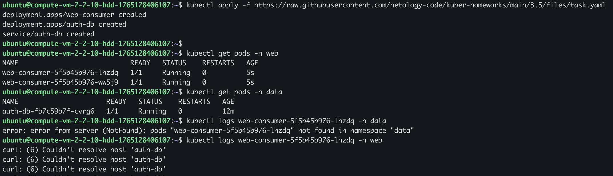
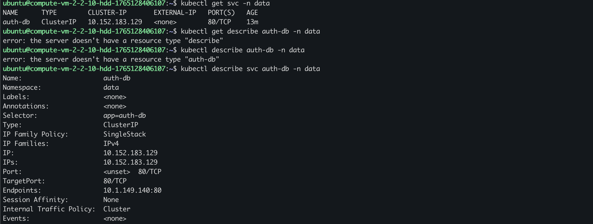
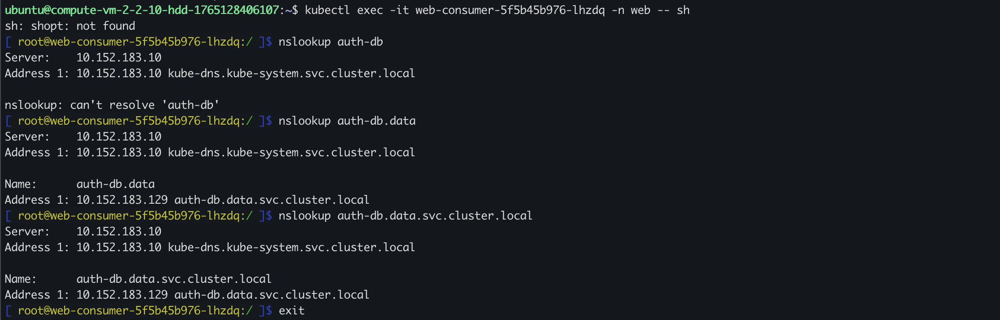
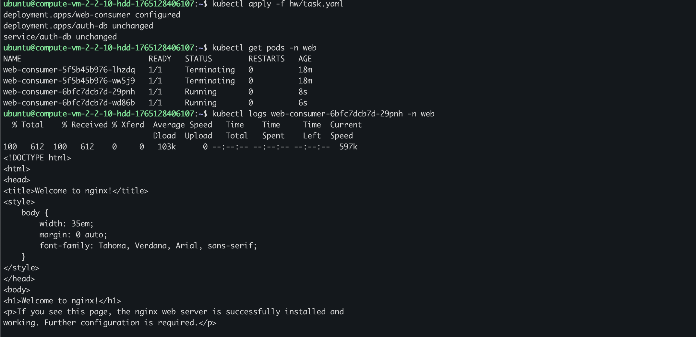

# Домашнее задание к занятию Troubleshooting

### Цель задания

Устранить неисправности при деплое приложения.

### Чеклист готовности к домашнему заданию

1. Кластер K8s.

### Задание. При деплое приложение web-consumer не может подключиться к auth-db. Необходимо это исправить

1. Установить приложение по команде:
```shell
kubectl apply -f https://raw.githubusercontent.com/netology-code/kuber-homeworks/main/3.5/files/task.yaml
```

2. Выявить проблему и описать.

После запуска приложение web-consumer не могло подключиться к сервису auth-db.
В логах pod’ов web-consumer наблюдалась ошибка:
```
curl: (6) Couldn't resolve host 'auth-db'
```





Причина проблемы: web-consumer расположен в namespace web и Service auth-db расположен в namespace data. В k8s DNS-имя вида `auth-db` корректно резолвится только внутри того же namespace. При обращении из другого namespace необходимо указывать полное DNS-имя.



3. Исправить проблему, описать, что сделано.
Было исправлено DNS-имя сервиса в Deployment web-consumer.

Было:
```
curl auth-db
```

Стало:
```
curl auth-db.data.svc.cluster.local
```

4. Продемонстрировать, что проблема решена.




### Правила приёма работы

1. Домашняя работа оформляется в своём Git-репозитории в файле README.md. Выполненное домашнее задание пришлите ссылкой на .md-файл в вашем репозитории.
2. Файл README.md должен содержать скриншоты вывода необходимых команд, а также скриншоты результатов.
3. Репозиторий должен содержать тексты манифестов или ссылки на них в файле README.md.
