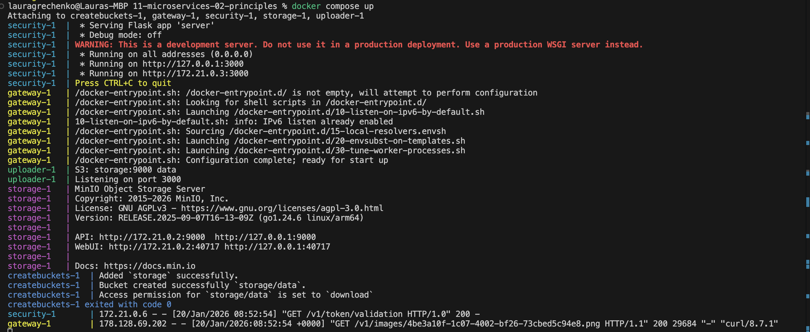
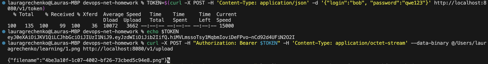
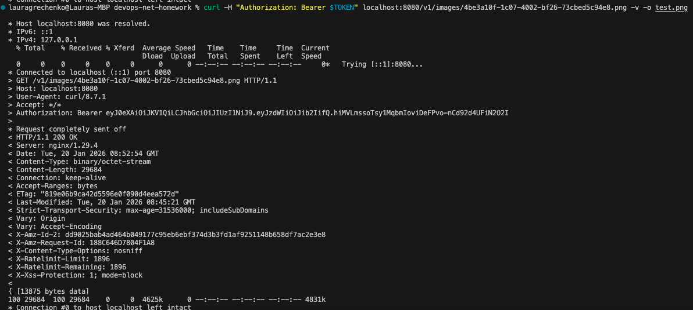

# Домашнее задание к занятию «Микросервисы: принципы»

Вы работаете в крупной компании, которая строит систему на основе микросервисной архитектуры.
Вам как DevOps-специалисту необходимо выдвинуть предложение по организации инфраструктуры для разработки и эксплуатации.

## Задача 1: API Gateway 

Предложите решение для обеспечения реализации API Gateway. Составьте сравнительную таблицу возможностей различных программных решений. На основе таблицы сделайте выбор решения.

Решение должно соответствовать следующим требованиям:
- маршрутизация запросов к нужному сервису на основе конфигурации,
- возможность проверки аутентификационной информации в запросах,
- обеспечение терминации HTTPS.

Обоснуйте свой выбор.

## Сравнительная таблица решений (2025–2026)

Самые популярные API Gateway решения взяты из источников:
1) [Сравнение топ-11 платформ](https://api7.ai/top-11-api-gateways-platforms-compared)  
2) [Сравнение топ-6 open-source платформ](https://daily.dev/blog/top-6-open-source-api-gateway-frameworks)

> Колонка “Цена” = публичная модель ценообразования (без стоимости инфраструктуры и эксплуатации).
Ниже — **проверенные (публичные) цены**. Важно: у части вендоров прайс **зависит от региона/типа API/типа деплоя** и может меняться; взято, что опубликовано на официальных страницах.

| Решение | Тип | Маршрутизация по конфигу | Проверка аутентификации | Терминация HTTPS | Цена / модель |
|---|---|---:|---:|---:|---|
| **AWS API Gateway** | Managed | ✅ | ✅ | ✅ | REST APIs: **$3.50 за 1M запросов** + отдельно **data transfer** (есть volume tiers)  |
| **Azure API Management** | Managed | ✅ | ✅ | ✅ | Tier-based; пример публичных цен v2: **Basic v2 ~$150.01/мес**, **Standard v2 ~$700/мес** (зависит от региона/scale units)  |
| **Google Apigee** | Managed (enterprise API management) | ✅ | ✅ | ✅ | Pay-as-you-go: **Standard API Proxy calls $20 за 1M вызовов (до 50M)** + отдельно **Environment usage (per hour per region)**  |
| **Kong (Konnect / Dedicated Cloud Gateways)** | Hybrid / self-managed | ✅ | ✅ (плагины) | ✅ | Для DCGW: **$500/месяц за control plane** + **$0.15/GB bandwidth** (другие варианты — по условиям продукта/контракта)  |
| **Tyk** | Hybrid / self-managed | ✅ | ✅ | ✅ | Официально: **usage-based / contact sales** (фиксированная “$X/мес” публично не гарантируется)  |
| **Apache APISIX** | Self-managed | ✅ | ✅ (плагины) | ✅ | **Open Source (Apache 2.0), бесплатно**; коммерческая поддержка/enterprise — отдельно  |
---

## Выбор решения

### Рекомендуемое решение: **Kong Gateway** (основной) + **Apache APISIX** (альтернатива)
- **Переносимость:** оба решения можно разворачивать в Kubernetes, на VM и bare metal — подходят и для on-prem, и для облаков (в задании нет фиксированной стратегии).
- **Единые политики на входе:** аутентификация, rate limiting, логирование и трансформации на уровне gateway (через плагины), без изменений кода сервисов.

### Когда выбрать **APISIX** вместо Kong
Если ожидаются **частые изменения маршрутов/политик** и важны:
- hot reload без рестартов,  
- кластерное управление и быстрая доставка конфигурации, 
то APISIX часто удобнее как “Kubernetes-first” gateway. В [профильной статье](https://medium.com/@ApacheAPISIX/why-do-you-need-apache-apisix-when-you-have-nginx-and-kong-4aa3403a053b) подчёркивается, что APISIX решает проблемы NGINX (нет кластерного управления и hot reload) и потенциальные ограничения Kong (зависимость от БД для конфигурации и просадка производительности роутинга при большом числе маршрутов), поэтому может быть выбран как основной API Gateway.

> Примечание: если компания позже выберет одного облачного провайдера, можно рассмотреть managed-решение этого облака (AWS API Gateway / Azure API Management / Apigee) для снижения операционных затрат.


## Задача 2: Брокер сообщений

Составьте таблицу возможностей различных брокеров сообщений. На основе таблицы сделайте обоснованный выбор решения.

Решение должно соответствовать следующим требованиям:
- поддержка кластеризации для обеспечения надёжности,
- хранение сообщений на диске в процессе доставки,
- высокая скорость работы,
- поддержка различных форматов сообщений,
- разделение прав доступа к различным потокам сообщений,
- простота эксплуатации.

Обоснуйте свой выбор.

## Сравнительная таблица

Данные взяты из статьи: [Сравнение Kafka / RabbitMQ / NATS / NSQ](https://gcore.com/learning/nats-rabbitmq-nsq-kafka-comparison)

> Обозначения: ✅ — “поддерживает”, ◑ — возможно, но с оговорками/нужно доп.настройки, ❌ — не поддерживает.

| Брокер | Кластеризация (HA) | Диск (persistence) | Скорость | Форматы сообщений | Разделение прав доступа | Простота эксплуатации | Итог по требованиям |
|---|---:|---:|---:|---|---:|---:|---|
| **Apache Kafka** | ✅ (кластер, репликация) | ✅ (log на диске + retention + replay) | ✅ (очень высокий throughput) | ✅ payload-agnostic (JSON/Avro/Protobuf и т.д. — на уровне приложений) | ✅ ACL на топики/группы/операции | ◑ (сложнее, чем RabbitMQ/NATS) | **Подходит лучше всего** |
| **RabbitMQ (Quorum Queues)** | ✅ (реплицируемые очереди на Raft) | ✅ (персистентность, запись на диск) | ◑ (быстро, но обычно ниже Kafka на больших потоках) | ✅ payload-agnostic (AMQP) | ✅ (права доступа на vhost/ресурсы) | ✅ (обычно самый простой в эксплуатации) | Подходит, но **без replay по умолчанию** |
| **NATS + JetStream** | ✅ (HA/кластерность JetStream)  | ✅ (хранение + replay) | ✅ (низкая задержка; высокая производительность) | ✅ payload-agnostic | ✅ (разделение по accounts/subjects — модель NATS) | ✅ (лёгкий footprint, быстрый старт) | Подходит (особенно для realtime) |
| **NSQ** | ❌ (в статье отмечены проблемы с replication/clustering) | ◑/❌ (ограниченная durability и нет replay) | ✅ (высокая скорость, low latency) | ✅ payload-agnostic | ◑ (менее зрелая модель security, чем у Kafka/RabbitMQ) | ✅ (простая модель) | **Не проходит по HA и persistence** |

---

### Выбор решения

**Вывод:** требований из задания недостаточно, чтобы **однозначно** выбрать один брокер между **Kafka**, **RabbitMQ** и **NATS + JetStream** — все три могут закрыть базовые пункты (кластер/диск/скорость/ACL/форматы), а выбор зависит от *паттерна использования* и нефункциональных деталей (нагрузка, latency vs throughput, необходимость replay, и тд).

#### Рекомендуемый подход для крупной микросервисной системы (нейтрально)
- **Kafka** — как основной **event streaming backbone** (событийная шина):
  - кластер + репликация,
  - данные на диске,
  - высокая пропускная способность,
  - ретеншн и удобный **replay** (переигрывание истории по offset),
  - ACL на топики/consumer groups.
- **RabbitMQ** — для **тасок/очередей** (point-to-point) и сложного роутинга:
  - проще в эксплуатации,
  - сильная модель очередей и маршрутизации,
  - но “replay как в Kafka” не является базовой моделью очередей (для log/replay у RabbitMQ есть отдельный режим **Streams**, это другой сценарий).
- **NATS + JetStream** — если приоритет **низкая задержка** и “cloud-native simplicity”:
  - лёгкий footprint и быстрый старт,
  - persistence + replay в JetStream,
  - хорошо подходит для realtime/edge и сервисной коммуникации.

Задание не уточняет ключевые развилки:
- поток событий или очередь задач (pub-sub log vs work queue),
- нужен ли **replay истории** как основной сценарий,
- целевые нагрузки (throughput/latency), объёмы хранения и ретеншн,
- необходимость сложной маршрутизации сообщений на уровне брокера.

**Итог:** для платформы обычно выбирают **Kafka + RabbitMQ** (разные классы задач), либо **Kafka** как единый backbone, либо **NATS+JetStream** как более лёгкую альтернативу под realtime — выбор зависит от конкретных сценариев.


## Задача 3: API Gateway * (необязательная)

### Есть три сервиса:

**minio**
- хранит загруженные файлы в бакете images,
- S3 протокол,

**uploader**
- принимает файл, если картинка сжимает и загружает его в minio,
- POST /v1/upload,

**security**
- регистрация пользователя POST /v1/user,
- получение информации о пользователе GET /v1/user,
- логин пользователя POST /v1/token,
- проверка токена GET /v1/token/validation.

### Необходимо воспользоваться любым балансировщиком и сделать API Gateway:

**POST /v1/token**
1. Анонимный доступ.
2. Запрос направляется в сервис security POST /v1/token.

**POST /v1/upload**
1. Проверка токена. Токен ожидается в заголовке Authorization. Токен проверяется через вызов сервиса security GET /v1/token/validation/.
2. Запрос направляется в сервис uploader POST /v1/upload.

**GET /v1/images/{image}**
1. Проверка токена. Токен ожидается в заголовке Authorization. Токен проверяется через вызов сервиса security GET /v1/token/validation/.
2. Запрос направляется в сервис minio GET /images/{image}.

### Результат

### Реализация API Gateway (конфиг для NGinx):
```
worker_processes  1;

events { worker_connections 1024; }

http {
  sendfile on;

  upstream security_upstream { server security:3000; }
  upstream uploader_upstream { server uploader:3000; }
  upstream minio_upstream    { server storage:9000; }

  server {
    listen 80;

    # --- Public endpoints (no auth) ---
    location = /v1/token {
      proxy_pass http://security_upstream/v1/token;
      proxy_set_header Host $host;
    }

    # --- Auth subrequest ---
    location = /_auth {
      internal;
      proxy_pass http://security_upstream/v1/token/validation;
      proxy_set_header Authorization $http_authorization;
      proxy_set_header Content-Length "";
      proxy_pass_request_body off;
    }

    # --- Protected endpoints ---
    location = /v1/upload {
      auth_request /_auth;

      proxy_pass http://uploader_upstream/v1/upload;
      proxy_set_header Authorization $http_authorization;
      proxy_set_header Host $host;
    }

    # GET /v1/images/{image} -> minio GET /data/{image}
    location ~ ^/v1/images/(.+)$ {
      auth_request /_auth;

      proxy_pass http://minio_upstream/data/$1;
      proxy_set_header Authorization $http_authorization;
      proxy_set_header Host $host;
    }
  }
}
```
 ### Запуск

 

 ### Тестирование

 

 

---

#### [Дополнительные материалы: как запускать, как тестировать, как проверить](https://github.com/netology-code/devkub-homeworks/tree/main/11-microservices-02-principles)

---

### Как оформить ДЗ?

Выполненное домашнее задание пришлите ссылкой на .md-файл в вашем репозитории.

---
