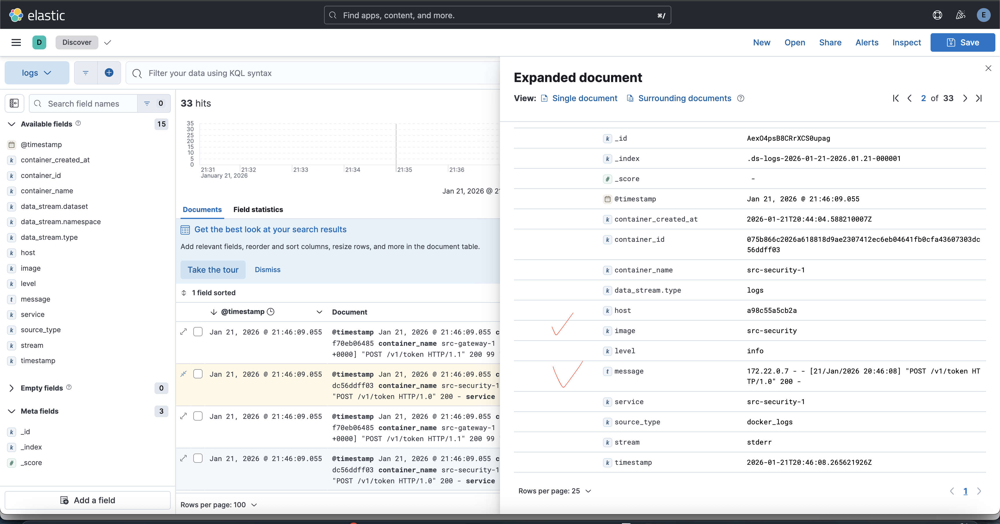
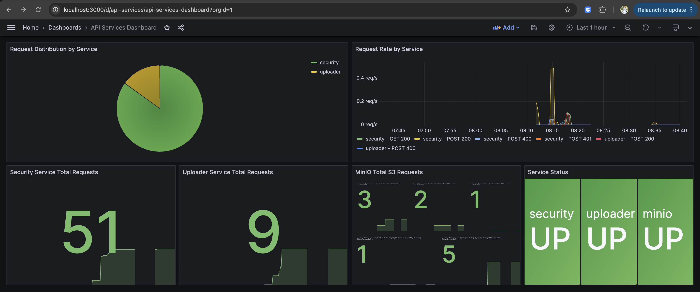

# Домашнее задание к занятию «Микросервисы: подходы»

Вы работаете в крупной компании, которая строит систему на основе микросервисной архитектуры.
Вам как DevOps-специалисту необходимо выдвинуть предложение по организации инфраструктуры для разработки и эксплуатации.

## Задача 1: Обеспечить разработку

Предложите решение для обеспечения процесса разработки: хранение исходного кода, непрерывная интеграция и непрерывная поставка. 
Решение может состоять из одного или нескольких программных продуктов и должно описывать способы и принципы их взаимодействия.

Решение должно соответствовать следующим требованиям:
- облачная система;
- система контроля версий Git;
- репозиторий на каждый сервис;
- запуск сборки по событию из системы контроля версий;
- запуск сборки по кнопке с указанием параметров;
- возможность привязать настройки к каждой сборке;
- возможность создания шаблонов для различных конфигураций сборок;
- возможность безопасного хранения секретных данных (пароли, ключи доступа);
- несколько конфигураций для сборки из одного репозитория;
- кастомные шаги при сборке;
- собственные докер-образы для сборки проектов;
- возможность развернуть агентов сборки на собственных серверах;
- возможность параллельного запуска нескольких сборок;
- возможность параллельного запуска тестов.

Обоснуйте свой выбор.

### Предложение
Для крупной компании без привязки к конкретному провайдеру предлагаю облачную связку:

- **GitLab** - хранение кода (Git), управление репозиториями и CI/CD пайплайны.
- **[GitLab Runner](https://docs.gitlab.com/runner/) (self-hosted)** — агенты сборки на наших серверах.
- **Vault (или GitLab CI/CD Variables, OIDC)** — безопасное хранение и выдача секретов. [Аутентификация и чтение секретных данных с помощью HashiCorp Vault](https://docs.gitlab.com/ci/secrets/hashicorp_vault_tutorial/).
- **Container Registry** ([GitLab Container Registry](https://docs.gitlab.com/user/packages/container_registry/)) — хранение собственных docker-образов и артефактов.

> Почему GitLab: это один продукт, закрывающий SCM + CI/CD + шаблоны/параметризацию + registry, при этом runners можно держать у себя.

---

## Архитектура и взаимодействие компонентов

1) **Каждый микросервис — отдельный репозиторий в GitLab Group**  
   - единые правила: branch protection, code owners, approvals, merge request workflow.

2) **CI запускается событием из GitLab**
   - push / merge request / tag — триггеры для сборки, тестов, линта.

3) **CI запускается вручную “по кнопке”**
   - `Run pipeline` в UI + выбор переменных (окружение, версия, флаги сборки).

4) **Настройки на сборку и шаблоны**
   - `.gitlab-ci.yml` в каждом репо,
   - общие шаблоны выносим в отдельный репозиторий `ci-templates` и подключаем через `include:`  
   - для разных типов сервисов (python/elixir) — разные шаблоны.

5) **Секреты**
   - минимум: GitLab masked/protected variables + ограничение по environment/branch.
   - лучше для enterprise: Vault + OIDC/JWT auth из GitLab job → секреты выдаются динамически и не хранятся в GitLab постоянными значениями.

6) **Собственные docker-образы для сборки**
   - базовые images (например `company-ci/python`, `company-ci/go`, `company-ci/elixir`) публикуем в registry,
   - jobs используют `image: registry/...`.

7) **Self-hosted агенты (runners)**
   - разворачиваем GitLab Runner на собственных серверах / в k8s,
   - разделяем по тегам: `docker`, `k8s`, `prod-deploy`, `secure-zone`,
   - даёт контроль по ресурсам, сети, доступу к внутренним registry/репозиториям.

8) **Несколько конфигураций из одного репозитория**
   - `rules`/`workflow` + `matrix` (parallel) + разные `stages`/`variables`  
   - пример: сборка контейнера для `dev/stage/prod` разными параметрами, или сборка нескольких компонентов mono-repo (если потребуется).

9) **Кастомные шаги**
   - любые shell-скрипты/Makefile, отдельные jobs (lint, security scan, migrations, smoke tests).

10) **Параллельные сборки и параллельные тесты**
   - GitLab поддерживает параллельность на уровне jobs и runner’ов,
   - тесты — `parallel:` + шардинг по suite/пакетам.

---

Cоответстветствует всем требованиям. GitLab как единая платформа уменьшает разнообразие инструментов, ускоряет внедрение стандартов по всем сервисам и упрощает поддержку (единые шаблоны, единые политики, единая система прав).

---

## Задача 2: Логи

Предложите решение для обеспечения сбора и анализа логов сервисов в микросервисной архитектуре.
Решение может состоять из одного или нескольких программных продуктов и должно описывать способы и принципы их взаимодействия.

Решение должно соответствовать следующим требованиям:
- сбор логов в центральное хранилище со всех хостов, обслуживающих систему;
- минимальные требования к приложениям, сбор логов из stdout;
- гарантированная доставка логов до центрального хранилища;
- обеспечение поиска и фильтрации по записям логов;
- обеспечение пользовательского интерфейса с возможностью предоставления доступа разработчикам для поиска по записям логов;
- возможность дать ссылку на сохранённый поиск по записям логов.

Обоснуйте свой выбор.

## Задача 2: Логи

### Предложение
**Fluent Bit (или Vector) → OpenSearch (или Elasticsearch) → OpenSearch Dashboards (или Kibana)**

---

## Как работает решение

1) **Сервисы пишут логи в stdout/stderr**  
Никаких изменений в приложениях, кроме стандартного логирования в консоль (желательно в JSON, но не обязательно).

2) **На каждом хосте/ноде стоит агент сбора логов**  
- Kubernetes: DaemonSet Fluent Bit/Vector на каждой ноде  
- VM/bare metal: системный сервис  
Агент читает логи контейнеров и добавляет метаданные (service, pod, namespace, host и т.д.).

3) **Гарантированная доставка**  
Агент настроен на **буферизацию** (включая диск) и **повторные отправки**.  
Если центральное хранилище временно недоступно, логи копятся в буфере и отправляются позже.

4) **Центральное хранилище и поиск**  
OpenSearch/Elasticsearch хранит и индексирует логи, поддерживает репликацию, политики хранения (retention) и быстрый поиск.

5) **UI для разработчиков**  
OpenSearch Dashboards/Kibana дают:
- поиск и фильтры по полям (service, level, request_id, trace_id и т.п.)
- разграничение доступа (RBAC) по индексам/пространствам
- сохранённые поиски и ссылки

---

Соответствует всем требованиям.
Это универсальная и широко используемая архитектура для микросервисов: приложения пишут в stdout, агенты собирают и надёжно доставляют логи, центральное хранилище обеспечивает быстрый поиск, а UI позволяет разработчикам самостоятельно находить нужные записи и делиться результатами через сохранённые запросы.

## Задача 3: Мониторинг

Предложите решение для обеспечения сбора и анализа состояния хостов и сервисов в микросервисной архитектуре.
Решение может состоять из одного или нескольких программных продуктов и должно описывать способы и принципы их взаимодействия.

Решение должно соответствовать следующим требованиям:
- сбор метрик со всех хостов, обслуживающих систему;
- сбор метрик состояния ресурсов хостов: CPU, RAM, HDD, Network;
- сбор метрик потребляемых ресурсов для каждого сервиса: CPU, RAM, HDD, Network;
- сбор метрик, специфичных для каждого сервиса;
- пользовательский интерфейс с возможностью делать запросы и агрегировать информацию;
- пользовательский интерфейс с возможностью настраивать различные панели для отслеживания состояния системы.

Обоснуйте свой выбор.

## Мониторинг: состояние хостов и сервисов (метрики)

### Предложение
**Prometheus + exporters → Grafana**  
(Для K8s: kube-state-metrics для состояния ресурсов кластера и kubelet/cAdvisor для метрик контейнеров; для оповещений — Alertmanager.)

---

## Как работает решение

1) **Сбор метрик со всех хостов**
- На каждый хост ставим **node_exporter** → даёт базовые метрики ОС.
- Prometheus регулярно собирает метрики (pull-модель) exporters по HTTP.

2) **Ресурсы хостов (CPU/RAM/HDD/Network)**
- Это напрямую покрывает **node_exporter**: CPU load, memory, disk I/O/space, network traffic и т.д.

3) **Ресурсы по каждому сервису (CPU/RAM/HDD/Network)**
- В Kubernetes это дают метрики kubelet/cAdvisor (через kubelet endpoints):
  - CPU/Memory usage по pod/container
  - network rx/tx
  - filesystem usage (в пределах контейнера/томов, где доступно)
- В VM/bare metal варианте — аналогично через контейнерные метрики (cAdvisor) или метрики runtime.

4) **Сервис-специфичные метрики**
- Сервисы публикуют endpoint `/metrics` в формате Prometheus (или через client libs).
- Примеры: latency, RPS, error rate, queue depth, DB pool, cache hit rate и т.п.

5) **UI и запросы/агрегации**
- Prometheus хранит time-series и даёт язык запросов **PromQL**.
- Grafana использует Prometheus как datasource и позволяет делать агрегации/алерты/анализ.

6) **Дашборды и панели**
- Grafana — основной UI: готовые дашборды для node_exporter/kubernetes + кастомные панели под сервисы.

---

Соответствует всем требованиям.
Prometheus + Grafana — стандартный стек для микросервисов: легко масштабируется, поддерживает метрики инфраструктуры и приложений, хорошо интегрируется с Kubernetes и даёт понятный UI для разработчиков и эксплуатации.  
Отдельный плюс — единый подход: “всё метрики в Prometheus, всё визуализируем в Grafana”, без привязки к конкретному облаку.

## Задача 4: Логи * (необязательная)

Продолжить работу по задаче API Gateway: сервисы, используемые в задаче, пишут логи в stdout. 

Добавить в систему сервисы для сбора логов Vector + ElasticSearch + Kibana со всех сервисов, обеспечивающих работу API.

### Результат выполнения: 

docker compose файл, запустив который можно перейти по адресу http://localhost:8081, по которому доступна Kibana.
Логин в Kibana должен быть admin, пароль qwerty123456.

## Задача 5: Мониторинг * (необязательная)

Продолжить работу по задаче API Gateway: сервисы, используемые в задаче, предоставляют набор метрик в формате prometheus:

- сервис security по адресу /metrics,
- сервис uploader по адресу /metrics,
- сервис storage (minio) по адресу /minio/v2/metrics/cluster.

Добавить в систему сервисы для сбора метрик (Prometheus и Grafana) со всех сервисов, обеспечивающих работу API.
Построить в Graphana dashboard, показывающий распределение запросов по сервисам.

### Результат выполнения: 

docker compose файл, запустив который можно перейти по адресу http://localhost:8081, по которому доступна Grafana с настроенным Dashboard.
Логин в Grafana должен быть admin, пароль qwerty123456.

---

### Как оформить ДЗ?

Выполненное домашнее задание пришлите ссылкой на .md-файл в вашем репозитории.

---
