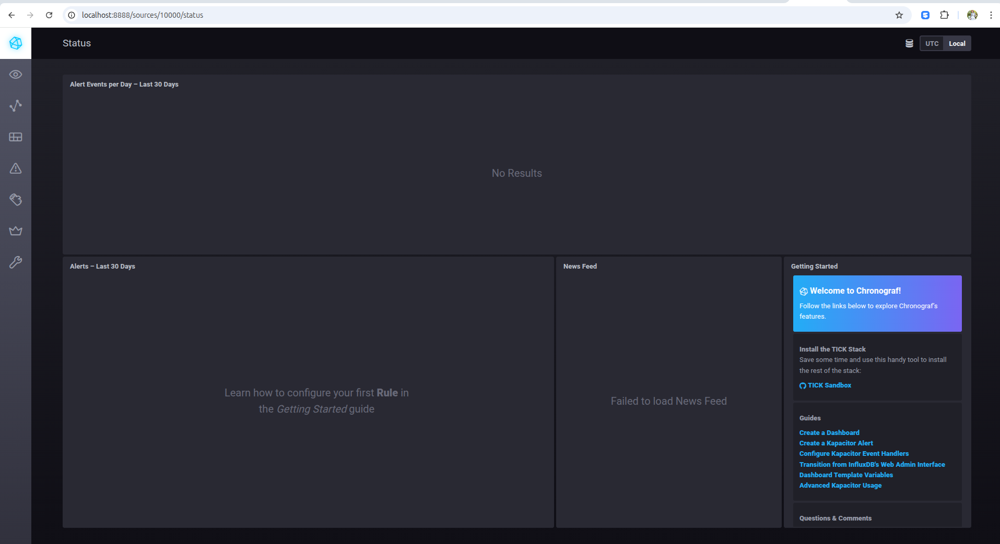
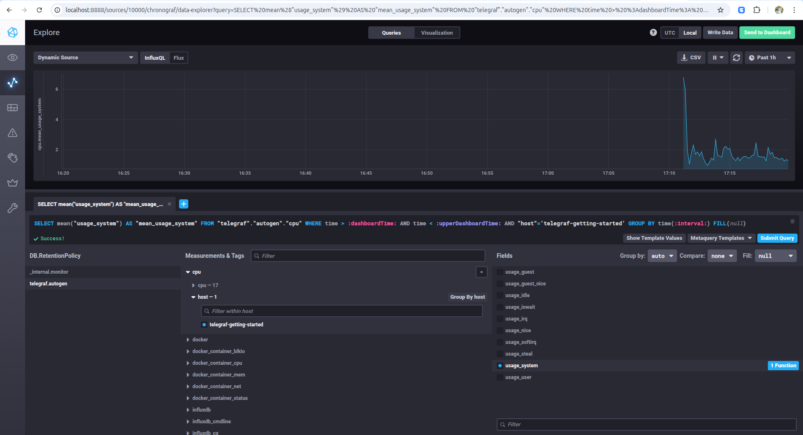
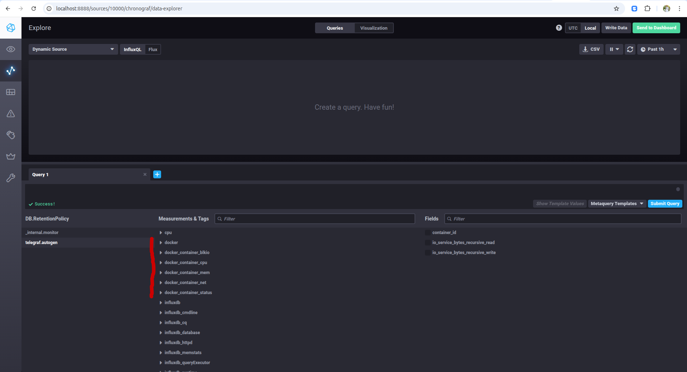
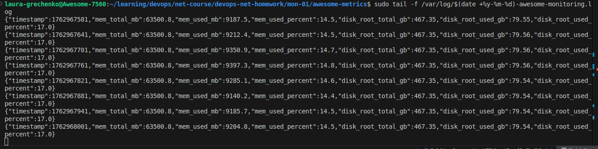
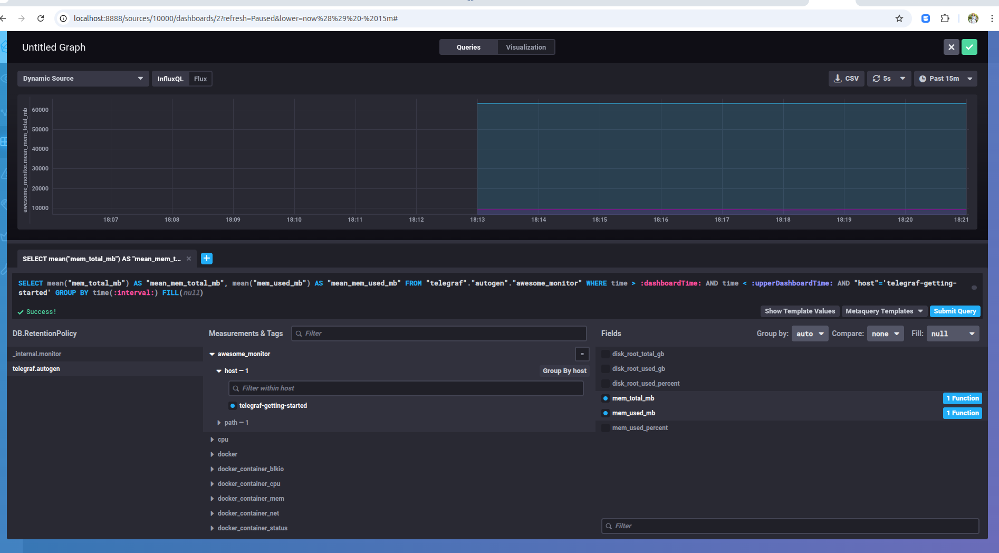

# Домашнее задание к занятию "13.Системы мониторинга"

## Обязательные задания

1. Вас пригласили настроить мониторинг на проект. На онбординге вам рассказали, что проект представляет из себя 
платформу для вычислений с выдачей текстовых отчетов, которые сохраняются на диск. Взаимодействие с платформой 
осуществляется по протоколу http. Также вам отметили, что вычисления загружают ЦПУ. Какой минимальный набор метрик вы
выведите в мониторинг и почему?
```
Минимум метрик:
- HTTP-доступность (2xx/5xx, latency) — чтобы видеть, жив ли сервис и как быстро отвечает.
- CPU usage / load average — потому что вычисления грузят процессор.
- RAM usage / swap — чтобы не упереться в память.
- Disk usage (FS space, inodes) — отчёты пишутся на диск, можно переполнить хранилище.
- IOwait — покажет, не тормозит ли диск при записи отчётов.
```

#

2. Менеджер продукта посмотрев на ваши метрики сказал, что ему непонятно что такое RAM/inodes/CPUla. Также он сказал, 
что хочет понимать, насколько мы выполняем свои обязанности перед клиентами и какое качество обслуживания. Что вы 
можете ему предложить?
```
Мы можем показать не загрузку серверов, а то, насколько быстро и стабильно клиенты получают свои отчёты — то есть фактическое качество сервиса.
SLO / SLI-метрики:
- SLI: доля успешных HTTP-запросов (например, все 2xx из общего числа).
  SLO: цель по этому индикатору, например — «99% успешных запросов за месяц».

- SLI: среднее и р95 времени ответа (показатель скорости работы).
  SLO: цель по задержке — «95% запросов отвечают быстрее 300 мс».

- SLI: доля успешно сгенерированных отчётов.
  SLO: «не менее 98% отчётов генерируются без ошибок».
```

#

3. Вашей DevOps команде в этом году не выделили финансирование на построение системы сбора логов. Разработчики в свою 
очередь хотят видеть все ошибки, которые выдают их приложения. Какое решение вы можете предпринять в этой ситуации, 
чтобы разработчики получали ошибки приложения?

```
Возможные варианты решения:
- Собирать логи локально через journald / docker logs / kubectl logs
- Отправлять ошибки в Slack через alert-скрипты
```

#

4. Вы, как опытный SRE, сделали мониторинг, куда вывели отображения выполнения SLA=99% по http кодам ответов. 
Вычисляете этот параметр по следующей формуле: summ_2xx_requests/summ_all_requests. Данный параметр не поднимается выше 
70%, но при этом в вашей системе нет кодов ответа 5xx и 4xx. Где у вас ошибка?

```
Правильный расчет SLI мог бы выглядеть таким образом:
SLI = (sum_2xx + sum_3xx) / (sum_2xx + sum_3xx + sum_4xx + sum_5xx)

```

#

5. Опишите основные плюсы и минусы pull и push систем мониторинга.
```
Push:
+ Упрощает репликацию данных - можно отправлять метрики сразу в несколько систем мониторинга или в резервную копию.
+ Возможность использовать UDP - менее затратный способ передачи
+ Более гибкая настройка частоты и формата отправки данных.

- Сложнее гарантировать подлинность данных - сервер просто принимает всё, что пришло.
- Тяжелее контролировать, кто именно прислал метрики.
- Есть риск потерять данные при сбоях сети (особенно при UDP).

Pull:
+ Легче контролировать достоверность и источник данных — сервер знает, кого опрашивает.
+ Можно использовать единый proxy с TLS, чтобы безопасно собирать данные с множества агентов.
+ Проще отлаживать получение метрик - можно вручную сходить по URL и посмотреть, что возвращает агент.

- Труднее масштабировать при большом числе агентов.
- Проблемы при сборе данных с узлов за NAT.
- Повышенная нагрузка на центральный сервер при большом числе таргетов.

```

#

6. Какие из ниже перечисленных систем относятся к push модели, а какие к pull? А может есть гибридные?

```
    - Prometheus - Pull (Push возможен через Pushgateway (ограниченно))
    - TICK - Push
    - Zabbix - Гибрид (По умолчанию push-агенты, но есть и pull-мод)
    - VictoriaMetrics - Гибрид (Принимает push, но совместим с Prometheus pull)
    - Nagios - Pull
```

#

7. Склонируйте себе [репозиторий](https://github.com/influxdata/sandbox/tree/master) и запустите TICK-стэк, 
используя технологии docker и docker-compose.

В виде решения на это упражнение приведите скриншот веб-интерфейса ПО chronograf (`http://localhost:8888`). 

P.S.: если при запуске некоторые контейнеры будут падать с ошибкой - проставьте им режим `Z`, например
`./data:/var/lib:Z`

  

#
8. Перейдите в веб-интерфейс Chronograf (http://localhost:8888) и откройте вкладку Data explorer.
        
    - Нажмите на кнопку Add a query
    - Изучите вывод интерфейса и выберите БД telegraf.autogen
    - В `measurments` выберите cpu->host->telegraf-getting-started, а в `fields` выберите usage_system. Внизу появится график утилизации cpu.
    - Вверху вы можете увидеть запрос, аналогичный SQL-синтаксису. Поэкспериментируйте с запросом, попробуйте изменить группировку и интервал наблюдений.

Для выполнения задания приведите скриншот с отображением метрик утилизации cpu из веб-интерфейса.

  

#
9. Изучите список [telegraf inputs](https://github.com/influxdata/telegraf/tree/master/plugins/inputs). 
Добавьте в конфигурацию telegraf следующий плагин - [docker](https://github.com/influxdata/telegraf/tree/master/plugins/inputs/docker):
```
[[inputs.docker]]
  endpoint = "unix:///var/run/docker.sock"
```

Дополнительно вам может потребоваться донастройка контейнера telegraf в `docker-compose.yml` дополнительного volume и 
режима privileged:
```
  telegraf:
    image: telegraf:1.4.0
    privileged: true
    volumes:
      - ./etc/telegraf.conf:/etc/telegraf/telegraf.conf:Z
      - /var/run/docker.sock:/var/run/docker.sock:Z
    links:
      - influxdb
    ports:
      - "8092:8092/udp"
      - "8094:8094"
      - "8125:8125/udp"
```

После настройке перезапустите telegraf, обновите веб интерфейс и приведите скриншотом список `measurments` в 
веб-интерфейсе базы telegraf.autogen . Там должны появиться метрики, связанные с docker.

Факультативно можете изучить какие метрики собирает telegraf после выполнения данного задания.

  

## Дополнительное задание (со звездочкой*) - необязательно к выполнению

1. Вы устроились на работу в стартап. На данный момент у вас нет возможности развернуть полноценную систему 
мониторинга, и вы решили самостоятельно написать простой python3-скрипт для сбора основных метрик сервера. Вы, как 
опытный системный-администратор, знаете, что системная информация сервера лежит в директории `/proc`. 
Также, вы знаете, что в системе Linux есть  планировщик задач cron, который может запускать задачи по расписанию.

Суммировав все, вы спроектировали приложение, которое:
- является python3 скриптом
- собирает метрики из папки `/proc`
- складывает метрики в файл 'YY-MM-DD-awesome-monitoring.log' в директорию /var/log 
(YY - год, MM - месяц, DD - день)
- каждый сбор метрик складывается в виде json-строки, в виде:
  + timestamp (временная метка, int, unixtimestamp)
  + metric_1 (метрика 1)
  + metric_2 (метрика 2)
  
     ...
     
  + metric_N (метрика N)
  
- сбор метрик происходит каждую 1 минуту по cron-расписанию

Для успешного выполнения задания нужно привести:

а) работающий код python3-скрипта,

б) конфигурацию cron-расписания,

в) пример верно сформированного 'YY-MM-DD-awesome-monitoring.log', имеющий не менее 5 записей,

P.S.: количество собираемых метрик должно быть не менее 4-х.
P.P.S.: по желанию можно себя не ограничивать только сбором метрик из `/proc`.



Обновили `telegraf.conf`:

```
[[inputs.tail]]
  files = ["/host/var/log/*-awesome-monitoring.log"]
  from_beginning = false
  name_override = "awesome_monitor"
  data_format = "json"
  json_time_key = "timestamp"
  json_time_format = "unix"
```

Обновили `docker-compose.yml`:

```
    volumes:
      ....
      # Mount for the task 
      - /var/log:/host/var/log:Z
```      



2. В веб-интерфейсе откройте вкладку `Dashboards`. Попробуйте создать свой dashboard с отображением:

    - утилизации ЦПУ
    - количества использованного RAM
    - утилизации пространства на дисках
    - количество поднятых контейнеров
    - аптайм
    - ...
    - фантазируйте)
    
    ---

### Как оформить ДЗ?

Выполненное домашнее задание пришлите ссылкой на .md-файл в вашем репозитории.

---

