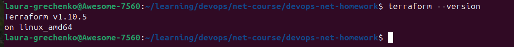
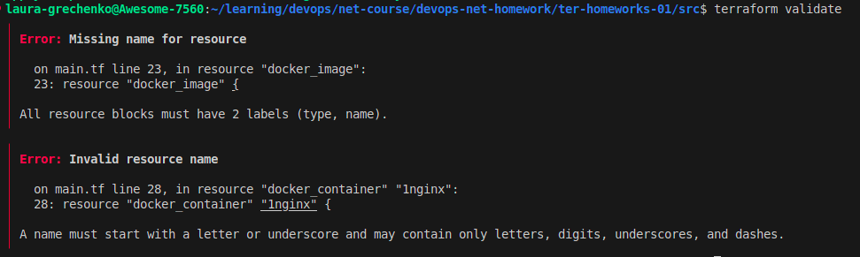
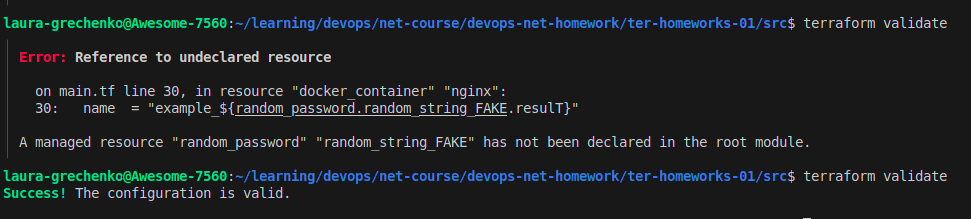
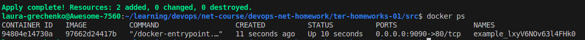
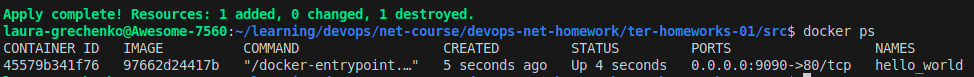
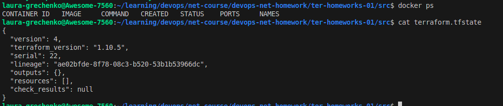
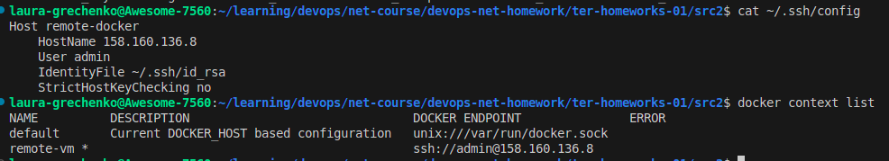
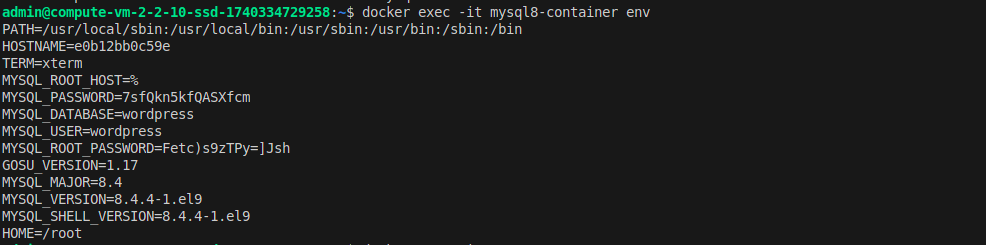

# Чек-лист готовности к домашнему заданию



-----------------
# Задание 1
### 2. Допустимо сохранить личную, секретную информацию в personal.auto.tfvars:
```
# own secret vars store.
personal.auto.tfvars
```

### 3. После запуска кода, нашли в `terraform.tfstate` файле результат созданного ресурса random_password, ключ - `result`:
```
"resources": [
    {
      "type": "random_password",
      ...
      "instances": [
        {
          "attributes": {
            ...
            "result": "lxyV6NOv63l4FHk0"
          },
          ...
        }
      ]
    }
  ]
```

### 4. Расскомментировали код и запустили валидацию.

```
Error: Missing name for resource
```
Необходимо при создание ресурса указать имя. Добавили имя `nginx`.

```
Error: Invalid resource name
```
Согласно описанию ошибки - имя ресурса должно начинаться с буквы или с нижнего подчеркивания и может содержать только буквы, цифры, нижнее подчеркивание или тире.

### После исправления ошибок, запустили еще раз валидацию 


```
Error: Reference to undeclared resource
```
Ссылаемся на неизвестный ресурс. Необходимо исправить опечатки в имени ресурса и ключа.

После этого валидация прошла успешно.

### Код после исправления всех ошибок.
```
resource "docker_image" "nginx" {
  name         = "nginx:latest"
  keep_locally = true
}

resource "docker_container" "nginx" {
  image = docker_image.nginx.image_id
  name  = "example_${random_password.random_string.result}"

  ...
}
```

### 5. Выполнили код и проверили запущенный docker-resource.


### 6. Заменили имя docker-контейнера на hello_world и использовали опцию `-auto-approve`.


Мы можем использовать эту опцию, чтобы Terraform применил все изменения (план) без подтверждения пользователя. 
Может использоваться, например, в скриптах или CI/CD.

Есть риски:
- непридведенных изменений - Terraform может удалить, изменить или пересоздать ресурсы без явного подтверждения.
- дрифта конфигурации - Если инфраструктура изменилась вручную, Terraform может перезаписать эти изменения.
- удаления критических ресурсов - например БД, если они изменены вне Terraform.

### 7. Уничтожили созданные ресурсы с помощью terraform destroy.

### Убедились, что все ресурсы удалены. Проверили содержимое файла terraform.tfstate.


### 8. Проверили, что docker-образ nginx:latest не был удалён.
Настроена опция `keep_locally = true`, поэтому Docker-образ `nginx:latest` не был удален из локального Docker-хранилища при выполнении `terraform destroy`. Это позволяет избежать повторного скачивания образа и ускоряет развёртывание.

[Ссылка на документацию](ttps://docs.comcloud.xyz/providers/kreuzwerker/docker/latest/docs/resources/image#:~:text=keep_locally%20(Boolean)%20If%20true%2C%20then%20the%20Docker%20image%20won%27t%20be%20deleted%20on%20destroy%20operation.%20If%20this%20is%20false%2C%20it%20will%20delete%20the%20image%20from%20the%20docker%20local%20storage%20on%20destroy%20operation)

--------------------
# Задание 2
### 0. Получили данные аутентификации по [YC инструкции](https://yandex.cloud/en/docs/tutorials/infrastructure-management/terraform-quickstart#get-credentials)
### Создали авторизованный ключ для service-account и сохраните файл::
```
laura-grechenko@Awesome-7560:~/learning/devops/net-course/devops-net-homework$ yc iam key create \
  --service-account-id ajef76a4nps3asoeifqd \
  --folder-name default \
  --output key.json
id: aje2t04hqhg8dsebnc9r
service_account_id: ajef76a4nps3asoeifqd
created_at: "2025-02-24T12:42:06.668661870Z"
key_algorithm: RSA_2048
```
### Настроили профиль CLI для запуска операций от имени service-account:
```
laura-grechenko@Awesome-7560:~/learning/devops/net-course/devops-net-homework$ yc config profile create net-devops-terraform
Profile 'net-devops-terraform' created and activated
laura-grechenko@Awesome-7560:~/learning/devops/net-course/devops-net-homework/ter-homeworks-01/src2$ yc config profile get net-devops-terraform 
service-account-key:
  id: aje2t04hqhg8dsebnc9r
  service_account_id: ajef76a4nps3asoeifqd
  created_at: "2025-02-24T12:42:06.668661870Z"
  key_algorithm: RSA_2048
  public_key: ****
  private_key: ****
cloud-id: b1g4vhp2shscb9od4rnn
folder-id: b1g4vhp2shscb9od4rnn
```
### 1. Создали в облаке *ВМ через web-консоль.
### 2. Подключились к ВМ по ssh и установили стек docker.
```*
admin@compute-vm-2-2-10-ssd-1740334729258:~$ docker --version
Docker version 28.0.0, build f9ced58
```
### 3. Настроили подключение terraform на рабочей станции к remote docker context ВМ через ssh.
####  Создали новый context `remote-vm` и настроили SSH-доступ через ~/.ssh/config
```
docker context create remote-vm --docker "host=ssh://admin@158.160.136.8"
```



### 4-5. Используя terraform и remote docker context, скачали и запустили на ВМ контейнер `mysql:8` на порту `3306`, передали ENV-переменные. 
### Сгенерировали разные пароли через random_password и передали их в контейнер.

```
docker_container.mysql8: Creation complete after 1m21s [id=e0b12bb0c59ed3229ef652bd90acb4e879f72ac525632c0ce9b80db37738ad0e]

Apply complete! Resources: 3 added, 0 changed, 0 destroyed.
```
[Ссылка на `main.tf`](https://github.com/lauragrechenko/devops-net-homework/blob/master/ter-homeworks-01/src2/main.tf)

### 6. Зашли на ВМ , подключились к контейнеру и проверили наличие секретных env-переменных с помощью команды env.



--------------------
# Задание 3 
### 1. Установили OpenTofu
```
laura-grechenko@Awesome-7560:~$ tofu --version
OpenTofu v1.9.0
on linux_amd64
```

### 2. Выполнили тот же код с помощью `tofu apply`. 
```
laura-grechenko@Awesome-7560:~/learning/devops/net-course/devops-net-homework/ter-homeworks-01/src3$ tofu apply

OpenTofu used the selected providers to generate the following execution plan. Resource actions are indicated with the following symbols:
  + create

OpenTofu will perform the following actions:

  # docker_container.mysql8 will be created
  + resource "docker_container" "mysql8" {
      ...
    }

  # random_password.mysql_pass_root will be created
  + resource "random_password" "mysql_pass_root" {
     ...
    }

  # random_password.mysql_pass_user will be created
  + resource "random_password" "mysql_pass_user" {
      ...
    }

Plan: 3 to add, 0 to change, 0 to destroy.
...
random_password.mysql_pass_root: Creating...
random_password.mysql_pass_user: Creating...
random_password.mysql_pass_user: Creation complete after 0s [id=none]
random_password.mysql_pass_root: Creation complete after 0s [id=none]
docker_container.mysql8: Creating...
docker_container.mysql8: Creation complete after 3s [id=e28099293c96d1a80bcdef06002f4c854195f97c0b0c0298eedc30cdfd7ecb13]

Apply complete! Resources: 3 added, 0 changed, 0 destroyed.
```

### Зашли на ВМ , подключились к контейнеру и проверили наличие секретных env-переменных с помощью команды env.
```
|admin@compute-vm-2-2-10-ssd-1740334729258:~$ docker exec -it mysql8-container env
PATH=/usr/local/sbin:/usr/local/bin:/usr/sbin:/usr/bin:/sbin:/bin
HOSTNAME=e28099293c96
TERM=xterm
MYSQL_ROOT_HOST=%
MYSQL_PASSWORD=2giG2Ac2GR9IKRLL
MYSQL_ROOT_PASSWORD=>WC4PS53zXT[b0&k
MYSQL_DATABASE=wordpress
MYSQL_USER=wordpress
GOSU_VERSION=1.17
MYSQL_MAJOR=8.4
MYSQL_VERSION=8.4.4-1.el9
MYSQL_SHELL_VERSION=8.4.4-1.el9
HOME=/root
```
