# Задание 1
### 1-2. Изучили проект. Использовали service-account и ключ созданный в предыдущей работе.
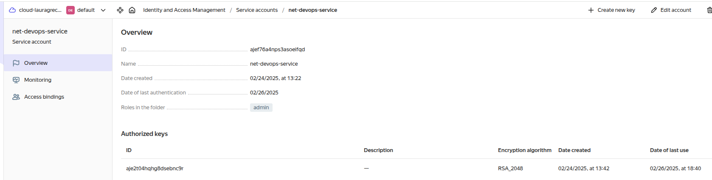

Перемионовали файл и скопировали в `~/`, чтобы имя соответствовало имени указанному в `providers.tf`.
```
 service_account_key_file = file("~/.authorized_key.json")
```

```
laura-grechenko@Awesome-7560:~/learning/devops/net-course/devops-net-homework$ cat ~/.authorized_key.json 
{
   "id": "aje2t04hqhg8dsebnc9r",
   "service_account_id": "ajef76a4nps3asoeifqd",
   "created_at": "2025-02-24T12:42:06.668661870Z",
   "key_algorithm": "RSA_2048",
   "public_key": "YYYYYYYYYYYYYY",
   "private_key": "XXXXXXXXXXXXXXXXX"
}
```

### 3. Сгенерировали новый ssh-ключ. Записали его открытую(public) часть в переменную vms_ssh_root_key.
```
variable "vms_ssh_root_key" {
  default     = "ssh-ed25519 AAAAC3NzaC1lZDI1NTE5AAAAIELR69LvbgRZaTyYcvL3f70oCf+l86UPTRG27wG6Vau0 laura-grechenko@Awesome-7560"
}
```

### 4. Исправили в `main.tf`
```
resource "yandex_compute_instance" "platform" {
    ...
  platform_id = "standart-v4"
  resources {
    cores         = 1
  }
  ...
}
```

`platform_id`, `cores` на 

```
resource "yandex_compute_instance" "platform" {
    ...
  platform_id = "standard-v2"
  resources {
    cores         = 2
  }
  ...
}
```
В имени допущена опечатка и версия 4 не найдена - выбрали платформу `standard-v2` из [Доступных платформ в YC](https://yandex.cloud/en/docs/compute/concepts/vm-platforms).

Исправили количество ядер на 2, т.к. 2 является [минимальным значением](https://yandex.cloud/en/docs/compute/concepts/performance-levels).

### Успешно выполнили код и проверили созданные ресурсы
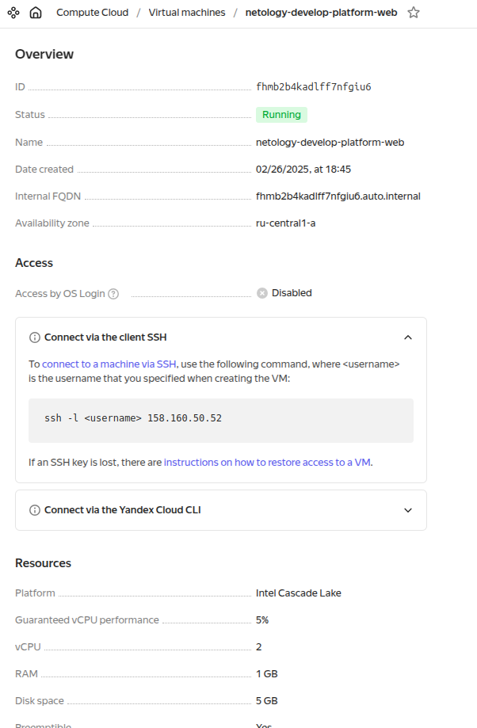

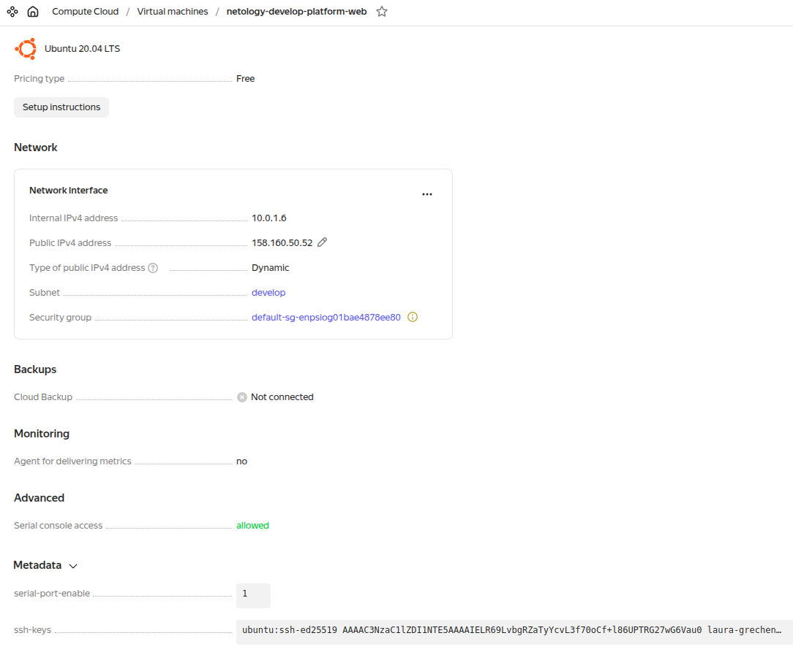

### 5. Подключились к консоли ВМ через ssh и выполнили команду `curl ifconfig.me`
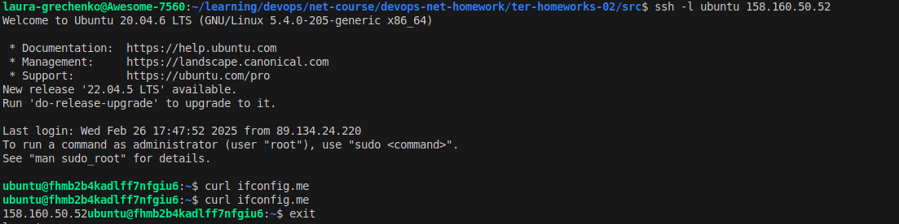

### 6. Как в процессе обучения могут пригодиться параметры preemptible = true и core_fraction=5 в параметрах ВМ.

[`preemptible`](https://registry.terraform.io/providers/yandex-cloud/yandex/latest/docs/resources/compute_instance#preemptible-1) делает виртуальную машину прерываемой, то есть она может быть автоматически завершена в любой момент, если облаку понадобятся ресурсы.


[`core_fraction`](https://registry.terraform.io/providers/yandex-cloud/yandex/latest/docs/resources/compute_instance#core_fraction-1) определяет минимально гарантированную производительность процессора. Например, при `core_fraction = 5` инстанс гарантированно получает 5% от мощности vCPU, но может использовать больше, если ресурсы свободны.

 Использование таких параметров делает виртуальную машину **значительно дешевле** и позволяет экономить ресурсы при выполнение ДР.


----------------------------


# Задание 2
### 1. Заменили все хардкод-значения для ресурсов yandex_compute_image и yandex_compute_instance на отдельные переменные. 
### К названиям переменных ВМ добавили в начало префикс vm_web_ .
### Проверили terraform plan. Изменений нет.
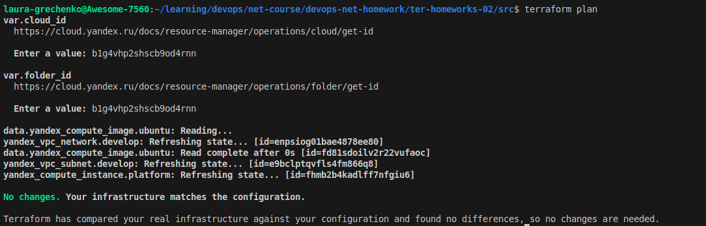


----------------------------


# Задание 3
### 1. Создали в корне проекта файл 'vms_platform.tf' . Перенесли в него все переменные первой ВМ.
### 2. Создали вторую ВМ в файле main.tf: "netology-develop-platform-db" , cores  = 2, memory = 2, core_fraction = 20. Объявили её переменные с префиксом vm_db_ в файле 'vms_platform.tf'. ВМ работает в зоне "ru-central1-b".
### 3. Применили изменения.
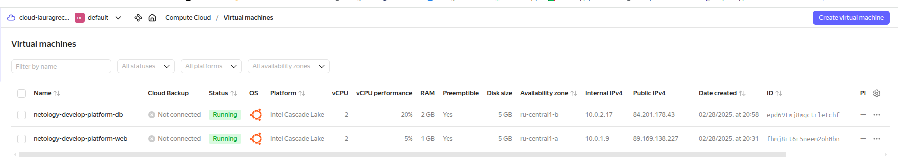


[Ссылка на vms_plartform.tf](https://github.com/lauragrechenko/devops-net-homework/blob/master/ter-homeworks-02/src1_5/vms_plartform.tf)
----------------------------


# Задание 4

### 1. Объявили в файле outputs.tf один output, содержащий: instance_name, external_ip, fqdn для каждой из ВМ.
```
output "vm_instances_info" {
  description = "Instance name, external IP and FQDN for each VM"
  value = {
    web = {
      instance_name = yandex_compute_instance.platform.name
      external_ip   = yandex_compute_instance.platform.network_interface.0.nat_ip_address
      fqdn          = yandex_compute_instance.platform.fqdn
    }
    db = {
      instance_name = yandex_compute_instance.platform_db.name
      external_ip   = yandex_compute_instance.platform_db.network_interface.0.nat_ip_address
      fqdn          = yandex_compute_instance.platform_db.fqdn
    }
  }
}
```
### 2. Применили изменения.
### Вывод значений ip-адресов команды terraform output:
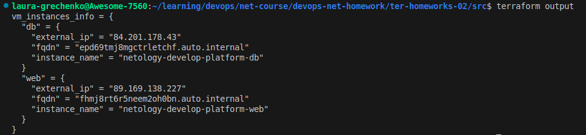

----------------------------


# Задание 5

### 1-2. В файле locals.tf описали в одном local-блоке имя каждой ВМ. 
### Заменили переменные внутри ресурса ВМ на созданные local-переменные.
```
locals {
  vm_web_instance_name = "netology-${var.vpc_name}-${var.vm_web_instance_sufix}"
  vm_db_instance_name  = "netology-${var.vpc_name}-${var.vm_db_instance_sufix}"
}
```
### 3. Применили изменения. Намеренно добавили изменения в имя и увидили, что state изменился.
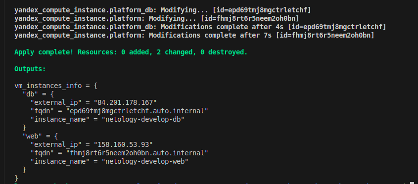

[Ссылка на vms_plartform.tf](https://github.com/lauragrechenko/devops-net-homework/blob/master/ter-homeworks-02/src1_5/vms_plartform.tf)

[Ссылка на locals.tf](https://github.com/lauragrechenko/devops-net-homework/blob/master/ter-homeworks-02/src1_5/locals.tf)

---------------------------


# Задание 6
### 1. Добавили map-переменную `vms_resources` в `variables.tf`:
```
variable "vms_resources" {
  type = map(
    object({
      cores         = number
      memory_gb     = number
      core_fraction = number
    })
  )
  description = "Map of VM resource configurations for each instance"
}
```
[Ссылка на vms_resources в variables.tf](https://github.com/lauragrechenko/devops-net-homework/blob/master/ter-homeworks-02/src_6/variables.tf#L3)

### Определили значение переменной vms_resources в terraform.tfvars:
```
vms_resources = {
  web = {
    cores         = 2
    memory_gb     = 1
    core_fraction = 5
  }
  db = {
    cores         = 2
    memory_gb     = 2
    core_fraction = 20
  }
}
```
[Ссылка на vms_resources в terraform.tfvars](https://github.com/lauragrechenko/devops-net-homework/blob/master/ter-homeworks-02/src_6/terraform.tfvars#L4)

### 2. Добавили map(object) переменную для блока metadata, общая для всех ВМ.
```
variable "metadata" {
  type        = map(string)
  description = "Metadata key/value pairs to make available from within the instance."
}
```

или

```
variable "metadata" {
  type = map(
    object({
      serial-port-enable = number
      ssh-keys = string
    })
  )
  description = "Metadata key/value pairs to make available from within the instance."
}
```
[Ссылка на metadata в variables.tf](https://github.com/lauragrechenko/devops-net-homework/blob/master/ter-homeworks-02/src_6/variables.tf#L14)

### Определили значение переменной vms_resources в terraform.tfvars:
```
metadata = {
  serial-port-enable = "1"
  ssh-keys           = "ubuntu:ssh-ed25519 AAAAC3NzaC1lZDI1NTE5AAAAIELR69LvbgRZaTyYcvL3f70oCf+l86UPTRG27wG6Vau0 laura-grechenko@Awesome-7560"
}
```

[Ссылка на metadata в terraform.tfvars](https://github.com/lauragrechenko/devops-net-homework/blob/master/ter-homeworks-02/src_6/terraform.tfvars#L17)

### Удалили более не используемые переменные проекта.

### 3. Проверили terraform plan. Изменений нет.

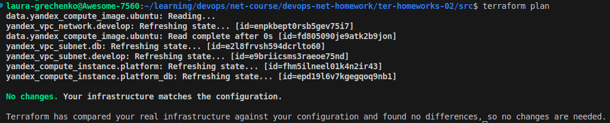


----------------------------


# Задание 7
### 1. Отобразили второй элемент списка test_list
### 2. Нашли длину списка test_list
### 3. Отобразили значение ключа admin из map test_map
### 4. Написали требуемое interpolation-выражение

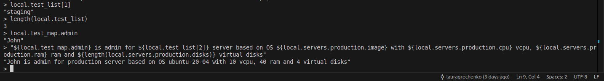


----------------------------


# Задание 8
### 1. Описали переменную test:
```
variable "test" {
  type        = list(map(list(string)))
  description = "Test variable from the task 8"
}
```

### Сохранили значение в terraform.tfvars:
```
test = [
  {
    "dev1" = [
      "ssh -o 'StrictHostKeyChecking=no' ubuntu@62.84.124.117",
      "10.0.1.7",
    ]
  },
  {
    "dev2" = [
      "ssh -o 'StrictHostKeyChecking=no' ubuntu@84.252.140.88",
      "10.0.2.29",
    ]
  },
  {
    "prod1" = [
      "ssh -o 'StrictHostKeyChecking=no' ubuntu@51.250.2.101",
      "10.0.1.30",
    ]
  },
]
```

### 2. Вычленили строку "ssh -o StrictHostKeyChecking=no ubuntu@62.84.124.117" из `test` переменной:
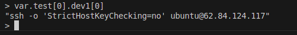


----------------------------


# Задание 9
### Используя [инструкцию](https://cloud.yandex.ru/ru/docs/vpc/operations/create-nat-gateway#tf_1), настроили для ВМ nat_gateway.
### Добавили 2 новых ресурсов `yandex_vpc_gateway`, `yandex_vpc_route_table`:
```
resource "yandex_vpc_gateway" "nat_gateway" {
  folder_id = var.folder_id
  name      = var.vpc_gateway_name
  shared_egress_gateway {}
}

resource "yandex_vpc_route_table" "rt" {
  folder_id  = var.folder_id
  name       = var.vpc_route_table_name
  network_id = yandex_vpc_network.develop.id

  static_route {
    destination_prefix = var.vpc_route_table_destination_prefix
    gateway_id         = yandex_vpc_gateway.nat_gateway.id
  }
}
```
[Ссылка на yandex_vpc_gateway в main.tf](https://github.com/lauragrechenko/devops-net-homework/blob/master/ter-homeworks-02/src/main.tf#L21)

### Добавили аргумент `route_table_id` в ресурсы `yandex_vpc_subnet.develop` `yandex_vpc_subnet.db`
```
resource "yandex_vpc_subnet" "develop" {
  ...
  route_table_id = yandex_vpc_route_table.rt.id
}

resource "yandex_vpc_subnet" "db" {
  ...
  route_table_id = yandex_vpc_route_table.rt.id
}
```

[Ссылка на yandex_vpc_subnet в main.tf](https://github.com/lauragrechenko/devops-net-homework/blob/master/ter-homeworks-02/src/main.tf#L10)

### Для проверки убрали внешний IP адрес (nat=false) и применили изменения
```
laura-grechenko@Awesome-7560:~/learning/devops/net-course/devops-net-homework/ter-homeworks-02/src$ 
terraform apply -var 'vm_web_nat_enabled=false' -var 'vm_db_nat_enabled=false'
```

### Через интерфейс подключились к serial-консоли DB-VM. Проверили доступ к интернету
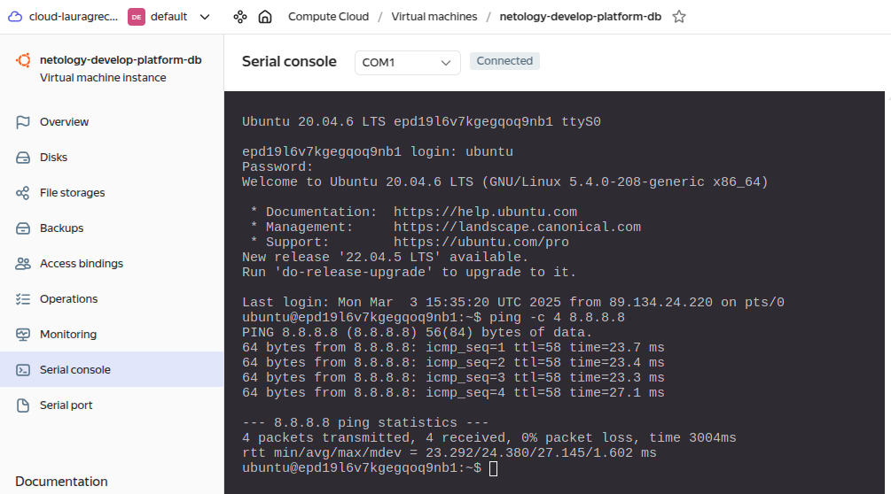

### Через интерфейс подключились к serial-консоли Web-VM. Проверили доступ к интернету
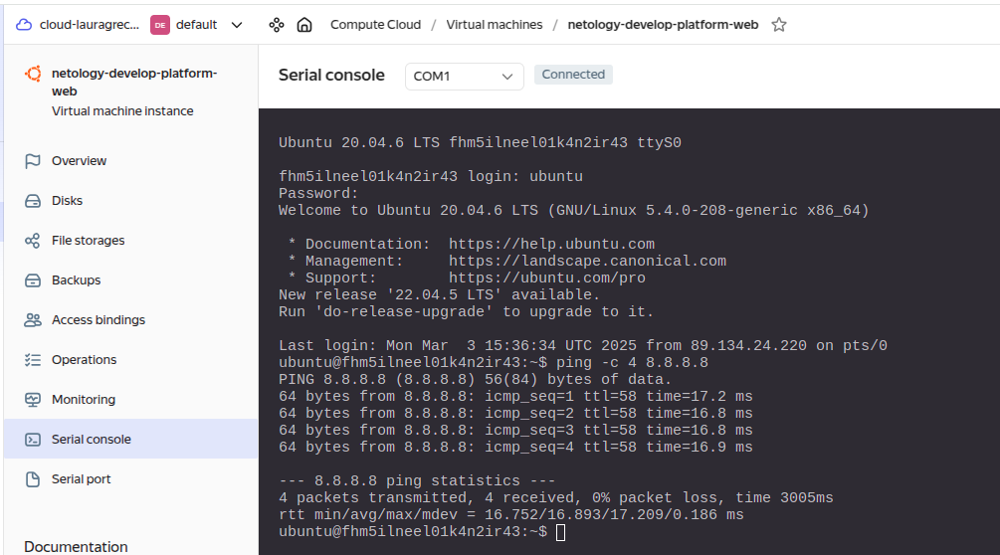
