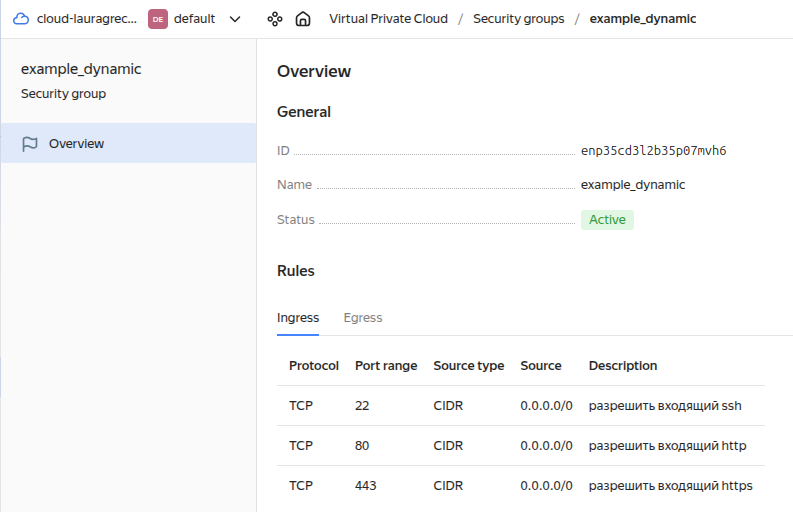

# Задание 1
### Выполнили код и проверили входящие правила «Группы безопасности».



---------------------

# Задание 2
### Создали ВМ `web-1` и `web-2` используя `count loop`.

### Создали ВМ для баз данных с именами `main` и `replica` используя `for_each loop`.

---------------------

# Задание 3
### Создали 3 одинаковых виртуальных диска размером 1 Гб
### Создали ВМ `storage` и подключили созданные 3 дополнительных диска.


---------------------

# Итоговый результат по задания 1-3

### Созданные 5 ВМ


### Созданные 3 Виртуальные диски


### Проверили Группу безопасности (Security group) в ВМ `Web-1`.


---------------------
# Задание 4
### Создали файл-шаблон `hosts.tpl`

### Создали файл-шаблон `ansible.tf`

### Cкриншот получившегося файла `hosts.ini`


### [Ссылка на ветку terraform-03-tasks-1-4](https://github.com/lauragrechenko/devops-net-homework/pull/1/files)

---------------------
# Задание 5
### Cкриншот вывода:


---------------------
# Задание 6
### Используя `null_resource` и `local-exec`, применили `ansible-playbook` к ВМ из `ansible inventory-файла`. Готовый код взяли из демонстрации к лекции.

### Модифицировали файл-шаблон `hosts.tpl`: ansible_host="<внешний IP-address или внутренний IP-address если у ВМ отсутвует внешний адрес>.

### Для проверки убрали внешний IP адрес (nat=false) для `web-1`, `web-2`, `storage` и применили изменения:
```
laura-grechenko@Awesome-7560:~/learning/devops/net-course/devops-net-homework/ter-homeworks-03/src$ 
terraform apply -var 'vm_web_nat_enabled=false' -var 'vm_storage_nat_enabled=false'
```

### Проверили, что для `web-1`, `web-2`, storage используется внутренний IP:


### [Ссылка на ветку terraform-03-tasks-5-6](https://github.com/lauragrechenko/devops-net-homework/pull/2/files)


---------------------
# Задание 7
### Выражение, которое удалит из заданной переменной 3 элемент из: subnet_ids и subnet_zones.
```
{
  network_id  = local.vpc.network_id,
  subnet_ids  = concat(slice(local.vpc.subnet_ids, 0, 2), slice(local.vpc.subnet_ids, 3, length(local.vpc.subnet_ids))),
  subnet_zones = concat(slice(local.vpc.subnet_zones, 0, 2), slice(local.vpc.subnet_zones, 3, length(local.vpc.subnet_zones)))
}
```


---------------------
# Задание 8
### Идентифицировали и устранили опечатки в tpl-шаблоне. 
```
[webservers]
%{~ for i in web_servers ~}
${i["name"]} ansible_host=${i["network_interface"][0]["nat_ip_address"]} platform_id=${i["platform_id"]}
%{~ endfor ~}
```

### Terraform логирует на какой строке и в какой позиции ошибка.


---------------------

# Задание 9
### Напишите terraform выражения, которые сформируют списки:

#### ["rc01","rc02","rc03","rc04",rc05","rc06",rc07","rc08","rc09","rc10....."rc99"] те список от "rc01" до "rc99"
```
[for i in range(1, 100) : format("rc%02d", i)]
```

#### ["rc01","rc02","rc03","rc04",rc05","rc06","rc11","rc12","rc13","rc14",rc15","rc16","rc19"....."rc96"] те список от "rc01" до "rc96", пропуская все номера, заканчивающиеся на "0","7", "8", "9", за исключением "rc19"
```
[for i in range(1,97) : format("rc%02d", i) if ((i % 10 != 0 && i % 10 != 7 && i % 10 != 8 && i % 10 != 9) || i == 19)]
```