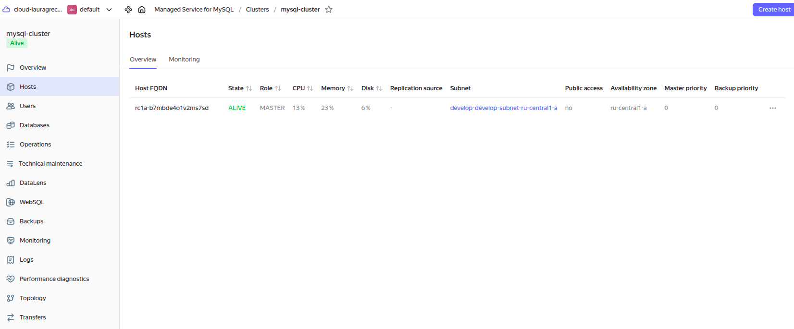

# Задание 1
### Используя remote-модуль создали две ВМ для двух разных проектов marketing и analytics. 
### Настроили ssh и установку nginx в файле cloud-init.yml.

### Скриншот консоли ВМ yandex cloud с их метками


### Скриншот подключения к консоли и вывод команды sudo nginx -t


### Скриншот содержимого модуля module.test-vm


[Ссылка на коммит с изменениями](https://github.com/lauragrechenko/devops-net-homework/pull/5/commits/90c65e7fb9a3104f741b46691ced74b8b1897c4d)


---------------------


# Задание 2
### Написали локальный модуль vpc, который создает 2 ресурса: одну сеть и одну подсеть в зоне, объявленной при вызове модуля.
### Модуль возвращает в root module с помощью output информацию о yandex_vpc_subnet. 
### Скриншот информации из terraform console о модуле.

### Заменили ресурсы yandex_vpc_network и yandex_vpc_subnet созданным модулем. 
```
module "test_vpc" {
  source      = "./modules/vpc"
  vpc_name    = var.vpc_name
  subnet_cidr = var.default_cidr
  subnet_zone = var.default_zone
}
```

### Сгенерировали документацию к модулю с помощью terraform-docs.
```
laura-grechenko@Awesome-7560:~/learning/devops/net-course/devops-net-homework/ter-homeworks-04/src/modules/vpc$ docker run --rm --volume "$(pwd):/terraform-docs" -u $(id -u) quay.io/terraform-docs/terraform-docs:0.19.0 markdown /terraform-docs > terraform-docs.md
```

[Ссылка на коммит с изменениями](https://github.com/lauragrechenko/devops-net-homework/pull/5/commits/7653c2315034b360ee21bd698595d2574c6edea7)


---------------------


# Задание 3
### Выведите список ресурсов в стейте.


### Полностью удалите из стейта модуль vpc.


### Полностью удалите из стейта модуль vm.


### Импортировали всё обратно. 
```
terraform import 'module.test_vm["marketing-vm"].yandex_compute_instance.vm[0]' 'fhmg10loqmh66rdunmg1'
terraform import 'module.test_vm["analytics-vm"].yandex_compute_instance.vm[0]' 'fhm38epga12l39i3avhq'
terraform import 'module.test_vpc.yandex_vpc_network.this' 'enpk8rt34cgtpsdiq5rv'
terraform import 'module.test_vpc.yandex_vpc_subnet.this' 'e9bsdca921osf4djg7q6'
```

### Проверили terraform plan. Значимых изменений нет. 


---------------------


# Задание 4
### Изменили модуль vpc для возможности создания подсети во всех зонах доступности, переданных в переменной типа list(object).
### Скриншот части плана.

### Output модуля.


[Ссылка на коммит с изменениями](https://github.com/lauragrechenko/devops-net-homework/pull/5/commits/b7cc8353c85ca62354e3648069e4674a8337de28)


---------------------


# Задание 5
### 1. Написали модуль для создания кластера `Yandex Managed Service for MySQL` с использованием ресурса `yandex_mdb_mysql_cluster`. 

### Пример использования модуля HA=False, будет создан только 1 host в зоне default_zone в 1-й подсети.

```
module "test_cluster" {
  source   = "./modules/mysql_cluster"
  env_name = var.mysql_env

  ha              = var.mysql_ha_available # FALSE by default
  cluster_name    = var.mysql_cluster_name
  cluster_version = var.mysql_cluster_version

  network_id = module.test_vpc.network_id

  resources_preset_id    = var.mysql_cluster_resources_preset_id
  resources_disk_type_id = var.mysql_cluster_resources_disk_type_id
  resources_disk_size    = var.mysql_cluster_resources_disk_size

  host_configs = [
    {
      zone      = var.default_zone
      subnet_id = module.test_vpc.subnet_ids[0]
    },
    {
      zone      = var.zone_b
      subnet_id = module.test_vpc.subnet_ids[1]
    }
  ]
}
```

### 2. Написали модуль для создания базы данных `yandex_mdb_mysql_database` и пользователя `yandex_mdb_mysql_user` в кластере `managed БД Mysql`. 

### Пример использования модуля.
```
module "test_db" {
  source = "./modules/mysql_db"
  cluster_id = module.test_cluster.cluster_id

  db_name = var.mysql_db_name

  user_name     = var.mysql_db_user_name
  user_password = var.mysql_db_user_password
}
```

### 3. Используя оба модуля, создали кластер example из одного хоста.

### Выполнили команду:
```
laura-grechenko@Awesome-7560:~/learning/devops/net-course/devops-net-homework/ter-homeworks-04/src-5$ terraform apply
```

### План выполнения:
```
Terraform used the selected providers to generate the following execution plan. Resource actions are indicated with the following
symbols:
  + create

Terraform will perform the following actions:

  # module.test_cluster.yandex_mdb_mysql_cluster.this will be created
  + resource "yandex_mdb_mysql_cluster" "this" {
      + allow_regeneration_host   = false
      + backup_retain_period_days = (known after apply)
      + created_at                = (known after apply)
      + deletion_protection       = (known after apply)
      + description               = "MySQL cluster for PRESTABLE environment"
      + environment               = "PRESTABLE"
      + folder_id                 = (known after apply)
      + health                    = (known after apply)
      + host_group_ids            = (known after apply)
      + id                        = (known after apply)
      + mysql_config              = (known after apply)
      + name                      = "mysql-cluster"
      + network_id                = (known after apply)
      + status                    = (known after apply)
      + version                   = "8.0"

      + access (known after apply)

      + backup_window_start (known after apply)

      + host {
          + assign_public_ip   = false
          + fqdn               = (known after apply)
          + replication_source = (known after apply)
          + subnet_id          = (known after apply)
          + zone               = "ru-central1-a"
        }

      + maintenance_window (known after apply)

      + performance_diagnostics (known after apply)

      + resources {
          + disk_size          = 10
          + disk_type_id       = "network-hdd"
          + resource_preset_id = "b2.medium"
        }
    }

  # module.test_vpc.yandex_vpc_network.this will be created
  + resource "yandex_vpc_network" "this" {
      + created_at                = (known after apply)
      + default_security_group_id = (known after apply)
      + description               = "VPC for develop environment"
      + folder_id                 = (known after apply)
      + id                        = (known after apply)
      + labels                    = (known after apply)
      + name                      = "develop"
      + subnet_ids                = (known after apply)
    }

  # module.test_vpc.yandex_vpc_subnet.this[0] will be created
  + resource "yandex_vpc_subnet" "this" {
      + created_at     = (known after apply)
      + description    = "Subnet for develop environment"
      + folder_id      = (known after apply)
      + id             = (known after apply)
      + labels         = (known after apply)
      + name           = "develop-develop-subnet-ru-central1-a"
      + network_id     = (known after apply)
      + v4_cidr_blocks = [
          + "10.0.1.0/24",
        ]
      + v6_cidr_blocks = (known after apply)
      + zone           = "ru-central1-a"
    }

Plan: 3 to add, 0 to change, 0 to destroy.
```

### Созданный кластер


### Созданный хост


### Нет пользователей


### Нет БД


### Затем добавили в него БД test и пользователя app. 

### Выполнили команду:
```
laura-grechenko@Awesome-7560:~/learning/devops/net-course/devops-net-homework/ter-homeworks-04/src-5$ terraform apply -var-file="s
ecrets.tfvars" -var="mysql_db_name=test"
```

### План выполнения:
```
module.test_vpc.yandex_vpc_network.this: Refreshing state... [id=enp2fg968roch9beguiv]
module.test_vpc.yandex_vpc_subnet.this[0]: Refreshing state... [id=e9b584nr685navtb6oaq]
module.test_cluster.yandex_mdb_mysql_cluster.this: Refreshing state... [id=c9q7q49hfnp3f0mped8a]

Terraform used the selected providers to generate the following execution plan. Resource actions are indicated with the following
symbols:
  + create

Terraform will perform the following actions:

  # module.test_db.yandex_mdb_mysql_database.this will be created
  + resource "yandex_mdb_mysql_database" "this" {
      + cluster_id = "c9q7q49hfnp3f0mped8a"
      + id         = (known after apply)
      + name       = "test"
    }

  # module.test_db.yandex_mdb_mysql_user.this will be created
  + resource "yandex_mdb_mysql_user" "this" {
      + authentication_plugin = "SHA256_PASSWORD"
      + cluster_id            = "c9q7q49hfnp3f0mped8a"
      + global_permissions    = (known after apply)
      + id                    = (known after apply)
      + name                  = "app"
      + password              = (sensitive value)

      + connection_limits (known after apply)

      + permission (known after apply)
    }

Plan: 2 to add, 0 to change, 0 to destroy.
```


### Затем изменили переменную и превратите сингл хост в кластер из 2-х серверов.
### Второй хост будет создан в другой зоне и подсети. Для этого изменили `test_vpc.subnets` (добавили новую подсеть в зоне В):
```
module "test_vpc" {
  source   = "./modules/vpc"
  env_name = var.env_name
  vpc_name = var.vpc_name
  subnets = [
    {
      zone = var.default_zone,
      cidr = var.default_cidr
    },
    {
      zone = var.zone_b,
      cidr = var.cidr_2
    }
  ]
}
```

### И `test_cluster.host_configs` добавили новый хост, передав ID подсети:
```
module "test_cluster" {
  source   = "./modules/mysql_cluster"
  env_name = var.mysql_env

  ha              = var.mysql_ha_available

  .......

  host_configs = [
    {
      zone      = var.default_zone
      subnet_id = module.test_vpc.subnet_ids[0]
    },
    {
      zone      = var.zone_b
      subnet_id = module.test_vpc.subnet_ids[1]
    }
  ]
}
```

### Выполнили команду:
```
laura-grechenko@Awesome-7560:~/learning/devops/net-course/devops-net-homework/ter-homeworks-04/src-5$ terraform apply -var-file="secrets.tfvars" -var="mysql_ha_available=true" -var="mysql_db_name=test"
```

### План выполнения:
```
module.test_vpc.yandex_vpc_network.this: Refreshing state... [id=enp2fg968roch9beguiv]
module.test_vpc.yandex_vpc_subnet.this[0]: Refreshing state... [id=e9b584nr685navtb6oaq]
module.test_cluster.yandex_mdb_mysql_cluster.this: Refreshing state... [id=c9q7q49hfnp3f0mped8a]
module.test_db.yandex_mdb_mysql_database.this: Refreshing state... [id=c9q7q49hfnp3f0mped8a:test]
module.test_db.yandex_mdb_mysql_user.this: Refreshing state... [id=c9q7q49hfnp3f0mped8a:app]

Terraform used the selected providers to generate the following execution plan. Resource actions are indicated with the following
symbols:
  + create
  ~ update in-place

Terraform will perform the following actions:

  # module.test_cluster.yandex_mdb_mysql_cluster.this will be updated in-place
  ~ resource "yandex_mdb_mysql_cluster" "this" {
        id                        = "c9q7q49hfnp3f0mped8a"
        name                      = "mysql-cluster"
        # (15 unchanged attributes hidden)

      + host {
          + assign_public_ip = false
          + subnet_id        = (known after apply)
          + zone             = "ru-central1-b"
        }

        # (6 unchanged blocks hidden)
    }

  # module.test_vpc.yandex_vpc_subnet.this[1] will be created
  + resource "yandex_vpc_subnet" "this" {
      + created_at     = (known after apply)
      + description    = "Subnet for develop environment"
      + folder_id      = (known after apply)
      + id             = (known after apply)
      + labels         = (known after apply)
      + name           = "develop-develop-subnet-ru-central1-b"
      + network_id     = "enp2fg968roch9beguiv"
      + v4_cidr_blocks = [
          + "10.0.2.0/24",
        ]
      + v6_cidr_blocks = (known after apply)
      + zone           = "ru-central1-b"
    }

Plan: 1 to add, 1 to change, 0 to destroy.
```

### Второй хост был создан в зоне В


[Ссылка на коммит с изменениями](https://github.com/lauragrechenko/devops-net-homework/pull/5/commits/08a32c2405ad969fdea7ec64568c149f013f5671)


---------------------


# Задание 6

### Используя модуль и пример из задания создали s3 бакет размером 1 ГБ.


[Ссылка на коммит с изменениями]()