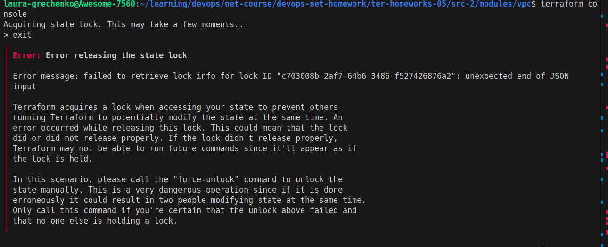
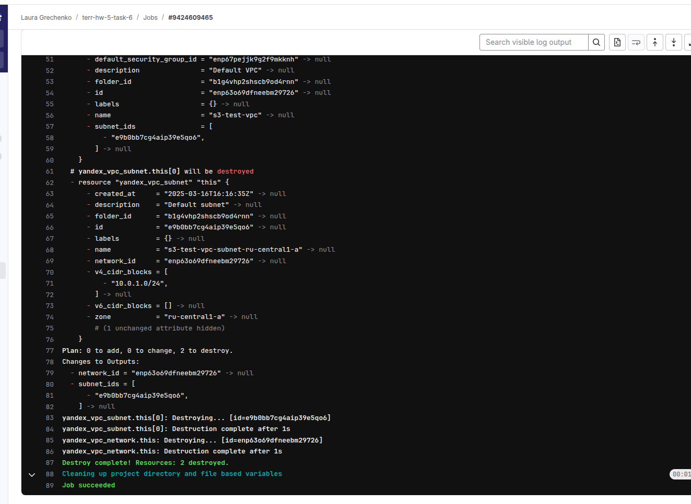
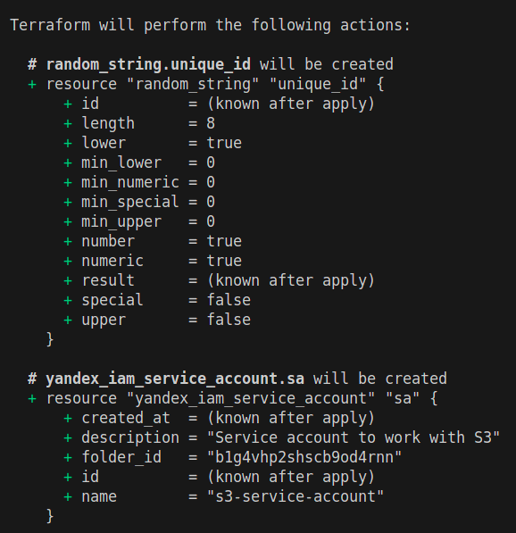

# Задание 1
## 1.1 Проверили код из ДЗ к лекции 4 с помощью `tflint` и `checkov`.
### Запустили `tflint`.


### Получили предупреждение, что в конфигурации Terraform для провайдера Yandex отсутствует ограничение версии.
```
Warning: Missing version constraint for provider "yandex" in `required_providers` (terraform_required_providers)
```

### Получили 3 предупреждения, о том что переменные `vms_ssh_root_key`, `vm_web_name`, `vm_db_name` объявлены, но не используются.
```
Warning: [Fixable] variable "vms_ssh_root_key" is declared but not used (terraform_unused_declarations)
```
### Запустили `checkov`, все проверки прошли успешно.


----

## 1.2 Проверили код из демо к лекции 4 с помощью tflint и checkov.
### Запустили `tflint`. Не получили каких-либо предупреждений или ошибок.


### Запустили `checkov`.


### Получили 4 ошибки (`CKV_TF_1`, `CKV_TF_2`)
```
Check: CKV_TF_1: "Ensure Terraform module sources use a commit hash"
```
Проверка CKV_TF_1 требует, чтобы в источниках Terraform-модулей использовался конкретный хэш коммита. 

```
Check: CKV_TF_2: "Ensure Terraform module sources use a tag with a version number"
```
Проверка CKV_TF_2 требует, чтобы в источниках Terraform-модулей использовался конкретный тег с номером версии, а не, например, ветка «master».

Таким образом, нам необходимо выбрать один способ: либо зафиксировать модуль по конкретному коммиту, либо использовать тэг с номером версии.


---------------------


# Задание 2
## 1. Скопировали код из выполненной ДР-4 (задание 8) с модулями: 
- vpc - модуль для создания сети и подсети и сохранением стейта в удаленный bucket S3, 
- state_iam - модуль для создания сервисного аккаунта с ролью "storage.editor" и генерации secret-key и access-key.

## 2.0 S3 bucket использовали созданный в ДР-4 (задание 6)


## 2.1. Создали yandex service account и сгенерировали secret-key и access-key. (Используя код из предыдущей ДР-4 (задание 8))
### План выполнения


## 2.2. Создали YDB:
### Использовали ресурсы `yandex_ydb_database_serverless`, `yandex_ydb_database_iam_binding` для создания БД и прав доступа для service account сгенерированного выше. 
### План выполнения


## 2.3. Создали `Документную таблицу` в созданной ранее YDB. Использовали ресурс `aws_dynamodb_table` согласно [инструкции](https://yandex.cloud/en/docs/ydb/terraform/dynamodb-tables)
### План выполнения


## 2.4 Выполнили код vpc с закомментированным блоком backend "s3" (то есть стейт хранится локально).


### Вернули блок backend "s3", проинициализировали и мигрировали state проекта vpc в S3 с блокировками:


### 2.5 Провели эксперимент с двумя консолями и разблокировкой стейта.



### [Ссылка на коммит с изменениями](https://github.com/lauragrechenko/devops-net-homework/pull/6/commits/e4923e462860f2328b0061a54c87aff6f3b685ed)


---------------------


# Задание 3
### Проверили модули с помощью tflint и checkov, исправили все предупреждения и ошибки.

### Модуль Vpc


#### План выполнения после исправления предупреждения:


### Модуль State_iam


### Модуль Serverless_DB


### Модуль Doc_table


#### Добавили шифрование на стороне сервера (Server-Side Encryption) с использованием управляемого пользователем ключа (Customer Managed CMK).
#### Включили восстановление до определённого момента во времени (Point-In-Time Recovery, PITR).

#### План выполнения после исправления failed проверок:


## [!!!UPDATE] Исправления выше при попытке их применить в Задание 6 (уже после того как я закончила задание 3) не взлетели - я не стала дальше "копать". Поэтому исправления выше невалидны.

### [Ссылка на коммит с изменениями](https://github.com/lauragrechenko/devops-net-homework/pull/6/commits/27cc9e3034c14b1782ef7494f53d0d0d83ff956d)


---------------------


# Задание 4
## Написали переменные с валидацией и протестировали их согласно заданию.
```
1. type=string, description="ip-адрес" — проверка, что значение переменной содержит верный IP-адрес с помощью функций cidrhost() или regex(). Тесты: "192.168.0.1" и "1920.1680.0.1";
2. type=list(string), description="список ip-адресов" — проверка, что все адреса верны. Тесты: ["192.168.0.1", "1.1.1.1", "127.0.0.1"] и ["192.168.0.1", "1.1.1.1", "1270.0.0.1"].
```
### Вывод консоли


### [Ссылка на коммит с изменениями](https://github.com/lauragrechenko/devops-net-homework/pull/6/commits/224e0f71c9048a13488be632eb109a731d523471)


---------------------


# Задание 5
## Написали переменные с валидацией и протестировали их согласно заданию.
```
1. type=string, description="любая строка" — проверка, что строка не содержит символов верхнего регистра;
2. type=object — проверка, что одно из значений равно true, а второе false, т. е. не допускается false false и true true.
variable "in_the_end_there_can_be_only_one" {
    description="Who is better Connor or Duncan?"
    type = object({
        Dunkan = optional(bool)
        Connor = optional(bool)
    })
}
``` 

### Вывод консоли


### [Ссылка на коммит с изменениями](https://github.com/lauragrechenko/devops-net-homework/pull/6/commits/3faa8f447afb2ebe06d4b6c94212f1da6b16567e)


---------------------


# Задание 6
## Настроили Gitlab CI/CD-систему. (Ранее не изучала - поэтому это больше проба :))
### Создали докер образ (yc, terraform, tflint, checkov) и загрузили образ в DockerHub.
### Для тестирования использовала модуль VPC.

### Созданный Pipeline


### Результаты Pipeline - lint_plan


### Результаты Pipeline - apply (manual)


### Были создан ресурс сеть с подсетью, state сохранен в S3 bucket


### Результаты Pipeline - destroy (manual)



### [Ссылка на коммит с изменениями](https://github.com/lauragrechenko/devops-net-homework/pull/6/commits/1abc73759d25baafd43a9d07d02a3d8e31d41374)


---------------------


# Задание 7
### Создали отдельный terraform root модуль, который создает YDB, s3 bucket для tfstate и сервисный аккаунт с необходимыми правами.
Использовали модули, созданные при выполнении ДР-5 задания 2 (serverless_db, state_iam) и ДР-4 задания 6 (S3 модуль) - объединили модули в 1 root модуль.

#### План выполнения




### [Ссылка на коммит с изменениями](https://github.com/lauragrechenko/devops-net-homework/pull/6/commits/7ac048cd34cf52dc96e9eeb4bc674d49bf15c3c5)


