# 1. Развертывание инфраструктуры в Yandex Cloud.
### [Ссылка на проект](https://github.com/lauragrechenko/devops-net-homework/tree/master/ter-project)

## 1.0 Настройка Backend (S3 Bucket) и Serverless БД для хранения terraform state удаленно.
### [Ссылка на код backend-setup](https://github.com/lauragrechenko/devops-net-homework/tree/master/ter-project/backend_setup)
### [Ссылка на код doc-table](https://github.com/lauragrechenko/devops-net-homework/tree/master/ter-project/doc_table)

### Используя код из предыдущей работы - создали `S3 Bucket` и создали `Managed Service for YDB`.
### Результаты выполнения:
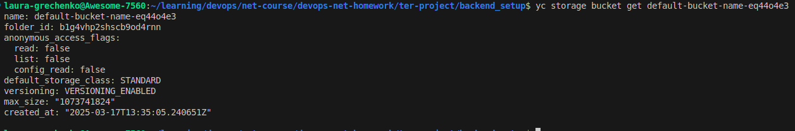

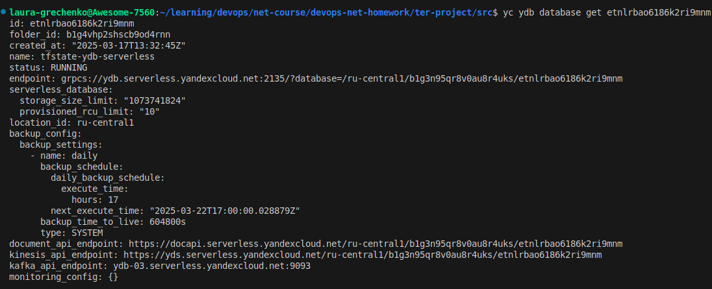

### Используя код из предыдущей работы - создали DynamoDB таблицу `state-lock-table` в Managed Service for YDB.

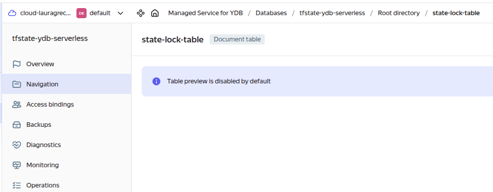

### Настроили Backend в root модуле
```
terraform {
  backend "s3" {
    endpoints = {
      s3 = "https://storage.yandexcloud.net"
      dynamodb = "https://docapi.serverless.yandexcloud.net/ru-central1/b1g3n95qr8v0au8r4uks/etnlrbao6186k2ri9mnm"
    }
    bucket = "default-bucket-name-eq44o4e3"
    region = "ru-central1"
    key    = "project/terraform.tfstate"

    dynamodb_table = "state-lock-table"

    skip_region_validation      = true
    skip_credentials_validation = true
    skip_requesting_account_id  = true
    skip_s3_checksum            = true
  }
}
```


## 1.1-2 Для создания VPC и подсети использовали код модуля VPC из предыдущих работ.
### [Ссылка на код VPC module](https://github.com/lauragrechenko/devops-net-homework/tree/master/ter-project/src/modules/vpc)

###  Использовали VPC в root модуле
```
module "project_vpc" {
  source = "./modules/vpc"

  vpc_name = var.vpc_name
  env_name = var.vpc_env
  subnets  = var.vpc_subnets
}
```
### Результаты выполнения:
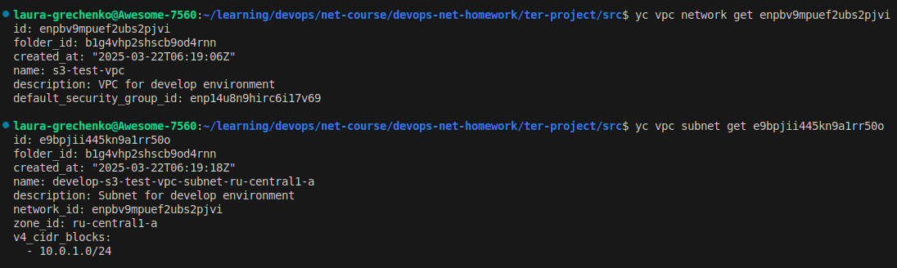


## 1.3 Настроили группы безопасности (порты 22, 80, 443, 8090) использовали код модуля Security из предыдущих работ.
### [Ссылка на код security module](https://github.com/lauragrechenko/devops-net-homework/tree/master/ter-project/src/modules/security)

###  Использовали security в root модуле
```
module "project_security_group" {
  source = "./modules/security"

  name       = var.security_group_name
  network_id = module.project_vpc.network_id

  security_group_ingress = var.security_group_ingress

  security_group_egress = var.security_group_egress
}
```
### Результаты выполнения:

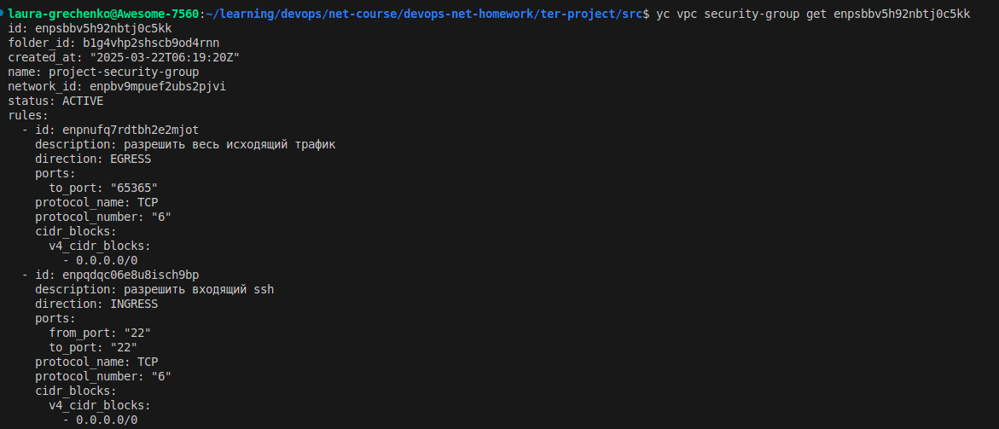

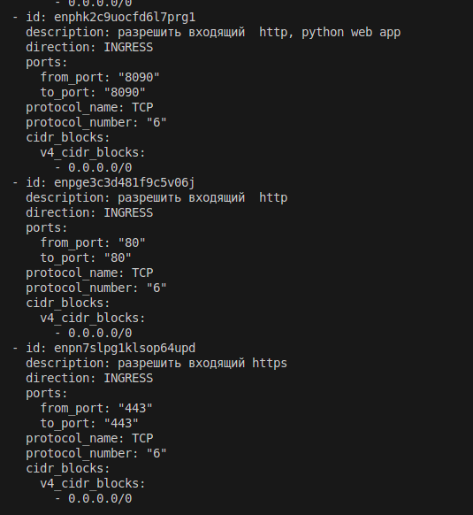


## 1.4 Создание Container Registry модуля.
### [Ссылка на код container-registry module](https://github.com/lauragrechenko/devops-net-homework/tree/master/ter-project/src/modules/container_registry)

### Используя ресурсы `yandex_container_registry` и `yandex_container_repository` - создали реестр Docker-образов.
### Используя ресурс `yandex_container_repository_iam_binding` - назначили сервисному аккаунту роли на добавление и подтягивание образов из репозитория.
### Использовали container-registry module в root модуле
```
module "project_registry" {
  source = "./modules/container_registry"

  service_account_id = var.registry_service_account_id
}
```
### Результаты выполнения:
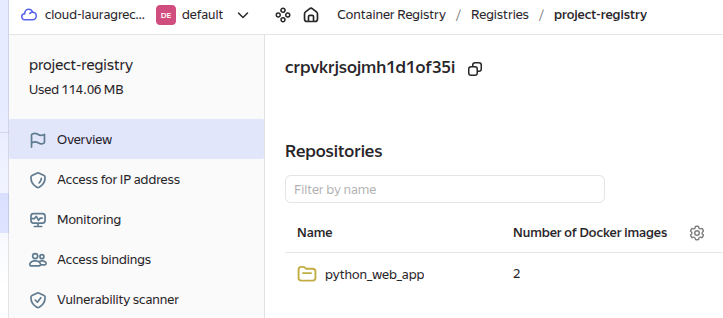

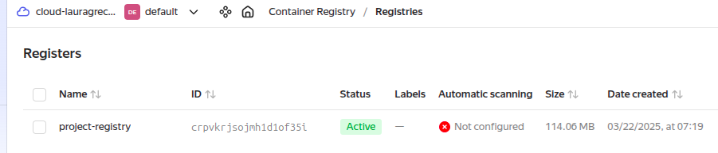


## 1.5 Добавали новый модуль для создания LockBox и дальнейшей интеграции с Terraform так, чтобы пароль для БД брался из LockBox.
### [Ссылка на код lockbox-password module](https://github.com/lauragrechenko/devops-net-homework/tree/master/ter-project/src/modules/lockbox_password)

### Внутри модуля генерируем пароль используя random_password. 
### Создаем Lockbox используя ресурс `yandex_lockbox_secret`
### Сохраняем данные(random_password) в Lockbox используя ресурс `yandex_lockbox_secret_version`. 
### Добавили сервисному аккаунту роль на добавление и чтение данных из Lockbox - используя `yandex_lockbox_secret_iam_member`. 

###  Использовали lockbox-password module в root модуле
```
module "project_db_password_secret" {
  source = "./modules/lockbox_password"

  secret_name        = var.lockbox_db_secret_name
  secret_description = var.lockbox_db_secret_description
  entry_key          = var.lockbox_db_entry_key

  service_account_id = var.lockbox_db_service_account_id
}
```
### Результаты выполнения:
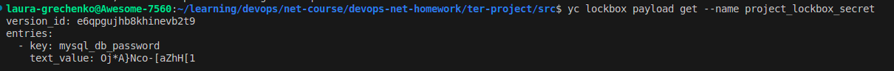


## 1.6 Создание БД MySQL в Yandex Cloud.
### [Ссылка на код mysql-cluster module](https://github.com/lauragrechenko/devops-net-homework/tree/master/ter-project/src/modules/mysql_cluster)

### 1.6.1 Используя ресурсы `yandex_mdb_mysql_cluster` создали кластер серверов MySQL (с одним хостом).
###  Использовали mysql-cluster module в root модуле.
```
module "project_mysql_cluster" {
  source = "./modules/mysql_cluster"

  cluster_name = var.mysql_cluster_name
  network_id   = module.project_vpc.network_id
  host_configs = [
    {
      zone      = var.default_zone
      subnet_id = module.project_vpc.subnet_ids[0]
    }
  ]
}
```
### Результаты выполнения:
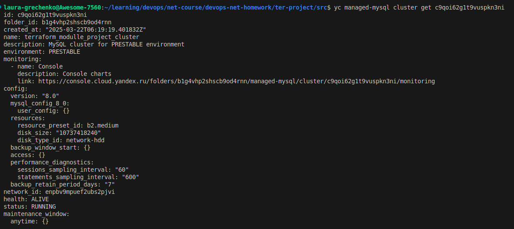


### 1.6.2 Используя ресурсы `yandex_mdb_mysql_database` и `yandex_mdb_mysql_user` создали Базу данных и пользователя с доступом к ней.
### [Ссылка на код mysql-db module](https://github.com/lauragrechenko/devops-net-homework/tree/master/ter-project/src/modules/mysql_db)

### В качестве пароля взяли данные из LockBox (созданные на шаге 1.5)
```
module "project_mysql_db" {
  source     = "./modules/mysql_db"
  cluster_id = module.project_mysql_cluster.cluster_id

  db_name = var.mysql_db_name

  user_name = var.mysql_db_user_name
  user_password = [for entry in data.yandex_lockbox_secret_version.project_db_password.entries : entry.text_value if entry.key == var.lockbox_db_entry_key][0]
}
```
### Результаты выполнения:
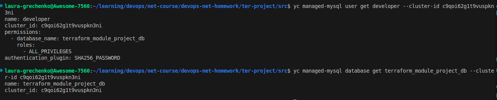


### 1.7 Создание VM
### [Ссылка на код VM module](https://github.com/lauragrechenko/devops-net-homework/tree/master/ter-project/src/modules/vm)

### Использовали модуль VM из предыдущих работ c привязкой групп безопасности к VM.
### Добавили в модуль код для добавления роли сервисному аккаунту на скачивание Docker образов с репозитория (созданного на шаге 1.4).
### Использовали vm в root модуле
```
module "project_vm" {
  source = "./modules/vm"

  vpc_subnet_id      = module.project_vpc.subnet_ids[0]
  security_group_ids = [module.project_security_group.vpc_security_group_id]

  container_registry_id = module.project_registry.container_registry_id

  vm_metadata = {
    user-data          = data.template_file.cloudinit.rendered
    serial-port-enable = var.vm_web_serial_port_enabled
  }

  service_account_id = var.service_account_id
}
```
### Результаты выполнения:
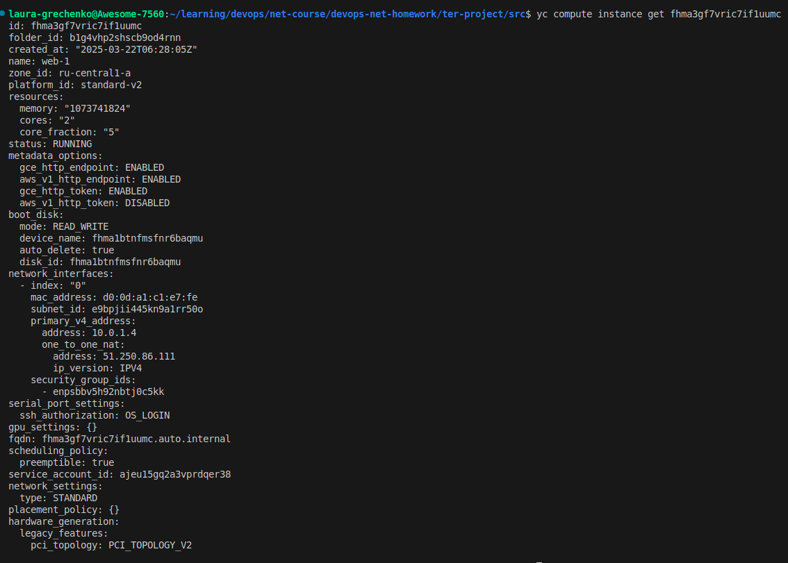


---------------------


 
# Задание 2. 
### [Ссылка на код cloud-init.yml](https://github.com/lauragrechenko/devops-net-homework/blob/master/ter-project/src/cloud-init.yml)

### Конфигурирование ВМ используя user-data (cloud-init)
### При вызове модуля vm передали user-data.
```
module "project_vm" {
  source = "./modules/vm"
  ...
  vm_metadata = {
    user-data          = data.template_file.cloudinit.rendered
    serial-port-enable = var.vm_web_serial_port_enabled
  }
}
```

### В vars дополнительно передали данные Mysql БД и secret_id для чтения пароля из Lockbox.
```
data "template_file" "cloudinit" {
  template = file("./cloud-init.yml")

  vars = {
    username       = var.vms_ssh_user
    ssh_public_key = file(local.ssh_pub_key_path)
    packages       = jsonencode(var.vm_web_cloudinit_packages)

    db_host               = module.project_mysql_cluster.db_host_fqdns[0]
    db_user               = module.project_mysql_db.user_name
    db_password_secret_id = module.project_db_password_secret.secret_id
    db_name               = var.mysql_db_name
  }
}
```

### Добавили команды на установку docker и docker compose.
### Проверили что установка прошла.


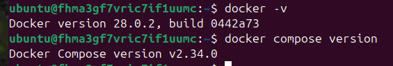

### Добавили команды на установку yc-cli, для чтения данных из Lockbox пароля к БД для пользователя и запись данных в файл /etc/myapp/db.conf.

### Проверили что установка yc-cli прошла.
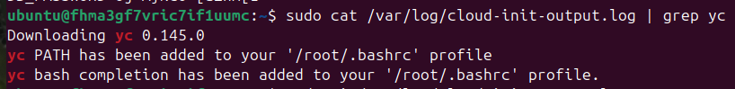

### Проверили что файл /etc/myapp/db.conf был создан с корректными данными и пароль получен из Lockbox.


---------------------


 
# Задание 3. 
## Использовали python проект с предыдущих ДР.  [Ссылка на код проекта web-python (со всеми изменениями)](https://github.com/lauragrechenko/shvirtd-example-python/tree/main)
## 3.1 Обновили Docker файл c web-приложением.
### [Ссылка на код Dockerfile](https://github.com/lauragrechenko/shvirtd-example-python/blob/main/Dockerfile)


## 3.2 Добавили .gitlab-ci.yml файл.
### Сборка docker образа python-web приложения и сохранение его в реестре YC созданного на шаге 1.4
### Создание архива в качестве артифакта для дальнейшего использования на шаге deploy.
```
stage: build
  script:
    - docker build -t "$DOCKER_REGISTRY/$REGISTRY_ID/$IMAGE_NAME:$IMAGE_TAG" .
    - echo "$CI_REGISTRY_PASSWORD" | base64 -d > service_account.json
    - cat service_account.json | docker login $DOCKER_REGISTRY -u "json_key" --password-stdin
    - docker push "$DOCKER_REGISTRY/$REGISTRY_ID/$IMAGE_NAME:$IMAGE_TAG"
    - printf "DOCKER_REGISTRY=%s\nREGISTRY_ID=%s\nIMAGE_NAME=%s\nCI_COMMIT_SHORT_SHA=%s\n" "$DOCKER_REGISTRY" "$REGISTRY_ID" "$IMAGE_NAME" "$CI_COMMIT_SHORT_SHA" > .env
    - tar czf app_deploy.tar.gz .env compose.yaml proxy.yaml haproxy/ nginx/
  artifacts:
    paths:
      - app_deploy.tar.gz
```

### Запуск python-web-app на ВМ созданной на шаге 1.7
```
  stage: deploy
  script:
    - eval $(ssh-agent -s)
    - echo "$SSH_PRIVATE_KEY" | base64 -d | tr -d '\r' | ssh-add -
    - >
      ssh -o StrictHostKeyChecking=no ${VM_USER_NAME}@${VM_IP_ADDR} "
      echo \"${CI_REGISTRY_PASSWORD}\" | base64 -d > service_account.json &&
      cat service_account.json | docker login ${DOCKER_REGISTRY} -u 'json_key' --password-stdin
      "
    - ssh -o StrictHostKeyChecking=no ${VM_USER_NAME}@${VM_IP_ADDR} 'mkdir -p ~/app'
    - scp -o StrictHostKeyChecking=no app_deploy.tar.gz ${VM_USER_NAME}@${VM_IP_ADDR}:~/app/
    - ssh -o StrictHostKeyChecking=no ${VM_USER_NAME}@${VM_IP_ADDR} 'cd ~/app && tar xzf app_deploy.tar.gz && docker compose up -d'
```

### Обновили compose.yaml - настроили имя образа и переменные окружения. Файл proxy.yaml  не меняли.
```
include:
  - proxy.yaml 
services:
  web:
    image: $DOCKER_REGISTRY/$REGISTRY_ID/$IMAGE_NAME:${CI_COMMIT_SHORT_SHA}
    env_file:
      - .env
      - /etc/myapp/db.conf
    restart: always
    networks:
      backend:
        ipv4_address: 172.20.0.5
```

### Настроили переменные CI/CD для доступа к реестру Docker образов (созданный на шаге 1.4) и доступа к ВМ (шаг 1.7).
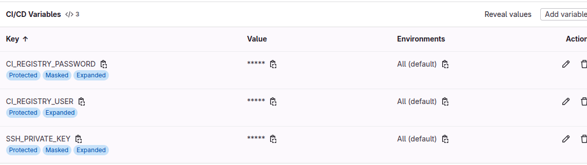

### Скриншоты выполнения pipelines & jobs.
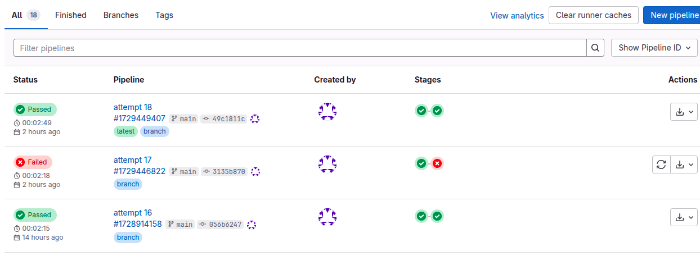

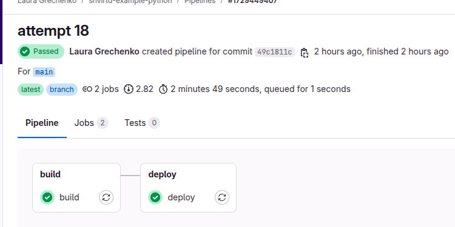

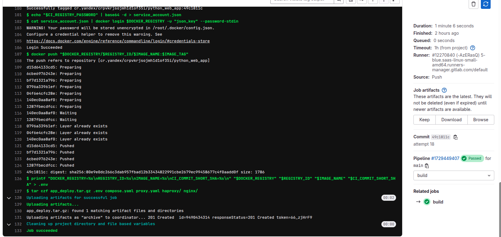

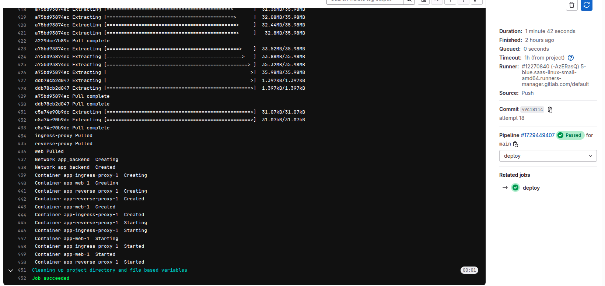


### [Ссылка на код gitlab-ci](https://github.com/lauragrechenko/shvirtd-example-python/blob/main/.gitlab-ci.yml)


---------------------


 
# Задание 4. (web - db взаимодействие к этому моменту уже настроено и описано на предыдущих этапах)

### На предыдущем шаге 2 (cloud-init) настроили работу приложения в контейнере с БД в Yandex Cloud через переменные ENV.
```
write_files:
  - path: /etc/myapp/db.conf
    content: |
      DB_HOST=${db_host}
      DB_USER=${db_user}
      DB_NAME=${db_name}
    owner: root:root
    permissions: '0644'
```
### При конфигурации ВМ также записали пароль полученный из Lockbox в /etc/myapp/db.conf.
```
    DB_PASSWORD=$(yc lockbox payload get --id ${db_password_secret_id} --format json | jq -r '.entries[0].text_value')
    echo "DB_PASSWORD=$${DB_PASSWORD}" >> /etc/myapp/db.conf
```


---------------------


 
# 5. Настройка DNS
##  Добавили в главный модуль ресурсы yandex_dns_zone, yandex_dns_recordset.
### Сначала использовали dns_zone_public = true, но в течение 2 часов адрес так и не стал публичным. Не уверена связано ли это с настройкой или просто нужно было больше времени. Внутри инфраструктуры доступ был.

```
resource "yandex_dns_zone" "zone1" {
  name             = var.dns_zone_name
  description      = var.dns_zone_description
  zone             = var.domain_zone
  public           = var.dns_zone_public
  private_networks = [module.project_vpc.network_id]
}

resource "yandex_dns_recordset" "rs1" {
  zone_id = yandex_dns_zone.zone1.id
  name    = var.dns_record_name
  type    = var.dns_record_type
  ttl     = var.dns_record_ttl
  data    = [module.project_vm.vm_instances_info[0].ip]
}
```
### Результаты выполнения:

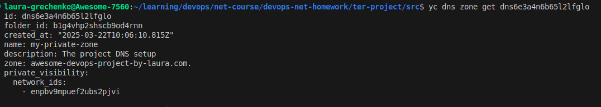

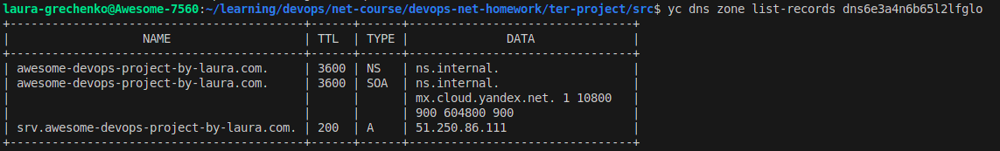


---------------------


 
# 6. Работа системы
### Проверили доступ к Веб-серверу с локальной машины используя VM public ip и по public Domain name (не заработало).
 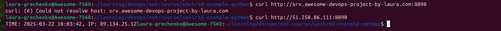

### Внутри инфраструктуры отработало.
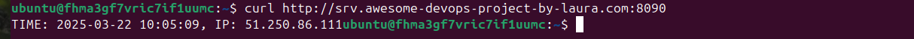

### Проверили логи Docker контейнера.
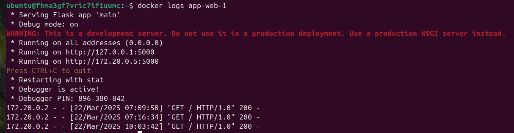

### Подключились к БД и проверили, что появились записи.
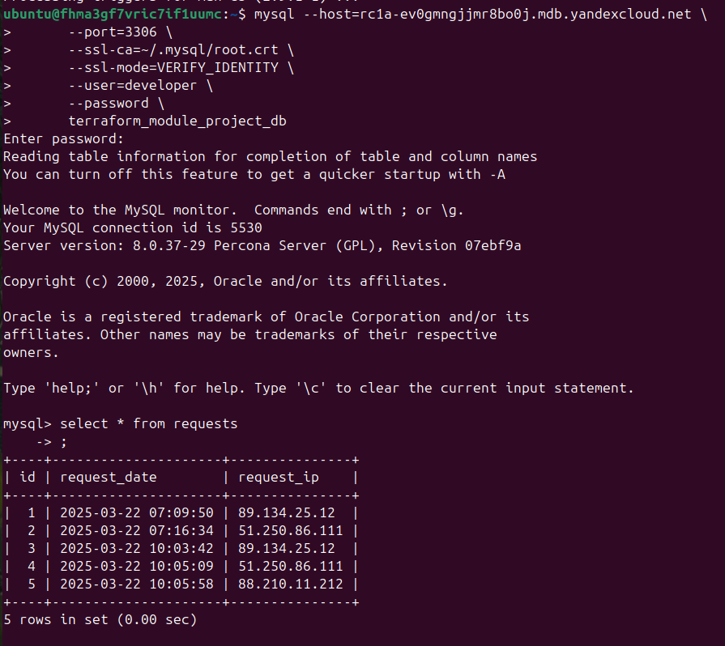

### state-lock-table используется для блокировки Terraform State.
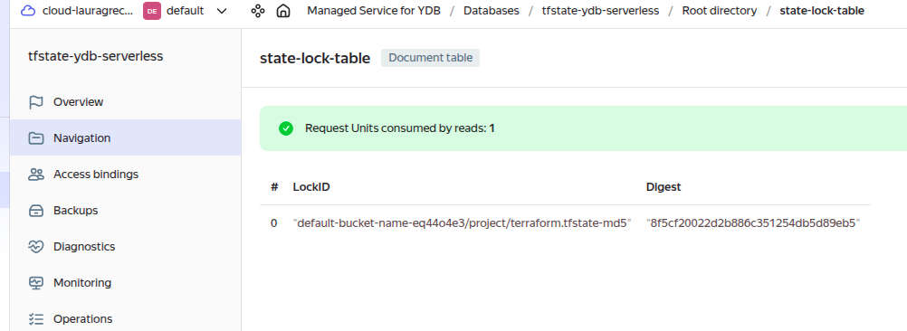

### Terraform State хранится удаленно.
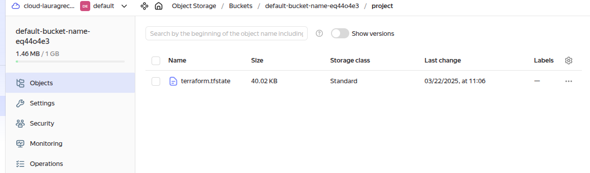


# The end! 🎉🎉🎉